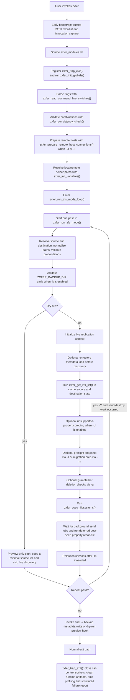
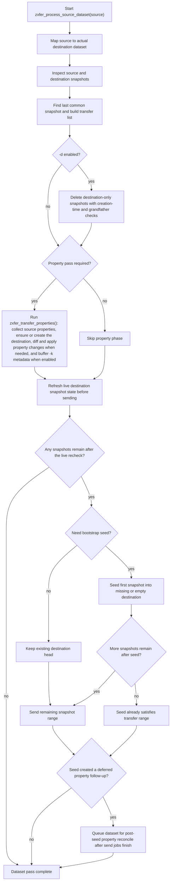
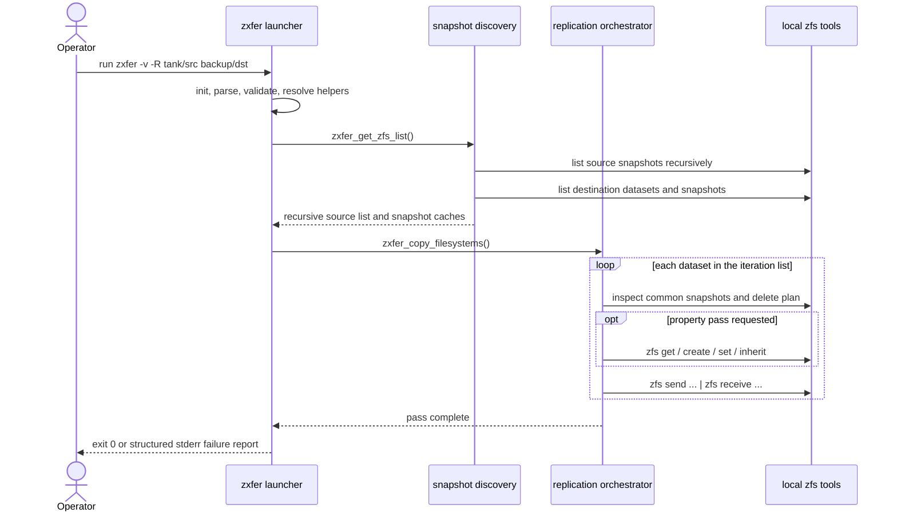
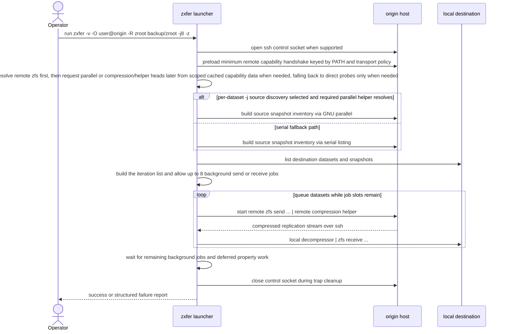
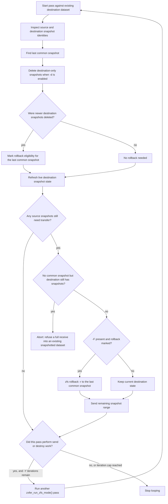
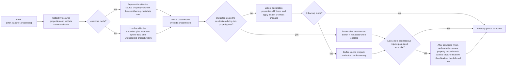

# Architecture

## Entry Point

- [../zxfer](../zxfer): top-level launcher and CLI entry point

The entry script now sources only
[../src/zxfer_modules.sh](../src/zxfer_modules.sh). That loader owns runtime
module order for the launcher, `tests/test_helper.sh`, and other
direct-sourcing fixtures, so the flat `src/` layout keeps one canonical source
sequence.

## Module Layout

The `src/` tree remains flat, but each file now owns a stable long-term
responsibility boundary.

- [../src/zxfer_modules.sh](../src/zxfer_modules.sh): canonical loader and
  source-order entry point for the runtime modules
- [../src/zxfer_reporting.sh](../src/zxfer_reporting.sh): structured failure
  reporting, verbose output helpers, usage errors, and operator-facing status
- [../src/zxfer_exec.sh](../src/zxfer_exec.sh): shell-safe token handling,
  command rendering, ssh wrappers, and exec helpers
- [../src/zxfer_dependencies.sh](../src/zxfer_dependencies.sh): secure PATH
  computation, required-tool lookup, and local dependency validation
- [../src/zxfer_runtime.sh](../src/zxfer_runtime.sh): runtime/session
  initialization, shared per-run defaults, validated temp-root selection,
  runtime-artifact allocation/readback/cleanup, runtime-owned cache staging,
  and trap handling
- [../src/zxfer_cli.sh](../src/zxfer_cli.sh): CLI parsing, option validation,
  and compression command interpretation
- [../src/zxfer_snapshot_state.sh](../src/zxfer_snapshot_state.sh): snapshot
  record parsing, normalization, and cached snapshot index state
- [../src/zxfer_path_security.sh](../src/zxfer_path_security.sh): filesystem
  ownership/mode checks, secure-path validation, symlink-aware path guards
- [../src/zxfer_remote_hosts.sh](../src/zxfer_remote_hosts.sh): remote helper
  resolution, scoped requested-tool capability handshakes and caches, ssh control-
  socket management
- [../src/zxfer_backup_metadata.sh](../src/zxfer_backup_metadata.sh): backup
  metadata accumulation, path derivation, and secure exact-keyed lookup/read/write flows
- [../src/zxfer_property_cache.sh](../src/zxfer_property_cache.sh): normalized
  property caching, prefetch state, startup/iteration cache reset helpers
- [../src/zxfer_snapshot_discovery.sh](../src/zxfer_snapshot_discovery.sh):
  source and destination dataset / snapshot discovery
- [../src/zxfer_snapshot_reconcile.sh](../src/zxfer_snapshot_reconcile.sh):
  snapshot comparison and deletion planning
- [../src/zxfer_property_reconcile.sh](../src/zxfer_property_reconcile.sh):
  readonly-property defaults, unsupported-property derivation, property
  diffing, filtering, override planning, per-call scratch resets, and apply
  logic
- [../src/zxfer_send_receive.sh](../src/zxfer_send_receive.sh): send /
  receive command construction, progress pipeline, compression handling
- [../src/zxfer_replication.sh](../src/zxfer_replication.sh): dataset iteration,
  replication orchestration, migration/service handling

## Initialization And State Ownership

The startup path is intentionally explicit:

1. [../src/zxfer_modules.sh](../src/zxfer_modules.sh) loads the flat module
   stack in one canonical order.
2. `zxfer_init_globals()` seeds generic runtime/session state in
   [../src/zxfer_runtime.sh](../src/zxfer_runtime.sh).
3. Module-specific mutable scratch state is then reset through the owning
   module helpers rather than by duplicating those variable inventories in the
   runtime layer. The main examples are
   [../src/zxfer_snapshot_discovery.sh](../src/zxfer_snapshot_discovery.sh),
   [../src/zxfer_snapshot_reconcile.sh](../src/zxfer_snapshot_reconcile.sh),
   [../src/zxfer_send_receive.sh](../src/zxfer_send_receive.sh),
   [../src/zxfer_backup_metadata.sh](../src/zxfer_backup_metadata.sh),
   [../src/zxfer_property_cache.sh](../src/zxfer_property_cache.sh), and
   [../src/zxfer_property_reconcile.sh](../src/zxfer_property_reconcile.sh).
4. `zxfer_init_variables()` resolves local/remote execution context, helper
   paths, and platform-specific bootstrap details.

That split keeps startup readable without reintroducing source-time side
effects or generic catch-all modules.

## Runtime Artifact Layer

The runtime layer owns transient artifacts that live under the validated
runtime temp root: temp files, temp directories, staged command or probe
captures, staged payload files, and runtime-owned cache objects.

Callers should allocate those artifacts through
[../src/zxfer_runtime.sh](../src/zxfer_runtime.sh), reload staged contents
through the shared readback helper, and let `zxfer_trap_exit()` clean up the
registered paths. This keeps partial payloads out of shared `g_*` scratch
state and preserves exact nonzero readback failures for the caller.

Not every staging flow belongs in that layer. Modules that intentionally stage
files beside the final target to preserve same-directory atomic rename and
trusted-parent checks, such as backup publish or rollback paths, continue to
own that path-adjacent secure staging locally.

## High-Level Replication Flow

1. Bootstrap with the built-in trusted PATH allowlist, capture the invocation,
   and source the flat module stack.
2. Register runtime traps and initialize runtime/session state through the
   explicit init flow.
3. Parse CLI options, validate combinations, and resolve source and
   destination execution context.
4. Build dataset and snapshot lists.
5. Inspect source versus destination state.
6. Optionally delete destination-only snapshots.
7. Transfer snapshots through explicit stage helpers:
   live recheck, seed decision, then final send/receive range. Seed-only
   receive `-F` is passed as an internal execution flag without mutating the
   parsed `g_option_*` state.
8. Optionally transfer or restore properties, including exact-keyed backup
   metadata reads and deferred post-seed reconciliation for datasets that were
   seeded into empty destinations.
9. Repeat when `-Y` is enabled.
10. Emit structured failure reporting on non-zero exit.

## Execution Lifecycle Diagrams

The following Mermaid diagrams describe the current execution path through the
launcher plus the main orchestration modules. They intentionally use the real
function boundaries so operators and contributors can line the diagrams up with
[`../zxfer`](../zxfer),
[`../src/zxfer_runtime.sh`](../src/zxfer_runtime.sh),
[`../src/zxfer_remote_hosts.sh`](../src/zxfer_remote_hosts.sh),
[`../src/zxfer_snapshot_discovery.sh`](../src/zxfer_snapshot_discovery.sh),
[`../src/zxfer_snapshot_reconcile.sh`](../src/zxfer_snapshot_reconcile.sh),
[`../src/zxfer_property_reconcile.sh`](../src/zxfer_property_reconcile.sh),
[`../src/zxfer_send_receive.sh`](../src/zxfer_send_receive.sh), and
[`../src/zxfer_replication.sh`](../src/zxfer_replication.sh).

### General Run Lifecycle

This is the end-to-end path for one `zxfer` invocation, including remote
bootstrap, one or more replication passes, and trap-driven shutdown.

### Per-Dataset Replication Lifecycle

Each dataset in the iteration list flows through one orchestration pass in
`zxfer_process_source_dataset()`. This is the core lifecycle inside
`zxfer_copy_filesystems()`.

Live `-k` metadata is only persisted immediately when the dataset pass is safe
to commit. If background send jobs are still running, or if a seed requires a
deferred property follow-up, orchestration waits until the later
post-job/post-seed checkpoints before flushing the buffered rows.

### Example: Local Recursive Replication

This is the common local-to-local path for a command such as
`./zxfer -v -R tank/src backup/dst`. No ssh setup is needed, so discovery and
transfer stay entirely local.

### Example: Remote Pull From An Origin Host

This shows the main remote-origin lifecycle for a command shape such as
`./zxfer -v -O user@origin -R zroot backup/zroot -j8 -z`. The destination is
local, so the send side is remote and the receive side is local.

### Example: Diverged Destination With `-d`, `-F`, And `-Y`

This is the safety-oriented lifecycle when the destination has extra snapshots
or other divergence and the operator wants deletion plus convergence loops.

The abort path above is a deliberate safety stop. It is the branch where
`zxfer_seed_destination_for_snapshot_transfer()` refuses to do a full receive
into an existing destination dataset that still has snapshots but no common
snapshot guid with the source.

### Example: Property Backup And Restore Lifecycle

This describes the property-management branch for `-k` backup and `-e`
restore, including the deferred reconcile path used after an initial seed into
an empty destination.

## Design Priorities

The project is organized around:

- safety before throughput
- security before convenience
- testability of shell helpers
- portability across ZFS platforms

## Documentation Sources Of Truth

- man pages for the complete CLI reference
- `README.md` for the top-level overview and quick start
- `docs/` for operational and contributor guidance
- `KNOWN_ISSUES.md` for current limitations
