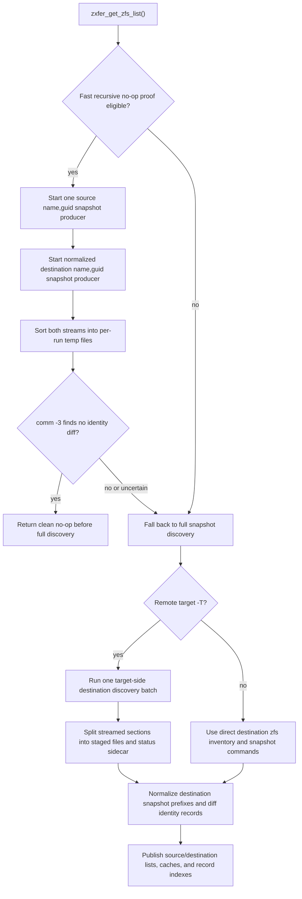
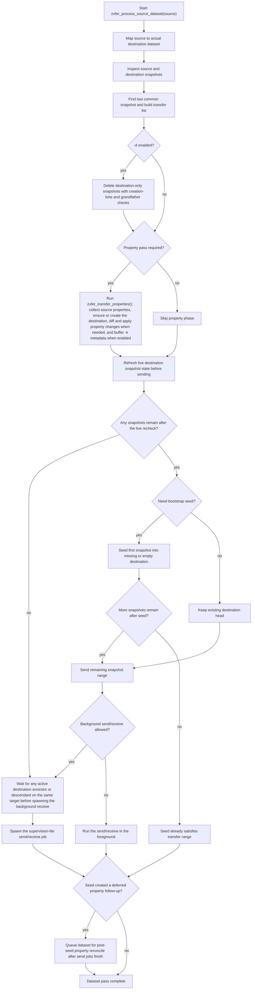
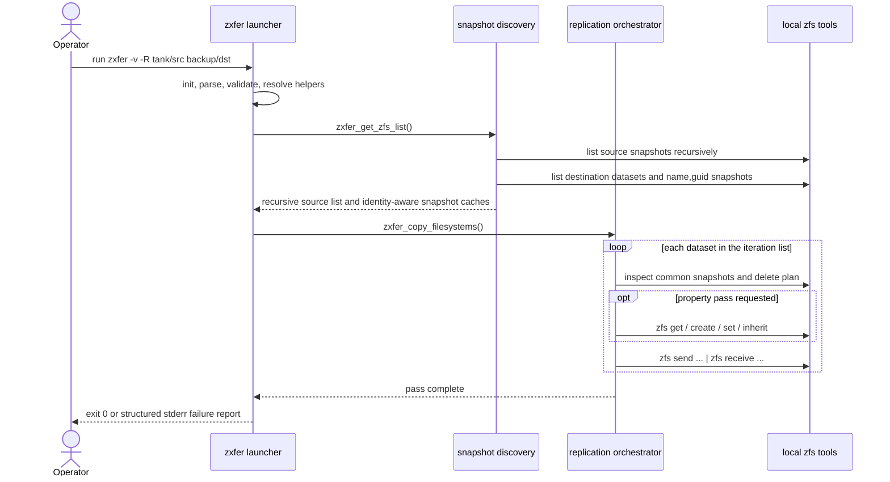
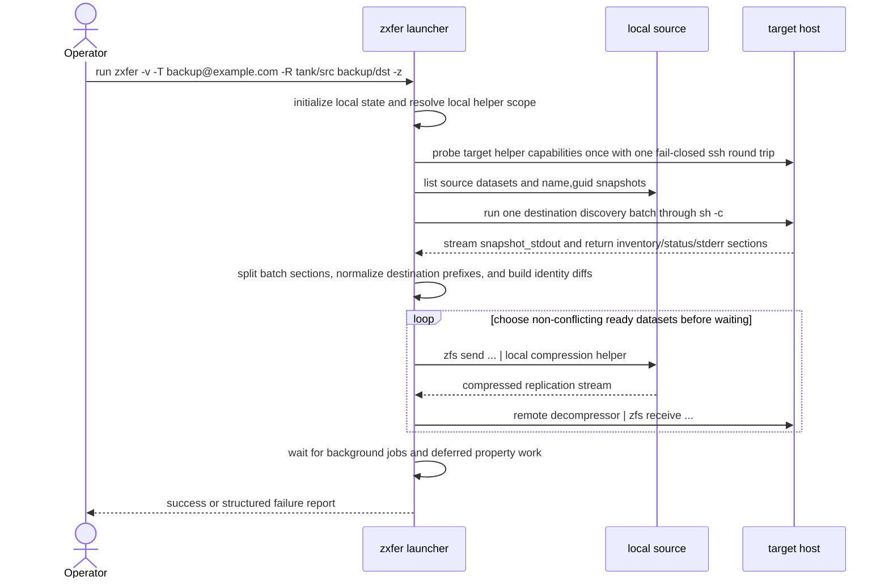
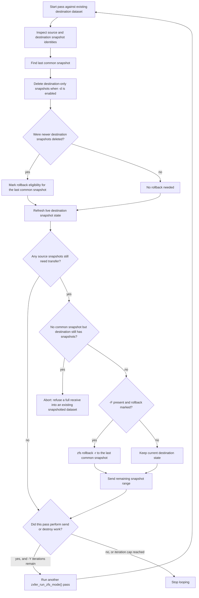

# Architecture

## Entry Point

- [../zxfer](../zxfer): top-level launcher and CLI entry point

The entry script now sources only
[../src/zxfer_modules.sh](../src/zxfer_modules.sh). That loader owns runtime
module order for the launcher, `tests/test_helper.sh`, and other
direct-sourcing fixtures, so the flat `src/` layout keeps one canonical source
sequence.

## Module Layout

The `src/` tree remains flat, but each file now owns a stable long-term
responsibility boundary.

- [../src/zxfer_modules.sh](../src/zxfer_modules.sh): canonical loader and
  source-order entry point for the runtime modules
- [../src/zxfer_reporting.sh](../src/zxfer_reporting.sh): structured failure
  reporting, verbose output helpers, usage errors, and operator-facing status
- [../src/zxfer_quoting.sh](../src/zxfer_quoting.sh): literal token splitting,
  single-quote escaping, and argv-to-shell rendering primitives
- [../src/zxfer_profile.sh](../src/zxfer_profile.sh): profiling counters,
  elapsed timings, and end-of-run summary rendering
- [../src/zxfer_exec.sh](../src/zxfer_exec.sh): shell-safe token handling,
  generic command rendering, foreground execution, and cleanup-aware short-
  lived background helpers; it has no remote-capability or snapshot-state
  dependency
- [../src/zxfer_dependencies.sh](../src/zxfer_dependencies.sh): secure PATH
  computation, required-tool lookup, and local dependency validation
- [../src/zxfer_path_security.sh](../src/zxfer_path_security.sh): filesystem
  ownership/mode checks and symlink-aware trusted-path validation
- [../src/zxfer_locking.sh](../src/zxfer_locking.sh): pid/start-token owned-lock
  metadata, stale-owner validation/reaping, and checked release
- [../src/zxfer_runtime.sh](../src/zxfer_runtime.sh): validated per-run temp
  root, runtime artifact allocation/readback, and short-lived cleanup-PID state
- [../src/zxfer_secure_staging.sh](../src/zxfer_secure_staging.sh): randomized
  path-adjacent staging entries and runtime artifact registration
- [../src/zxfer_error_log.sh](../src/zxfer_error_log.sh): secure structured
  failure-log mirroring and serialized append coordination
- [../src/zxfer_background_jobs.sh](../src/zxfer_background_jobs.sh):
  supervision-lite long-lived background jobs: an in-memory job registry,
  per-job status files written by the job shell itself, rolling completion
  queue notifications, and process-group (setsid) or cleanup-wrapper teardown
- [../src/zxfer_ssh_transport.sh](../src/zxfer_ssh_transport.sh): validated
  host/wrapper parsing, managed SSH options, direct argv invocation versus
  rendered shell-pipeline channels, per-role transport memos, active remote
  ZFS routing, and per-run control-socket lifecycle
- [../src/zxfer_remote_hosts.sh](../src/zxfer_remote_hosts.sh): remote helper
  resolution, one fail-closed per-run capability probe per host parsed into
  in-memory state, and resolved remote OS/tool selections; it consumes the SSH
  transport API but does not own transport state
- [../src/zxfer_cli.sh](../src/zxfer_cli.sh): CLI parsing, option validation,
  and compression command interpretation
- [../src/zxfer_operation_state.sh](../src/zxfer_operation_state.sh): mutable
  per-pass planning and replication-convergence state
- [../src/zxfer_snapshot_state.sh](../src/zxfer_snapshot_state.sh): snapshot
  record parsing, normalization, flat per-run snapshot record files, and the
  generation-gated live destination view
- [../src/zxfer_backup_storage.sh](../src/zxfer_backup_storage.sh): secure
  exact-keyed storage layout, local/remote path guards, checked reads, atomic
  publication/rollback, and remote storage transport rendering
- [../src/zxfer_backup_metadata.sh](../src/zxfer_backup_metadata.sh): backup
  format/record handling, capture and write orchestration, provenance, and
  restore-candidate selection
- [../src/zxfer_property_state.sh](../src/zxfer_property_state.sh): property
  serialization, shared result/reset lifecycle, normalized-property tables,
  recursive prefetch, and targeted destination invalidation
- [../src/zxfer_property_policy.sh](../src/zxfer_property_policy.sh): readonly
  and noninheritable defaults, override validation/planning, filtering, and
  unsupported-property compatibility decisions
- [../src/zxfer_property_reconcile.sh](../src/zxfer_property_reconcile.sh):
  source/destination collection, dataset creation, property diffing and
  application, and the per-dataset transfer workflow
- [../src/zxfer_snapshot_producers.sh](../src/zxfer_snapshot_producers.sh):
  source/destination command production, staged execution, and snapshot-stream
  normalization
- [../src/zxfer_remote_snapshot_discovery.sh](../src/zxfer_remote_snapshot_discovery.sh):
  target-side discovery batch rendering, checked status parsing, and remote
  inventory/snapshot collection
- [../src/zxfer_snapshot_discovery.sh](../src/zxfer_snapshot_discovery.sh):
  discovery orchestration, source/destination diffing, cache publication, and
  recursive discovery state
- [../src/zxfer_migration_services.sh](../src/zxfer_migration_services.sh):
  Solaris/illumos SMF stop/restart state and recovery behavior
- [../src/zxfer_send_jobs.sh](../src/zxfer_send_jobs.sh): send/receive domain
  queue metadata, rolling completion handling, job limits, and destination-
  ancestry serialization
- [../src/zxfer_send_receive.sh](../src/zxfer_send_receive.sh): send /
  receive command construction, progress pipeline, compression handling
- [../src/zxfer_snapshot_reconcile.sh](../src/zxfer_snapshot_reconcile.sh):
  snapshot comparison and deletion planning
- [../src/zxfer_replication.sh](../src/zxfer_replication.sh): dataset iteration
  and replication orchestration across discovery, reconciliation, and transfer
- [../src/zxfer_session.sh](../src/zxfer_session.sh): final composition root for
  owner resets, CLI-to-execution-context startup, remote connection
  preparation, trap registration, ordered shutdown, and top-level execution

## Initialization And State Ownership

The startup path is intentionally explicit:

1. [../src/zxfer_modules.sh](../src/zxfer_modules.sh) loads the flat module
   stack in one canonical order without source-time initialization.
2. `zxfer_discard_inherited_cleanup_state()` clears every inherited internal
   process, SSH, path, and migration-service handle without acting on it. An
   exported `g_*` value can therefore never grant cleanup ownership.
3. Dependency bootstrap completes, then the session installs traps before any
   initialization step can allocate a runtime resource.
4. `zxfer_init_globals()` in
   [../src/zxfer_session.sh](../src/zxfer_session.sh) calls each module's
   owner-specific reset in a fixed order. SSH transport and remote capability
   state are reset independently through `zxfer_reset_ssh_transport_state()`
   and `zxfer_reset_remote_host_state()`.
5. Module-specific mutable scratch state stays with the owning module rather
   than being duplicated in the runtime layer. The main examples are
   [../src/zxfer_background_jobs.sh](../src/zxfer_background_jobs.sh),
   [../src/zxfer_snapshot_discovery.sh](../src/zxfer_snapshot_discovery.sh),
   [../src/zxfer_snapshot_reconcile.sh](../src/zxfer_snapshot_reconcile.sh),
   [../src/zxfer_send_receive.sh](../src/zxfer_send_receive.sh),
   [../src/zxfer_backup_storage.sh](../src/zxfer_backup_storage.sh),
   [../src/zxfer_backup_metadata.sh](../src/zxfer_backup_metadata.sh), and
   [../src/zxfer_property_state.sh](../src/zxfer_property_state.sh).
6. `zxfer_prepare_remote_host_connections()` composes transport validation and
   capability preload without moving either concern into the other module.
   `zxfer_init_variables()` then resolves local/remote execution context,
   helper paths, and platform-specific bootstrap details.

The manifest and architecture policies machine-check layer direction, cycles,
module completeness, mutable-global ownership, caller/callee scratch overlap,
and the exact inventory of the few remaining production `eval` commands.
Dependencies point only downward from composition through
domain/state/infrastructure to foundation. That split keeps startup readable
without reintroducing source-time side effects or generic catch-all modules.

## Runtime Artifact Layer

All run-private transient state lives under one per-run 0700 temp root,
created with a single `mktemp -d` after TMPDIR is validated once (single-pass
physical resolution plus owner/mode checks). Allocators in
[../src/zxfer_runtime.sh](../src/zxfer_runtime.sh) hand out
`<prefix>.<counter>` children by redirection or `mkdir`; there is no per-file
registration or unregistration ceremony for contained children. Runtime
records the exact root, validated physical parent, and device/inode identity
returned by its own allocation; whole-root removal requires that provenance,
an unchanged identity, and the reserved `zxfer.<pid>.*` shape.
`zxfer_trap_exit()` in
[../src/zxfer_session.sh](../src/zxfer_session.sh) removes the whole root only
after supervised jobs, short-lived cleanup helpers, SSH control sockets, and
registered path-adjacent staging entries have been handled. Staged contents
reload through the shared readback helper, which keeps partial payloads out of
shared `g_*`
scratch state and preserves exact nonzero readback failures for the caller.
Registered path-adjacent directories also retain their allocation-time
device/inode identity. Recursive cleanup requires that identity to remain
unchanged; SSH socket-directory memo reuse additionally rechecks effective
ownership and private mode. A same-path replacement is never adopted as
zxfer-owned state.

Not every staging flow belongs in that layer. Modules that intentionally stage
files beside the final target to preserve same-directory atomic rename and
trusted-parent checks continue to own that path-adjacent secure staging
locally. In particular, backup publication and rollback staging lives in
[`../src/zxfer_backup_storage.sh`](../src/zxfer_backup_storage.sh).

Long-lived background work now layers on top of the runtime temp root through
[../src/zxfer_background_jobs.sh](../src/zxfer_background_jobs.sh) using a
supervision-lite model: there is no per-job supervisor process. Spawn runs the
job pipeline directly in one backgrounded job shell, and the per-job state is
one in-memory registry row (`job_id`, kind, pid, teardown mode, status file).
The job shell itself writes `status<TAB>N` to a per-run temp status file
after the pipeline finishes and then publishes its `job_id` to the rolling
completion queue when one is open, so a queue reader always finds the status
already recorded. Missing, unterminated, duplicated, unknown, noncanonical, or
out-of-range protocol rows fail closed rather than being accepted as a job
completion.

When `setsid` works (feature-tested once per process, requiring the spawned
child to lead its own process group), abort signals the whole pipeline with
one process-group TERM, a brief bounded wait, and a single KILL escalation
before reaping. Without `setsid` the job runs through
[../src/zxfer_cleanup_child_wrapper.sh](../src/zxfer_cleanup_child_wrapper.sh),
whose TERM trap bounds teardown of its owned direct child and performs
token-validated, best-effort cleanup of cooperative descendants. POSIX ancestry
snapshots cannot guarantee containment if an arbitrary TERM handler forks and
exits before the refreshed snapshot; strict containment requires the isolated
process-group path. The safety argument that replaced
the old normal-path start-token revalidation and process-table snapshots is
the baseline supervision-lite ownership model: zxfer registers the `$!` from
its own spawn, signals it before the script's explicit wait, and releases the
record only after reaping. This avoids a per-job `ps` spawn but does not claim
that every POSIX shell defers internal reaping until the script calls `wait`.
Wrapper-mode abort still snapshots descendants and revalidates their start
tokens immediately before signalling them. Trap-time
transport cleanup follows the same checked-cleanup contract: a managed ssh
control-socket close failure now upgrades an otherwise successful exit into a
runtime cleanup failure instead of being treated as warning-only success.

Short-lived background helpers still go through the shared runtime cleanup
registry in [../src/zxfer_runtime.sh](../src/zxfer_runtime.sh). Helpers that
need an inline shell wrapper now launch through the standalone
[../src/zxfer_cleanup_child_wrapper.sh](../src/zxfer_cleanup_child_wrapper.sh),
which traps TERM, escalates its owned direct child with KILL after a bounded
grace period, and reaps that child before exiting. It also snapshots and
token-validates cooperative descendants on the abort path. That keeps the
remaining local helper paths on validated ownership tracking instead of bare
wrapper-shell PID teardown.

## Owned Lock Layer

Cross-process coordination is now a single concern: the `ZXFER_ERROR_LOG`
append lock. The generic owned-lock helpers live in
[../src/zxfer_locking.sh](../src/zxfer_locking.sh) and are used by the secure
error-log append path. Lock identity is deliberately slim: a
mode-0700 lock directory whose metadata file records only the owner pid and
one memoized `ps` process-start token. Helpers validate that metadata before
trusting an existing owner, treat missing or corrupt metadata as busy on
first sighting (corrupt-reaping only after a sleep-and-recheck round so a
concurrent winner inside its mkdir-to-publish window is never reaped), and
treat release as a checked owner-match operation. The older lease entries,
hostname/purpose/created-at metadata fields, ssh socket locks, and
capability-cache locks were deleted with the machinery they coordinated:
ssh control sockets and remote capability state are per-run now and need no
cross-process locking.

## High-Level Replication Flow

1. Bootstrap with the built-in trusted PATH allowlist, capture the invocation,
   and source the flat module stack.
2. Discard inherited internal cleanup handles without side effects, bootstrap
   dependencies, register runtime traps, and initialize owner state through
   the explicit session flow.
3. Parse CLI options, validate combinations, and resolve source and
   destination execution context.
4. Build identity-aware dataset and snapshot lists. Eligible recursive no-op
   runs (local sources and `-O` pulls alike) first try the fast `name,guid`
   proof, and remote-target `-T` destination discovery batches inventory,
   missing-root pool probing, and snapshot listing into one target-side ssh
   shell invocation.
5. Inspect source versus destination state.
6. Optionally delete destination-only snapshots.
7. Transfer snapshots through explicit stage helpers:
   live recheck, seed decision, then final send/receive range. Seed-only
   receive `-F` is passed as an internal execution flag without mutating the
   parsed `g_option_*` state.
8. For long-lived background work, spawn supervision-lite jobs through the
   background-job layer, wait by `job_id`, and abort remaining jobs through
   process-group or tracked-child cleanup on the first failure.
   Parallel send/receive scheduling also serializes conflicting
   ancestor/descendant destination datasets on the same target while a
   ready-queue pass skips blocked descendants and starts later independent
   datasets before waiting.
9. Optionally transfer or restore properties, including exact-keyed v2 backup
   metadata reads, source-root-relative restore rows, and deferred post-seed
   reconciliation for datasets that were seeded into empty destinations.
10. Repeat when `-Y` is enabled.
11. Emit structured failure reporting on non-zero exit.

## Execution Lifecycle Diagrams

The following Mermaid diagrams describe the current execution path through the
launcher plus the main orchestration modules. They intentionally use the real
function boundaries so operators and contributors can line the diagrams up with
[`../zxfer`](../zxfer),
[`../src/zxfer_runtime.sh`](../src/zxfer_runtime.sh),
[`../src/zxfer_background_jobs.sh`](../src/zxfer_background_jobs.sh),
[`../src/zxfer_ssh_transport.sh`](../src/zxfer_ssh_transport.sh),
[`../src/zxfer_remote_hosts.sh`](../src/zxfer_remote_hosts.sh),
[`../src/zxfer_snapshot_producers.sh`](../src/zxfer_snapshot_producers.sh),
[`../src/zxfer_remote_snapshot_discovery.sh`](../src/zxfer_remote_snapshot_discovery.sh),
[`../src/zxfer_snapshot_discovery.sh`](../src/zxfer_snapshot_discovery.sh),
[`../src/zxfer_snapshot_reconcile.sh`](../src/zxfer_snapshot_reconcile.sh),
[`../src/zxfer_property_state.sh`](../src/zxfer_property_state.sh),
[`../src/zxfer_property_policy.sh`](../src/zxfer_property_policy.sh),
[`../src/zxfer_property_reconcile.sh`](../src/zxfer_property_reconcile.sh),
[`../src/zxfer_send_receive.sh`](../src/zxfer_send_receive.sh),
[`../src/zxfer_replication.sh`](../src/zxfer_replication.sh), and
[`../src/zxfer_session.sh`](../src/zxfer_session.sh).

### General Run Lifecycle

This is the end-to-end path for one `zxfer` invocation, including remote
bootstrap, one or more replication passes, and trap-driven shutdown.

```mermaid
flowchart TD
    A["User invokes zxfer"] --> B["Early bootstrap: trusted PATH allowlist and invocation capture"]
    B --> C["Source zxfer_modules.sh to define the pure loader"]
    C --> C1["Call zxfer_load_modules() for the canonical manifest"]
    C1 --> D["Discard inherited cleanup handles"]
    D --> D1["Run zxfer_initialize_dependency_defaults()"]
    D1 --> D2["Register zxfer_trap_exit()"]
    D2 --> D3["Run zxfer_init_globals()"]
    D3 --> E["Parse flags with zxfer_read_command_line_switches()"]
    E --> F["Validate combinations with zxfer_consistency_check()"]
    F --> G["Probe remote capabilities once per host into in-memory state when -O or -T is configured"]
    G --> H["Resolve local and needed remote helper paths with zxfer_init_variables()"]
    H --> I["Enter zxfer_run_zfs_mode_loop()"]
    I --> J["Start one pass in zxfer_run_zfs_mode()"]
    J --> K["Resolve source and destination, normalize paths, validate preconditions"]
    K --> L["Validate ZXFER_BACKUP_DIR early when -k is enabled"]
    L --> M{"Dry run?"}
    M -- "yes" --> N["Preview-only path: seed a minimal source list and skip live discovery"]
    M -- "no" --> O["Initialize live replication context"]
    O --> P["Optional -e restore metadata load before discovery"]
    P --> Q["Run zxfer_get_zfs_list() to cache source and destination state"]
    Q --> Q1["Source snapshot listing runs as a tracked background helper and later waits by PID"]
    Q1 --> R["Optional unsupported-property probing when -U has later work to filter"]
    R --> S["Optional preflight snapshot via -s or migration prep via -m"]
    S --> T["Optional grandfather deletion checks via -g"]
    T --> U["Run zxfer_copy_filesystems()"]
    N --> V{"Repeat pass?"}
    U --> W["Fill a ready queue with background send/receive jobs, skipping blocked destination descendants while independent work exists"]
    W --> X["Wait for background send jobs by job_id and run deferred post-seed property reconcile"]
    X --> Y["Relaunch services after -m if needed"]
    Y --> V
    V -- "yes: -Y and send/destroy work occurred" --> J
    V -- "no" --> Z["Invoke final -k backup metadata write or dry-run preview hook"]
    Z --> AA["Normal exit path"]
    AA --> AB["zxfer_trap_exit(): abort owned jobs/helpers, close SSH sockets, remove registered staging and the proven run root, restore migration services, then emit profiling and structured failure output"]
```

### Snapshot Discovery And No-Op Proof

`zxfer_get_zfs_list()` owns the initial source and destination view used by
later delete, seed, send, and property decisions. Snapshot records stay
identity-aware at this layer: source and destination snapshot lists use
`zfs list -Hr -o name,guid -t snapshot`, and destination records are normalized
by rewriting only the leading destination dataset prefix.

For eligible recursive runs — local sources and remote-origin `-O` pulls
alike since Phase 8 — `zxfer_try_fast_recursive_noop_discovery()` attempts a
clean no-op proof before the heavier creation-order source discovery path.
Eligibility is intentionally narrow: `-R` must be active, `-T` must be
absent, and snapshot creation, migration, property transfer or restore,
backup metadata, and property overrides must be inactive.
The proof starts one recursive source `name,guid` producer even when `-j` is
configured, starts one normalized destination `name,guid` producer, sorts both
streams into regular files under the per-run temp root, and treats a non-empty
`comm -3` diff as a mismatch. `-U` unsupported-property filtering and `-g`
grandfather protection can remain enabled because a proven no-op leaves no
source transfer queue, destination delete queue, or property/create work to
consume those checks. A mismatch, missing destination, excluded-dataset
uncertainty, or stream failure falls back to full discovery or fails through the
same staged stderr paths used by the normal discovery flow. A proven clean no-op
never runs the destination existence check or the creation-order source listing
at all.

Remote target discovery has a separate `-T` optimization in
`zxfer_run_remote_destination_discovery_batch_to_files()`. The target-side
script uses the resolved target `zfs` path and validated dependency `PATH`,
starts recursive dataset inventory in the background, streams the large
destination snapshot stdout section directly back over ssh as `name,guid`
records, captures stderr and compact statuses in target-side temp files, and
runs the pool-exists fallback only when the destination root appears missing.
The local splitter writes the same staged inventory, stderr, and raw snapshot
files that the non-batched path expects, then the existing destination snapshot
normalization helper produces the normalized diff input. Protocol markers are
interpreted only outside section bodies, malformed or truncated payloads fail
closed, and snapshot-list stderr is preserved before the existing `Failed to
retrieve snapshot list from the destination.` context is reported.

```mermaid
flowchart TD
    A["zxfer_get_zfs_list()"] --> B{"Fast recursive no-op proof eligible?"}
    B -- "yes" --> C["Start one source name,guid snapshot producer"]
    C --> D["Start normalized destination name,guid snapshot producer"]
    D --> E["Sort both streams into per-run temp files"]
    E --> F{"comm -3 finds no identity diff?"}
    F -- "yes" --> G["Return clean no-op before full discovery"]
    F -- "no or uncertain" --> H["Fall back to full snapshot discovery"]
    B -- "no" --> H
    H --> I{"Remote target -T?"}
    I -- "yes" --> J["Run one target-side destination discovery batch"]
    J --> K["Split streamed sections into staged files and status sidecar"]
    I -- "no" --> L["Use direct destination zfs inventory and snapshot commands"]
    K --> M["Normalize destination snapshot prefixes and diff identity records"]
    L --> M
    M --> N["Publish source/destination lists, caches, and record indexes"]
```

### Per-Dataset Replication Lifecycle

Each dataset in the iteration list flows through one orchestration pass in
`zxfer_process_source_dataset()`. This is the core lifecycle inside
`zxfer_copy_filesystems()`.

```mermaid
flowchart TD
    A["Start zxfer_process_source_dataset(source)"] --> B["Map source to actual destination dataset"]
    B --> C["Inspect source and destination snapshots"]
    C --> D["Find last common snapshot and build transfer list"]
    D --> E{"-d enabled?"}
    E -- "yes" --> F["Delete destination-only snapshots with creation-time and grandfather checks"]
    E -- "no" --> G{"Property pass required?"}
    F --> G
    G -- "yes" --> H["Run zxfer_transfer_properties(): collect source properties, ensure or create the destination, diff and apply property changes when needed, and buffer -k metadata when enabled"]
    G -- "no" --> I["Skip property phase"]
    H --> J["Refresh live destination snapshot state before sending"]
    I --> J
    J --> K{"Any snapshots remain after the live recheck?"}
    K -- "no" --> S["Dataset pass complete, or delete-only changes remain for the loop to observe"]
    K -- "yes" --> L{"Need bootstrap seed?"}
    L -- "yes" --> M["Seed first snapshot into missing or empty destination"]
    L -- "no" --> N["Keep existing destination head"]
    M --> O{"More snapshots remain after seed?"}
    N --> P["Send remaining snapshot range"]
    O -- "yes" --> P
    O -- "no" --> Q["Seed already satisfies transfer range"]
    P --> R{"Background send/receive allowed?"}
    R -- "yes" --> S["Wait for any active destination ancestor or descendant on the same target before spawning the background receive"]
    R -- "no" --> T["Run the send/receive in the foreground"]
    S --> U["Spawn the supervision-lite send/receive job"]
    T --> V{"Seed created a deferred property follow-up?"}
    U --> V
    Q --> V
    V -- "yes" --> W["Queue dataset for post-seed property reconcile after send jobs finish"]
    V -- "no" --> X["Dataset pass complete"]
    W --> X
```

Live `-k` metadata is only persisted immediately when the dataset pass is safe
to commit. If background send jobs are still running, or if a seed requires a
deferred property follow-up, orchestration waits until the later
post-job/post-seed checkpoints before flushing the buffered rows.

### Example: Local Recursive Replication

This is the common local-to-local path for a command such as
`./zxfer -v -R tank/src backup/dst`. No ssh setup is needed, so discovery and
transfer stay entirely local.

```mermaid
sequenceDiagram
    actor Operator
    participant Launcher as zxfer launcher
    participant Discovery as snapshot discovery
    participant Repl as replication orchestrator
    participant ZFS as local zfs tools

    Operator->>Launcher: run zxfer -v -R tank/src backup/dst
    Launcher->>Launcher: init, parse, validate, resolve helpers
    Launcher->>Discovery: zxfer_get_zfs_list()
    Discovery->>ZFS: list source snapshots recursively
    Discovery->>ZFS: list destination datasets and name,guid snapshots
    Discovery-->>Launcher: recursive source list and identity-aware snapshot caches
    Launcher->>Repl: zxfer_copy_filesystems()
    loop each dataset in the iteration list
        Repl->>ZFS: inspect common snapshots and delete plan
        opt property pass requested
            Repl->>ZFS: zfs get / create / set / inherit
        end
        Repl->>ZFS: zfs send ... | zfs receive ...
    end
    Repl-->>Launcher: pass complete
    Launcher-->>Operator: exit 0 or structured stderr failure report
```

### Example: Remote Pull From An Origin Host

This shows the main remote-origin lifecycle for a command shape such as
`./zxfer -v -O user@origin -R zroot backup/zroot -j8 -z`. The destination is
local, so the send side is remote and the receive side is local.

```mermaid
sequenceDiagram
    actor Operator
    participant Launcher as zxfer launcher
    participant Origin as origin host
    participant Local as local destination

    Operator->>Launcher: run zxfer -v -O user@origin -R zroot backup/zroot -j8 -z
    Launcher->>Launcher: initialize local state and determine the needed remote helper scope
    Launcher->>Origin: probe remote helper capabilities once with one fail-closed ssh round trip
    Launcher->>Launcher: serve later zfs, parallel, and compression helper lookups from the per-run in-memory capability state
    Launcher->>Local: list destination datasets and snapshots
    Launcher->>Origin: for eligible no-snapshot recursive pulls, list source snapshot identity records with one recursive stream
    alt source and destination identity records match after excludes
        Launcher->>Launcher: return clean no-op before creation-order discovery
    else identity records differ or fast proof is not eligible
        Launcher->>Origin: build the source dataset inventory with remote zfs list
        Launcher->>Origin: fan out per-dataset snapshot listing via the resolved origin-host parallel helper
    end
    Launcher->>Launcher: build the iteration list; clean no-op runs return before SSH control-socket setup
    Launcher->>Origin: open the per-run ssh control master (-M -S under the private temp root) only when send/delete/property work exists
    loop fill ready queue while job slots remain
        Launcher->>Origin: start remote zfs send ... | remote compression helper
        Origin-->>Launcher: compressed replication stream over ssh
        Launcher->>Local: local decompressor | zfs receive ...
    end
    Launcher->>Launcher: wait for remaining background jobs and deferred property work
    Launcher->>Origin: close the per-run control master once (-O exit) during trap cleanup
    Launcher-->>Operator: success or structured failure report
```

### Example: Remote Push To A Target Host

This shows the destination-side lifecycle for a command shape such as
`./zxfer -v -T backup@example.com -R tank/src backup/dst -z`. The source is
local, so destination discovery and receive work execute through the target
transport.

```mermaid
sequenceDiagram
    actor Operator
    participant Launcher as zxfer launcher
    participant Local as local source
    participant Target as target host

    Operator->>Launcher: run zxfer -v -T backup@example.com -R tank/src backup/dst -z
    Launcher->>Launcher: initialize local state and resolve local helper scope
    Launcher->>Target: probe target helper capabilities once with one fail-closed ssh round trip
    Launcher->>Local: list source datasets and name,guid snapshots
    Launcher->>Target: run one destination discovery batch through sh -c
    Target-->>Launcher: stream snapshot_stdout and return inventory/status/stderr sections
    Launcher->>Launcher: split batch sections, normalize destination prefixes, and build identity diffs
    loop choose non-conflicting ready datasets before waiting
        Launcher->>Local: zfs send ... | local compression helper
        Local-->>Launcher: compressed replication stream
        Launcher->>Target: remote decompressor | zfs receive ...
    end
    Launcher->>Launcher: wait for background jobs and deferred property work
    Launcher-->>Operator: success or structured failure report
```

SSH control sockets and remote capability state are strictly per-run but have
separate owners. `zxfer_ssh_transport.sh` owns the short
`ssh-<role>.sock` paths under the private temp root (including the fallback for
long TMPDIR paths), managed options, host-wrapper parsing, and socket cleanup.
`zxfer_remote_hosts.sh` owns only in-memory capability responses and resolved
remote helpers. Nothing is shared between concurrent zxfer processes, so no
socket locks, leases, or capability cache files exist to coordinate; session
trap cleanup closes each opened master once with `-O exit` before removing the
temp root.

### Example: Diverged Destination With `-d`, `-F`, And `-Y`

This is the safety-oriented lifecycle when the destination has extra snapshots
or other divergence and the operator wants deletion plus convergence loops.

```mermaid
flowchart TD
    A["Start pass against existing destination dataset"] --> B["Inspect source and destination snapshot identities"]
    B --> C["Find last common snapshot"]
    C --> D["Delete destination-only snapshots when -d is enabled"]
    D --> E{"Were newer destination snapshots deleted?"}
    E -->|yes| F["Mark rollback eligibility for the last common snapshot"]
    E -->|no| G["No rollback needed"]
    F --> H["Refresh live destination snapshot state"]
    G --> H
    H --> I{"Any source snapshots still need transfer?"}
    I -->|no| O{"Did this pass perform send or destroy work?"}
    I -->|yes| J{"No common snapshot but destination still has snapshots?"}
    J -->|yes| K["Abort: refuse a full receive into an existing snapshotted dataset"]
    J -->|no| L{"-F present and rollback marked?"}
    L -->|yes| M["zfs rollback -r to the last common snapshot"]
    L -->|no| N["Keep current destination state"]
    M --> P["Send remaining snapshot range"]
    N --> P
    P --> O
    O -->|yes, and -Y iterations remain| Q["Run another zxfer_run_zfs_mode() pass"]
    Q --> A
    O -->|no, or iteration cap reached| R["Stop looping"]
```

The abort path above is a deliberate safety stop. It is the branch where
`zxfer_seed_destination_for_snapshot_transfer()` refuses to do a full receive
into an existing destination dataset that still has snapshots but no common
snapshot guid with the source.

### Example: Property Backup And Restore Lifecycle

This describes the property-management branch for `-k` backup and `-e`
restore, including the deferred reconcile path used after an initial seed into
an empty destination.

```mermaid
flowchart LR
    A["Enter zxfer_transfer_properties()"] --> B["Collect raw live source properties and validate source create metadata"]
    B --> C{"-e restore mode?"}
    C -- "yes" --> D["Replace the effective source property view with the exact v2 relative backup row"]
    C -- "no" --> E["Keep the live effective source property view"]
    D --> F["Backfill required creation-time properties"]
    E --> F
    F --> G["Derive creation and override property sets"]
    G --> H["Apply readonly, -I ignore, dataset-type -U filters, and parent-matching inheritance for inheritable child overrides"]
    H --> I{"Did zxfer create the destination during this property pass?"}
    I -- "yes" --> J["Return after creation and buffer the raw live source -k metadata row when enabled"]
    I -- "no" --> K["Collect destination properties, diff them, adjust child inheritance, and apply zfs set or inherit changes"]
    K --> L{"-k backup mode?"}
    L -- "no" --> M["Property phase complete"]
    L -- "yes" --> N["Buffer the raw live source property metadata row in memory"]
    J --> O{"Later, did a seed receive require post-seed reconcile?"}
    N --> O
    O -- "yes" --> P["After send jobs finish, orchestration reruns property reconcile with backup capture disabled, then finalizes the deferred row"]
    O -- "no" --> M
    P --> M
```

## Design Priorities

The project is organized around:

- safety before throughput
- security before convenience
- testability of shell helpers
- portability across ZFS platforms

## Documentation Sources Of Truth

- man pages for the complete CLI reference
- `README.md` for the top-level overview and quick start
- `docs/` for operational and contributor guidance
- `KNOWN_ISSUES.md` for current limitations
