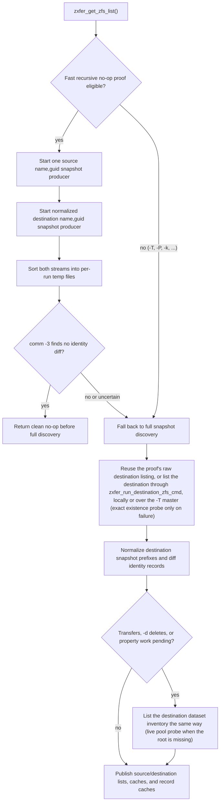
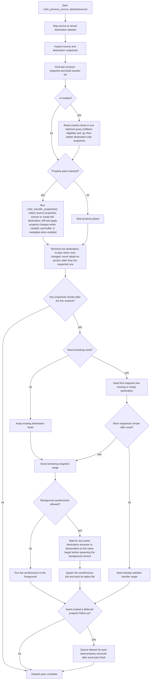
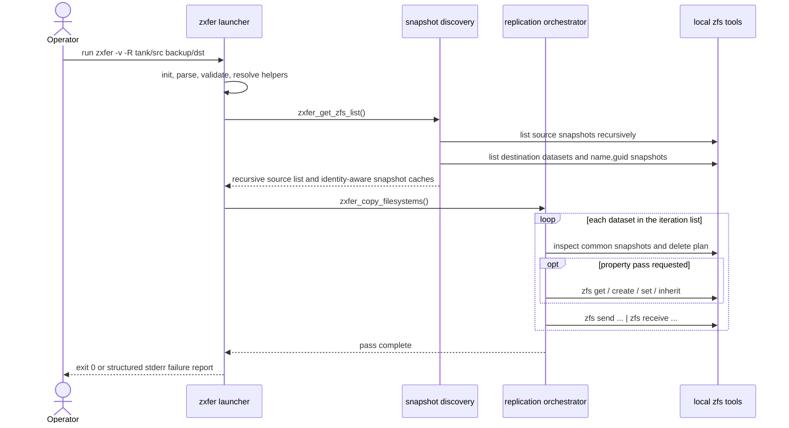
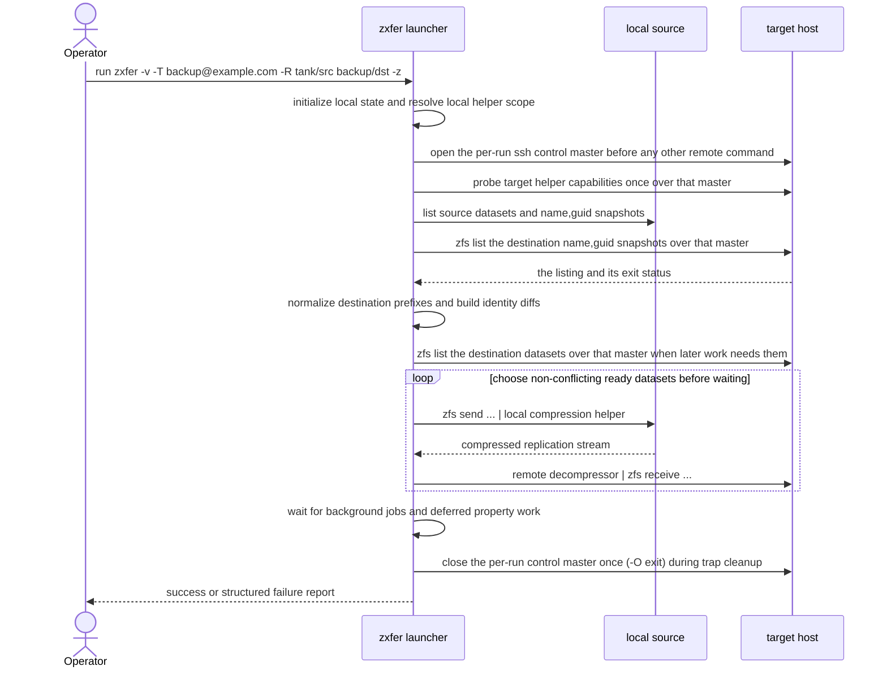
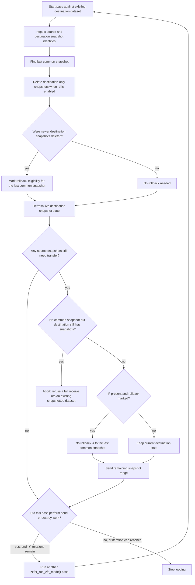

# Architecture

## Entry Point

- [../zxfer](../zxfer): top-level launcher and CLI entry point

The entry script now sources only
[../src/zxfer_modules.sh](../src/zxfer_modules.sh). That loader owns runtime
module order for the launcher, `tests/test_helper.sh`, and other
direct-sourcing fixtures, so the flat `src/` layout keeps one canonical source
sequence.

## Module Layout

The `src/` tree is flat and grouped by responsibility. The main flow stays in
the module that performs the work; small state updates do not need a separate
module or a chain of setters.

- [../src/zxfer_modules.sh](../src/zxfer_modules.sh): canonical loader and
  source-order entry point for the runtime modules
- [../src/zxfer_reporting.sh](../src/zxfer_reporting.sh): structured failure
  reporting and its validated `ZXFER_ERROR_LOG` mirror, verbose output
  helpers, usage errors, and operator-facing status
- [../src/zxfer_quoting.sh](../src/zxfer_quoting.sh): literal token splitting,
  single-quote escaping, and argv-to-shell rendering primitives; the
  line-control constants, `zxfer_split_begin`/`zxfer_split_end`, and the
  `*_into_result` helpers run in the current shell without command
  substitutions
- [../src/zxfer_profile.sh](../src/zxfer_profile.sh): profiling counters,
  elapsed timings, and end-of-run summary rendering
- [../src/zxfer_exec.sh](../src/zxfer_exec.sh): shell-safe token handling,
  generic command rendering, foreground execution, and cleanup-aware short-
  lived background helpers; it has no remote-capability or snapshot-state
  dependency
- [../src/zxfer_dependencies.sh](../src/zxfer_dependencies.sh): secure PATH
  computation, in-shell required-tool lookup (`zxfer_find_tool_in_path`,
  executable regular files only), and local dependency validation
- [../src/zxfer_path_security.sh](../src/zxfer_path_security.sh): filesystem
  ownership/mode checks and symlink-aware trusted-path validation
- [../src/zxfer_runtime.sh](../src/zxfer_runtime.sh): validated per-run temp
  root, runtime artifact allocation/readback, short-lived cleanup-PID rows,
  and the identity/path cleanup registry of the one path-adjacent entry left,
  the ssh transport's short fallback socket directory
- [../src/zxfer_ssh_transport.sh](../src/zxfer_ssh_transport.sh): validated
  host/wrapper parsing (`-O`/`-T` host specs parsed once per value), managed
  SSH options, ssh argv assembled per call with the role's control socket,
  direct argv invocation versus rendered shell-pipeline channels, an
  argv-preserving zfs role runner and renderer, active remote ZFS routing, and
  per-run control-socket lifecycle
- [../src/zxfer_remote_hosts.sh](../src/zxfer_remote_hosts.sh): remote helper
  resolution, one fail-closed capability probe per role, host and requested
  tool set, kept for the run in one in-memory slot per role (origin, target),
  and resolved remote OS/tool selections; it consumes the SSH transport API
  but does not own transport state
- [../src/zxfer_cli.sh](../src/zxfer_cli.sh): CLI parsing, option validation,
  and compression command interpretation
- [../src/zxfer_snapshot_state.sh](../src/zxfer_snapshot_state.sh): the one
  per-dataset record filter over the flat per-run snapshot record files, the
  in-shell destination
  existence probe and its linear existence cache, fork-free source-to-
  destination dataset mapping, and the once-per-pass batched live destination
  view with its per-dataset dirty list and depth-1 live record file
- [../src/zxfer_backup_metadata.sh](../src/zxfer_backup_metadata.sh): the
  `-k`/`-e` property backup metadata module: exact-keyed storage layout, the
  local and rendered-remote directory/write/read/storage-listing protections,
  rows buffered in memory and published at completed property checkpoints and
  run end, per-dataset forwarded provenance (each alias read at most once per
  run), and restore lookup
- [../src/zxfer_property_state.sh](../src/zxfer_property_state.sh): the
  name-list property parser (`ZXFER_PROPERTY_NORMALIZE_AWK`: per-dataset merge
  and recursive prefetch, trusting only a unique-headed run of one-line
  records from the first line), lone re-reads of every other property, the
  per-iteration in-memory property tables with
  targeted destination invalidation, live normalized lookups, argv decoding,
  and required creation-time property backfill
- [../src/zxfer_property_policy.sh](../src/zxfer_property_policy.sh): readonly
  and noninheritable defaults, override validation and derivation, one-pass
  readonly/`-I`/`-U` list filtering, source create-time metadata, and the `-U`
  destination-support scan
- [../src/zxfer_property_reconcile.sh](../src/zxfer_property_reconcile.sh):
  source collection (with `-e` restore), destination creation, destination
  set/inherit execution, property diffing and child-inherit adjustment, and
  the linear per-dataset `zxfer_transfer_properties` flow
- [../src/zxfer_snapshot_producers.sh](../src/zxfer_snapshot_producers.sh):
  source/destination command production, staged execution, and snapshot-stream
  normalization
- [../src/zxfer_snapshot_discovery.sh](../src/zxfer_snapshot_discovery.sh):
  discovery orchestration (a `-T` destination is listed like a local one),
  source/destination diffing, cache publication, recursive discovery state,
  and complete full/fast-no-op artifact groups
- [../src/zxfer_migration_services.sh](../src/zxfer_migration_services.sh):
  `-m`/`-c` preparation (stopping `-c` services, the mounted checks, the source
  unmounts, and the `-m` snapshot plus rediscovery) and Solaris/illumos SMF
  restart and recovery. It calls back into replication (`zxfer_newsnap`,
  `zxfer_refresh_dataset_iteration_state`), and replication calls its
  `zxfer_prepare_migration_services`, so the two modules depend on each other
- [../src/zxfer_send_jobs.sh](../src/zxfer_send_jobs.sh): send/receive job
  registry, status-file completion, abort handling, job limits, and destination-
  ancestry serialization
- [../src/zxfer_send_receive.sh](../src/zxfer_send_receive.sh): send /
  receive command construction, the `-D` progress stage, compression
  handling, and ssh wrapping, all rendered in the current shell as plain shell
  text so a `-j` job shell needs no zxfer function
- [../src/zxfer_snapshot_reconcile.sh](../src/zxfer_snapshot_reconcile.sh):
  one-awk-pass snapshot planning (common snapshot, transfer list, divergence,
  and the `-d` delete list), one batched creation-time query per delete plan
  that decides rollback eligibility and `-g`, deletion with its safety
  rechecks, the divergence contract, and reusable run-scoped plan and
  creation-time scratch files
- [../src/zxfer_replication.sh](../src/zxfer_replication.sh): dataset iteration,
  per-dataset planning state, the `-g` pre-pass, the live destination
  recheck, the per-pass send/destroy marker used by `-Y`, and orchestration
  across discovery, reconciliation, and transfer
- [../src/zxfer_session.sh](../src/zxfer_session.sh): final composition root for
  owner resets, CLI-to-execution-context startup, remote connection
  preparation, trap registration, ordered shutdown, and top-level execution

## Initialization And State Ownership

The startup path is intentionally explicit:

1. [../src/zxfer_modules.sh](../src/zxfer_modules.sh) loads the flat module
   stack in one canonical order without source-time initialization.
2. `zxfer_reset_session_state()` in
   [../src/zxfer_session.sh](../src/zxfer_session.sh) calls each module's
   owner reset once, in a fixed order, and only assigns. It resets dependency
   commands first (`zxfer_reset_dependency_state()`), because the ssh and
   remote-host resets read `g_cmd_ssh` and `g_cmd_zfs`. Inherited process,
   SSH, path, and migration-service handles are dropped without acting on
   them, so an exported `g_*` value can never grant cleanup ownership.
3. `zxfer_session_initialize()` points `g_cmd_awk` at the awk on the built-in
   secure PATH, installs the EXIT and HUP/INT/QUIT/TERM traps, then runs
   `zxfer_init_session_environment()`: secure PATH, `ZXFER_BACKUP_DIR`,
   required helpers (awk, zfs, ps, optional parallel; looked up in the shell
   by `zxfer_find_tool_in_path`), run temp root, then the narrowed and
   exported PATH.
4. Module-specific mutable scratch state stays with the owning module rather
   than being duplicated in the runtime layer. The main examples are
   [../src/zxfer_send_jobs.sh](../src/zxfer_send_jobs.sh),
   [../src/zxfer_snapshot_discovery.sh](../src/zxfer_snapshot_discovery.sh),
   [../src/zxfer_snapshot_reconcile.sh](../src/zxfer_snapshot_reconcile.sh),
   [../src/zxfer_send_receive.sh](../src/zxfer_send_receive.sh),
   [../src/zxfer_backup_metadata.sh](../src/zxfer_backup_metadata.sh), and
   [../src/zxfer_property_state.sh](../src/zxfer_property_state.sh).
5. `zxfer_prepare_remote_host_connections()` resolves ssh, opens each remote
   role's control master through `zxfer_open_ssh_control_sockets()` (ssh
   transport), then preloads each host's capabilities over it (remote hosts),
   so no later remote command opens its own connection when control sockets
   are supported.
   `zxfer_init_variables()` then looks up the local OS once
   (`g_zxfer_local_os`), runs `zxfer_init_endpoint_execution_context
   origin|target`, and resolves helper paths and platform-specific bootstrap
   details.

The sensitive-caller ratchets in `tests/budget_policy.tsv` cap security- and
performance-sensitive call sites, including the single hardened production
`eval` site. Module boundaries and function sizes are review decisions.
Functions use distinct `l_*` scratch names when calling one another in the
same shell because POSIX shell has no function-local variables. Shared `g_*`
state is appropriate when later phases need it; values used by one linear
flow stay in that flow. Single-caller wrappers can be inlined when this makes
the behavior easier to follow.

The stable `tests/test_helper.sh` entry point loads every module in manifest
order and owns only test lifecycle and process capture. Domain helpers such as
backup renderers and environment-driven fake tools are opt-in fixture modules
sourced only by their owning suites; this keeps fixture functions from
becoming an implicit global test API.

## Runtime Artifact Layer

All run-private transient state lives under one per-run 0700 temp root,
created with a single `mktemp -d` after TMPDIR is validated once (single-pass
physical resolution plus owner/mode checks). Allocators in
[../src/zxfer_runtime.sh](../src/zxfer_runtime.sh) hand out
`<prefix>.<counter>` children by redirection or `mkdir`; there is no per-file
registration or unregistration ceremony for contained children. Runtime
records the exact root, validated physical parent, and a security record
(inode, owner uid, mode 0700) taken right after its own `mktemp -d`;
whole-root removal requires that provenance, one fresh record equal to it
(one `ls -ldin`, no `id` fork), and the reserved `zxfer.<pid>.*` shape.
[../src/zxfer_path_security.sh](../src/zxfer_path_security.sh) reads every
owner, mode and inode from one `ls -ldin` line (inode, mode string, link
count, numeric owner: the POSIX fields every supported `ls` prints), checks a
TMPDIR candidate in one subshell (`cd -P`, `pwd`, then `exec ls`), and asks
`id -u` at most once per run.
`zxfer_trap_exit()` in
[../src/zxfer_session.sh](../src/zxfer_session.sh) removes the whole root only
after supervised jobs, short-lived cleanup helpers, SSH control sockets, and
registered path-adjacent staging entries have been handled. Staged contents
reload through the shared readback helper, which keeps partial payloads out of
shared `g_*`
scratch state and preserves exact nonzero readback failures for the caller.
Registered path-adjacent directories also retain their allocation-time
device/inode identity. Recursive cleanup requires that identity to remain
unchanged. The short fallback SSH socket directory, made only when the run
root's socket path would be too long, is created once per run and registered
with its device/inode identity like other path-adjacent entries. A same-path
replacement is never adopted as zxfer-owned state.

Not every staging flow belongs in that layer. Modules that intentionally stage
files beside the final target to preserve same-directory atomic rename
continue to own that path-adjacent staging locally. In particular, backup
metadata publication (0600 stage files beside the targets, atomic renames,
and a recovery copy for detected pair-publication failures) lives in
[`../src/zxfer_backup_metadata.sh`](../src/zxfer_backup_metadata.sh).

Snapshot artifacts also have narrower owners above the allocator. Full
discovery and the fast recursive no-op proof each allocate one complete ordered
file group, retain its handles in operation-specific state, and clean the group
from one terminal path. Discovery owns the flat source/destination record files
that survive for later lookups. Snapshot reconciliation owns a reusable plan
file and a reusable creation-time file, and snapshot state owns the reusable
live destination view and depth-1 listing files; all four are reused across
datasets for one run, are
not cleared by a per-dataset state reset, and are reused only when they lie
under the run's private temp root. The
runtime layer allocates and verifies these contained files but does not adopt
their domain lifecycle.

Before each send, the live recheck lists the dataset's destination rows
through `zxfer_get_live_destination_record_file`. That listing is served from
the pass's batched destination view until zxfer itself receives into, rolls
back, or destroys snapshots of the dataset; after that it is a depth-1 live
listing. The recheck keeps inspect's plan when those rows equal the rows it
was planned from, and otherwise re-plans through
`zxfer_plan_dataset_snapshots`. A common snapshot older than the inspected
anchor is never adopted: the anchor and pending records are republished
without an anchor, so the seed refuses a snapshotted destination, or re-seeds
an emptied one from the anchor with `-F`. A snapshot that another tool prunes
on the destination after the view was captured is not seen until the next
pass; the incremental receive then fails without changing the destination.

Parallel send/receive scheduling lives in
[../src/zxfer_send_jobs.sh](../src/zxfer_send_jobs.sh). Each running job has
one registry row containing its ID, PID, destination, status-file path,
snapshot, and cleanup scope. The job shell records its exit status in the
private status file. The parent polls all active jobs and reaps every finished
job in one scan, each reap reading stdin from `/dev/null`, so a later
completion can free a slot before an earlier job finishes; missing or invalid
status fails closed. Send/receive and `-D` stages are rendered in the main
shell as plain shell, so job shells need no zxfer functions. Source discovery
is simpler: it waits directly on its registered helper PID and checks the
command's status.

[../src/zxfer_exec.sh](../src/zxfer_exec.sh) selects background isolation once.
A working `setsid` is preferred; shell job control is feature-tested when
there is no controlling terminal, and only where it also isolates jobs
started from a subshell (bash; FreeBSD sh, dash and ksh93 use the wrapper when
`setsid` is unavailable). Job shells run `/bin/sh`. Both paths require a
process group whose ID is the spawned child's PID. Otherwise
[../src/zxfer_cleanup_child_wrapper.sh](../src/zxfer_cleanup_child_wrapper.sh)
provides bounded direct-child cleanup and token-validated descendant cleanup.
Abort sends TERM, allows a bounded grace period, then escalates with KILL and
reaps. Group cleanup covers pipeline stages even when the job-shell leader
has already exited. A job that has recorded its exit status gets only a
process-group signal, and the bare-PID fallback is used only while the PID is
still in zxfer's own process group, so a recycled PID is never signalled.
After a failed wait, discovery signals only a pgid-scoped producer's group and
never the reaped PID, whose number may have been recycled. In wrapper mode,
stages that outlive the reaped wrapper are reparented and are not stopped.
Normal completion avoids process-table snapshots. Every group probe and
signal goes through `zxfer_signal_process_group`, which uses the signal-first
`kill -SIG -PGID` form: it is the one form dash, bash 3.2, ksh93, FreeBSD sh
and BusyBox ash all read, while `kill -s SIG -- -PGID` makes BusyBox ash exit 1
after signalling the group.

The fallback wrapper uses ancestry snapshots, which cannot contain an
arbitrary descendant that forks and escapes before the next snapshot. A
descendant is signalled only when its current start token is readable and
matches the recorded one. One whose token changed or cannot be read counts as
stopped only when it no longer takes signals or `ps` reports it as a zombie.
Process-group isolation provides stronger containment for pipelines that
remain in their assigned group. Shells may reap children internally before
an explicit `wait`, so retained PID records alone are not a universal
protection against PID reuse. Cleanup failures propagate through the session's
structured failure path, including managed SSH control-socket close failures.
Short-lived helpers use the same spawn scopes and the runtime cleanup registry.

## Error Log Append

zxfer takes no cross-process locks. The only file that concurrent runs share
is the operator's `ZXFER_ERROR_LOG`, and
[../src/zxfer_reporting.sh](../src/zxfer_reporting.sh) appends each failure
report to it with one `O_APPEND` write, which the kernel places at the end of
the file as a unit. Before every append it checks the path (no symlinked
component, a trusted parent, a regular 0600 file with a single link, owned by
root or the effective user) and creates a missing log under umask 077 with
noclobber. The write goes through awk rather than the shell's `printf`: bash
line-buffers its builtins' output, so a report printed by the shell would go
out one line per write and could interleave with another run's report. The
lock directories, lease entries, ssh socket locks, and capability-cache locks
of earlier versions are gone; ssh control sockets and remote capability state
are per-run and need no cross-process coordination.

## Remote Protocol Rendering And Capability State

Remote capability probes and the secure backup directory/write/read and
`-O` storage-listing protocols, including their shared prelude and symlink
walk, are assembled as
readable multiline POSIX `sh` programs. Their stages, quoting, status values,
and publication topology are reviewable directly and pinned by golden
fixtures. The SSH
transport retains the established rendering for short, single-line scripts.
For long or multiline scripts it places bounded, quoted data chunks on one
physical login-shell command line; a fixed POSIX `sh` bootstrap reconstructs
the exact program before the explicit `sh -c` handoff. This keeps individual
words below the illumos csh lexical limit while preserving standard input and
the program's exit status.
Remote zfs commands are rendered from argv; when an argument contains a
newline the command uses the same chunked form, so argument boundaries,
including empty arguments, survive a csh login shell.
`ZXFER_SECURE_PATH`, `ZXFER_SECURE_PATH_APPEND`, resolved helper paths, and
`ZXFER_BACKUP_DIR` reject tab, carriage-return, and line-feed bytes before that
rendering, so transport compatibility cannot translate trusted configuration.

One accepted capability response is parsed once and checked for framing,
requested-tool coverage, duplicate records, statuses, and helper-path shape.
Only then are the OS, zfs status and validated tool records stored in that
role's slot, keyed by host and requested tool set. Later OS and tool lookups
for the same role, host and scope load those fields without another probe or
parse. A failed lookup leaves no parsed fields behind. A tool outside the
host's scope is probed as "zfs TOOL", and a tool without a record gets one
direct probe. Secure PATH and ssh policy cannot change within a run, so they
are not part of the key.

## Recursive Property Prefetch

`zfs get -H` prints property values raw, and a value may hold TAB and LF, so
a value line can look exactly like another record. Every `zfs get all` read
therefore takes the machine (`-Hpo`) and human (`-Ho`) views first and then
lists the record keys alone: `zfs get -H -o property all DS` per dataset, or
`zfs get -r -t filesystem,volume -H -o name,property all ROOT` for the
recursive prefetch (snapshot and bookmark rows never enter the capture).
Names hold neither TAB nor LF, so the list is unambiguous, and reading it last
means a dataset or property removed between the calls is never listed. Each
status is checked; a failed or rejected tree read falls back to per-dataset
reads.

The parser (`ZXFER_PROPERTY_NORMALIZE_AWK`, run behind the shared
`ZXFER_PROPERTY_AWK_LIB` helpers like every property `awk` program) accepts
record i only in an unbroken run from line 1: lines i and i+1 start with keys
i and i+1, and no other line starts with either key. The value runs from the
key's TAB to the line's last TAB, since a source holds none. A malformed or
repeated list row fails the read closed. The prefetch emits merged
`dataset<TAB>payload` rows directly into the side's in-memory table only for
wanted datasets (one name per filter line) whose every record is in the run
in both views; the rest take the per-dataset path, which re-reads every
property after the run alone
(`zfs get -H[p]o property,value,source -- PROP DS`, where `--` keeps a user
property name that starts with `-` from being parsed as an option, split at
its last TAB). A multi-line value therefore costs two extra `zfs get` calls
for each later property of that dataset, and in a recursive read sends every
later dataset to per-dataset reads. A user property that a lone re-read
reports with source `-` was removed after the name list and is left out, as
if the read had begun after the removal (a set user property never has that
source; native properties keep it). Two races remain (see
[../KNOWN_ISSUES.md](../KNOWN_ISSUES.md)): a wanted dataset destroyed before
the value views and recreated (or renamed away and back) before the name list
can take values forged by the value printed before it, native properties
included; and a user property created between the value views and the name
list takes its value and source from the user property value printed just
before it, which is published cut at its first line feed.
Property reads reuse five per-run scratch files (name list, machine view,
human view, zfs stderr, prefetch dataset filter); no intermediate grouped file
is read back. A destination create, set, inherit, or receive
strips the mutated dataset's row and its descendants' rows. Property lists
reach `awk` only through `ENVIRON`, never `awk -v`, and every call sets each
`ZXFER_AWK_*` variable it reads. Serialized values are decoded in the shell
one item per argument, so no byte in a property value can become an extra
`zfs create` or `zfs set` argument, locally or over `-T`.

## High-Level Replication Flow

1. Bootstrap with the built-in trusted PATH allowlist, capture the invocation,
   and source the flat module stack.
2. Reset every owner's state (inherited cleanup handles are dropped without
   side effects), bootstrap awk, register runtime traps, then prepare the
   secure PATH, helpers, and run temp root through the explicit session flow.
3. Parse CLI options, validate combinations, and resolve source and
   destination execution context.
4. Build identity-aware dataset and snapshot lists. Eligible recursive no-op
   runs (local sources and `-O` pulls alike) first try the fast `name,guid`
   proof. A `-T` destination is listed like a local one: each destination
   `zfs list` runs over the target's ssh control master.
5. With `-g`, plan every dataset of the pass and refuse divergence before
   anything is sent, received, or destroyed on the destination; with `-d`,
   also check each planned destination delete against `-g`. Then inspect
   source versus destination state per dataset.
6. Optionally delete destination-only snapshots.
7. Transfer snapshots in `zxfer_copy_snapshots()`: recheck the destination
   (re-planning when its rows changed), seed when needed, then send the
   remaining range. Seed-only
   receive `-F` is passed as an internal execution flag without mutating the
   parsed `g_option_*` state.
8. For parallel sends, `zxfer_send_jobs.sh` starts the pipelines, polls their
   status files, reaps completed jobs, and aborts remaining jobs on failure.
   Parallel send/receive scheduling also serializes conflicting
   ancestor/descendant destination datasets on the same target while a
   ready-queue pass skips blocked descendants and starts later independent
   datasets before waiting.
9. Optionally transfer or restore properties, including exact-keyed v2 backup
   metadata reads, source-root-relative restore rows, and deferred post-seed
   reconciliation for datasets that were seeded into empty destinations.
10. Repeat when `-Y` is enabled.
11. Emit structured failure reporting on non-zero exit.

## Execution Lifecycle Diagrams

The following Mermaid diagrams describe the current execution path through the
launcher plus the main orchestration modules. They intentionally use the real
function boundaries so operators and contributors can line the diagrams up with
[`../zxfer`](../zxfer),
[`../src/zxfer_runtime.sh`](../src/zxfer_runtime.sh),
[`../src/zxfer_send_jobs.sh`](../src/zxfer_send_jobs.sh),
[`../src/zxfer_ssh_transport.sh`](../src/zxfer_ssh_transport.sh),
[`../src/zxfer_remote_hosts.sh`](../src/zxfer_remote_hosts.sh),
[`../src/zxfer_snapshot_producers.sh`](../src/zxfer_snapshot_producers.sh),
[`../src/zxfer_snapshot_discovery.sh`](../src/zxfer_snapshot_discovery.sh),
[`../src/zxfer_snapshot_reconcile.sh`](../src/zxfer_snapshot_reconcile.sh),
[`../src/zxfer_property_state.sh`](../src/zxfer_property_state.sh),
[`../src/zxfer_property_policy.sh`](../src/zxfer_property_policy.sh),
[`../src/zxfer_property_reconcile.sh`](../src/zxfer_property_reconcile.sh),
[`../src/zxfer_send_receive.sh`](../src/zxfer_send_receive.sh),
[`../src/zxfer_replication.sh`](../src/zxfer_replication.sh), and
[`../src/zxfer_session.sh`](../src/zxfer_session.sh).

### General Run Lifecycle

This is the end-to-end path for one `zxfer` invocation, including remote
bootstrap, one or more replication passes, and trap-driven shutdown.

```mermaid
flowchart TD
    A["User invokes zxfer"] --> B["Early bootstrap: trusted PATH allowlist and invocation capture"]
    B --> C["Source zxfer_modules.sh to define the pure loader"]
    C --> C1["Call zxfer_load_modules() for the canonical manifest"]
    C1 --> D["Reset session state with zxfer_reset_session_state()"]
    D --> D1["Bootstrap awk from the built-in secure PATH"]
    D1 --> D2["Register zxfer_trap_exit() for EXIT and signals"]
    D2 --> D3["Run zxfer_init_session_environment()"]
    D3 --> E["Parse flags with zxfer_read_command_line_switches()"]
    E --> F["Validate combinations with zxfer_consistency_check()"]
    F --> G["When -O or -T is configured: open each role's ssh control master, then probe remote capabilities once per role over it into in-memory state"]
    G --> H["Resolve local and needed remote helper paths with zxfer_init_variables()"]
    H --> I["Enter zxfer_run_zfs_mode_loop()"]
    I --> J["Start one pass in zxfer_run_zfs_mode()"]
    J --> K["Resolve source and destination, reject control characters, validate preconditions"]
    K --> L["Name the -m snapshot first, then prepare the ZXFER_BACKUP_DIR root when -k is enabled (dry runs preview it)"]
    L --> M{"Dry run?"}
    M -- "yes" --> N["Preview-only path: seed a minimal source list and skip live discovery"]
    M -- "no" --> O["Initialize live replication context"]
    O --> P["Optional -e restore metadata load before discovery"]
    P --> Q["Run zxfer_get_zfs_list() to cache source and destination state"]
    Q --> Q1["Source snapshot listing runs as a tracked background helper and later waits by PID"]
    Q1 --> R["Optional unsupported-property probing when -U has later work to filter"]
    R --> S["Optional preflight snapshot via -s or migration prep via -m"]
    S --> T["-g pre-pass: plan every dataset and refuse divergence; with -d apply -g to planned deletes before copy"]
    T --> U["Run zxfer_copy_filesystems()"]
    N --> V{"Repeat pass?"}
    U --> W["Fill a ready queue with background send/receive jobs, skipping blocked destination descendants while independent work exists"]
    W --> X["Reap completed send jobs, then run deferred post-seed property reconcile"]
    X --> Y["Relaunch services after -m if needed"]
    Y --> V
    V -- "yes: -Y and send/destroy work occurred" --> J
    V -- "no" --> Z["Invoke the final -k backup metadata write (a dry run buffers no rows and only notes the skip)"]
    Z --> AA["Normal exit path"]
    AA --> AB["zxfer_trap_exit(): abort owned jobs/helpers, close SSH sockets, remove registered staging and the proven run root, restore migration services, then emit profiling and structured failure output"]
```

### Snapshot Discovery And No-Op Proof

`zxfer_get_zfs_list()` owns the initial source and destination view used by
later delete, seed, send, and property decisions. Snapshot records stay
identity-aware at this layer: source and destination snapshot lists use
`zfs list -Hr -o name,guid -t snapshot`, and destination records are normalized
by rewriting only the leading destination dataset prefix.

For eligible recursive runs — local sources and remote-origin `-O` pulls
alike since Phase 8 — `zxfer_try_fast_recursive_noop_discovery()` attempts a
clean no-op proof before the heavier creation-order source discovery path.
Eligibility is intentionally narrow: `-R` must be active, `-T` must be
absent, and snapshot creation, migration, property transfer or restore,
backup metadata, and property overrides must be inactive.
The proof starts one recursive source `name,guid` producer even when `-j` is
configured, starts one normalized destination `name,guid` producer, sorts both
streams into regular files under the per-run temp root, and treats a non-empty
`comm -3` diff as a mismatch. `-U` unsupported-property filtering and `-g`
grandfather protection can remain enabled because a proven no-op leaves no
source transfer queue, destination delete queue, or property/create work to
consume those checks. A mismatch, missing destination, excluded-dataset
uncertainty, or stream failure falls back to full discovery or fails through the
same staged stderr paths used by the normal discovery flow. A proven clean no-op
never runs the creation-order source listing. When the proof declines after a
successful destination listing, full discovery normalizes that raw listing
instead of listing again. A full-discovery listing checks destination
existence only when the listing itself fails. The destination producer writes
one status line for its list, normalize, and sort stages.

A `-T` destination takes the same full-discovery path as a local one. Every
destination `zfs list` goes through `zxfer_run_destination_zfs_cmd`, which
runs it on the target over the role's ssh control master, and each listing's
own exit status gates its output file (ssh exits 255 when the connection
drops), so there is no target-side script or framing protocol to validate.
The destination snapshot listing overlaps the source listing; when it fails,
the exact existence probe decides between a missing dataset (bootstrap) and
a failed run. A `-T` listing that ssh could not deliver (status 255, which
zfs never returns) says nothing about the dataset, so the run stops with
that status without probing over the same connection. After the diff, the
recursive dataset inventory is listed only when later work reads it
(transfers, `-d` deletes, property work), so a clean `-T` no-op lists no
inventory; a missing destination root is bootstrapped only after the live
pool probe lists its pool. Snapshot-list stderr precedes the `Failed to
retrieve snapshot list from the destination.` report, locally and over `-T`.

```mermaid
flowchart TD
    A["zxfer_get_zfs_list()"] --> B{"Fast recursive no-op proof eligible?"}
    B -- "yes" --> C["Start one source name,guid snapshot producer"]
    C --> D["Start normalized destination name,guid snapshot producer"]
    D --> E["Sort both streams into per-run temp files"]
    E --> F{"comm -3 finds no identity diff?"}
    F -- "yes" --> G["Return clean no-op before full discovery"]
    F -- "no or uncertain" --> H["Fall back to full snapshot discovery"]
    B -- "no (-T, -P, -k, ...)" --> H
    H --> L["Reuse the proof's raw destination listing, or list the destination through zxfer_run_destination_zfs_cmd, locally or over the -T master (exact existence probe only on failure)"]
    L --> M["Normalize destination snapshot prefixes and diff identity records"]
    M --> I{"Transfers, -d deletes, or property work pending?"}
    I -- "yes" --> J["List the destination dataset inventory the same way (live pool probe when the root is missing)"]
    I -- "no" --> N["Publish source/destination lists, caches, and record caches"]
    J --> N
```

### Per-Dataset Replication Lifecycle

Each dataset in the iteration list flows through one orchestration pass in
`zxfer_process_source_dataset()`. This is the core lifecycle inside
`zxfer_copy_filesystems()`.

```mermaid
flowchart TD
    A["Start zxfer_process_source_dataset(source)"] --> B["Map source to actual destination dataset"]
    B --> C["Inspect source and destination snapshots"]
    C --> D["Find last common snapshot and build transfer list"]
    D --> E{"-d enabled?"}
    E -- "yes" --> F["Read creation times in one batched query (rollback eligibility and -g), then delete destination-only snapshots"]
    E -- "no" --> G{"Property pass required?"}
    F --> G
    G -- "yes" --> H["Run zxfer_transfer_properties(): collect source properties, ensure or create the destination, diff and apply property changes when needed, and buffer -k metadata when enabled"]
    G -- "no" --> I["Skip property phase"]
    H --> J["Recheck live destination; re-plan when rows changed; never adopt an anchor older than the inspected one"]
    I --> J
    J --> K{"Any snapshots remain after the live recheck?"}
    K -- "no" --> X["Dataset pass complete"]
    K -- "yes" --> L{"Need bootstrap seed?"}
    L -- "yes" --> M["Seed first snapshot into missing or empty destination"]
    L -- "no" --> N["Keep existing destination head"]
    M --> O{"More snapshots remain after seed?"}
    N --> P["Send remaining snapshot range"]
    O -- "yes" --> P
    O -- "no" --> Q["Seed already satisfies transfer range"]
    P --> R{"Background send/receive allowed?"}
    R -- "yes" --> S["Wait for any active destination ancestor or descendant on the same target before spawning the background receive"]
    R -- "no" --> T["Run the send/receive in the foreground"]
    S --> U["Spawn the send/receive job and track its status file"]
    T --> V{"Seed created a deferred property follow-up?"}
    U --> V
    Q --> V
    V -- "yes" --> W["Queue dataset for post-seed property reconcile after send jobs finish"]
    V -- "no" --> X["Dataset pass complete"]
    W --> X
```

Live `-k` rows stay buffered in memory between write checkpoints.
`zxfer_write_backup_properties()` publishes the exact-pair file and the
forwarded alias after each post-seed property pass that ran, and at run end.
Each file is staged completely with mode 0600 and atomically renamed into
place. Until that rename, its previous complete contents remain available.
Both files are prepared before publication. A detected failure publishing
the second file restores the first file, or removes it if it did not exist
before. A failed rollback retains a private recovery copy and reports its
path. The two renames are not crash-atomic: an abrupt process or host failure
can still interrupt the pair between publications.

A chained `-k` run takes each dataset's provenance from the nearest forwarded
alias at or above it that has a row for it; an invalid alias anywhere on that
path stops the run. An alias without a row for its own root, which `-k` writes
when `-x` excludes the source root, is valid. Each alias root is looked up at most once per run and its
rows are kept in memory for later datasets and the post-seed pass. `-O` runs
first list the origin's storage directories with one ssh call, then read each
listed root once.

### Example: Local Recursive Replication

This is the common local-to-local path for a command such as
`./zxfer -v -R tank/src backup/dst`. No ssh setup is needed, so discovery and
transfer stay entirely local.

```mermaid
sequenceDiagram
    actor Operator
    participant Launcher as zxfer launcher
    participant Discovery as snapshot discovery
    participant Repl as replication orchestrator
    participant ZFS as local zfs tools

    Operator->>Launcher: run zxfer -v -R tank/src backup/dst
    Launcher->>Launcher: init, parse, validate, resolve helpers
    Launcher->>Discovery: zxfer_get_zfs_list()
    Discovery->>ZFS: list source snapshots recursively
    Discovery->>ZFS: list destination datasets and name,guid snapshots
    Discovery-->>Launcher: recursive source list and identity-aware snapshot caches
    Launcher->>Repl: zxfer_copy_filesystems()
    loop each dataset in the iteration list
        Repl->>ZFS: inspect common snapshots and delete plan
        opt property pass requested
            Repl->>ZFS: zfs get / create / set / inherit
        end
        Repl->>ZFS: zfs send ... | zfs receive ...
    end
    Repl-->>Launcher: pass complete
    Launcher-->>Operator: exit 0 or structured stderr failure report
```

### Example: Remote Pull From An Origin Host

This shows the main remote-origin lifecycle for a command shape such as
`./zxfer -v -O user@origin -R zroot backup/zroot -j8 -z`. The destination is
local, so the send side is remote and the receive side is local.

```mermaid
sequenceDiagram
    actor Operator
    participant Launcher as zxfer launcher
    participant Origin as origin host
    participant Local as local destination

    Operator->>Launcher: run zxfer -v -O user@origin -R zroot backup/zroot -j8 -z
    Launcher->>Launcher: initialize local state and determine the needed remote helper scope
    Launcher->>Origin: open the per-run ssh control master (-M -S under the private temp root) before any other remote command
    Launcher->>Origin: probe remote helper capabilities once over that master
    Launcher->>Launcher: serve later zfs, parallel, and compression helper lookups from the per-run in-memory capability state
    Launcher->>Local: list destination datasets and snapshots
    Launcher->>Origin: for eligible no-snapshot recursive pulls, list source snapshot identity records with one recursive stream
    alt source and destination identity records match after excludes
        Launcher->>Launcher: return clean no-op before creation-order discovery
    else identity records differ or fast proof is not eligible
        Launcher->>Origin: build the source dataset inventory with remote zfs list
        Launcher->>Origin: fan out per-dataset snapshot listing via the resolved origin-host parallel helper
    end
    Launcher->>Launcher: build the iteration list; clean no-op runs return here
    loop fill ready queue while job slots remain
        Launcher->>Origin: start remote zfs send ... | remote compression helper
        Origin-->>Launcher: compressed replication stream over ssh
        Launcher->>Local: local decompressor | zfs receive ...
    end
    Launcher->>Launcher: wait for remaining background jobs and deferred property work
    Launcher->>Origin: close the per-run control master once (-O exit) during trap cleanup
    Launcher-->>Operator: success or structured failure report
```

### Example: Remote Push To A Target Host

This shows the destination-side lifecycle for a command shape such as
`./zxfer -v -T backup@example.com -R tank/src backup/dst -z`. The source is
local, so destination discovery and receive work execute through the target
transport.

```mermaid
sequenceDiagram
    actor Operator
    participant Launcher as zxfer launcher
    participant Local as local source
    participant Target as target host

    Operator->>Launcher: run zxfer -v -T backup@example.com -R tank/src backup/dst -z
    Launcher->>Launcher: initialize local state and resolve local helper scope
    Launcher->>Target: open the per-run ssh control master before any other remote command
    Launcher->>Target: probe target helper capabilities once over that master
    Launcher->>Local: list source datasets and name,guid snapshots
    Launcher->>Target: zfs list the destination name,guid snapshots over that master
    Target-->>Launcher: the listing and its exit status
    Launcher->>Launcher: normalize destination prefixes and build identity diffs
    Launcher->>Target: zfs list the destination datasets over that master when later work needs them
    loop choose non-conflicting ready datasets before waiting
        Launcher->>Local: zfs send ... | local compression helper
        Local-->>Launcher: compressed replication stream
        Launcher->>Target: remote decompressor | zfs receive ...
    end
    Launcher->>Launcher: wait for background jobs and deferred property work
    Launcher->>Target: close the per-run control master once (-O exit) during trap cleanup
    Launcher-->>Operator: success or structured failure report
```

SSH control sockets and remote capability state are strictly per-run but have
separate owners. `zxfer_ssh_transport.sh` owns the short
`ssh-<role>.sock` paths under the private temp root (including the fallback for
long TMPDIR paths), managed options, host-wrapper parsing, and socket cleanup.
`zxfer_remote_hosts.sh` owns only in-memory capability responses and resolved
remote helpers, including the per-role slot (host, requested tools, validated
fields) reused by later lookups. Masters open during startup, before the first remote command; a `-T` spec
equal to the `-O` spec reuses the origin master. Nothing is shared between
concurrent zxfer processes, so no socket locks, leases, or capability cache
files exist to coordinate; session trap cleanup closes each opened master once
with `-O exit` before removing the temp root.

### Example: Diverged Destination With `-d`, `-F`, And `-Y`

This is the safety-oriented lifecycle when the destination has extra snapshots
or other divergence and the operator wants deletion plus convergence loops.

```mermaid
flowchart TD
    A["Start pass against existing destination dataset"] --> B["Inspect source and destination snapshot identities"]
    B --> C["Find last common snapshot"]
    C --> D["Delete destination-only snapshots when -d is enabled"]
    D --> E{"Were newer destination snapshots deleted?"}
    E -->|yes| F["Mark rollback eligibility for the last common snapshot"]
    E -->|no| G["No rollback needed"]
    F --> H["Refresh live destination snapshot state"]
    G --> H
    H --> I{"Any source snapshots still need transfer?"}
    I -->|no| O{"Did this pass perform send or destroy work?"}
    I -->|yes| J{"No common snapshot but destination still has snapshots?"}
    J -->|yes| K["Abort: refuse a full receive into an existing snapshotted dataset"]
    J -->|no| L{"-F present and rollback marked?"}
    L -->|yes| M["zfs rollback -r to the last common snapshot"]
    L -->|no| N["Keep current destination state"]
    M --> P["Send remaining snapshot range"]
    N --> P
    P --> O
    O -->|yes, and -Y iterations remain| Q["Run another zxfer_run_zfs_mode() pass"]
    Q --> A
    O -->|no, or iteration cap reached| R["Stop looping"]
```

The abort path above is a deliberate safety stop. It is the branch where
`zxfer_seed_destination_for_snapshot_transfer()` refuses to do a full receive
into an existing destination dataset that still has snapshots but no common
snapshot guid with the source.

### Example: Property Backup And Restore Lifecycle

This describes the property-management branch for `-k` backup and `-e`
restore, including the deferred reconcile path used after an initial seed into
an empty destination.

```mermaid
flowchart LR
    A["Enter zxfer_transfer_properties()"] --> B["Collect raw live source properties and validate source create metadata"]
    B --> C{"-e restore mode?"}
    C -- "yes" --> D["Replace the effective source property view with the exact v2 relative backup row"]
    C -- "no" --> E["Keep the live effective source property view"]
    D --> F["Backfill required creation-time properties"]
    E --> F
    F --> G["Derive creation and override property sets"]
    G --> H["Apply readonly, -I ignore, dataset-type -U filters, and parent-matching inheritance for inheritable child overrides"]
    H --> I{"Did zxfer create the destination during this property pass?"}
    I -- "yes" --> J["Return after creation and buffer the raw live source -k metadata row when enabled"]
    I -- "no" --> K["Collect destination properties, diff them, adjust child inheritance, and apply zfs set or inherit changes"]
    K --> L{"-k backup mode?"}
    L -- "no" --> M["Property phase complete"]
    L -- "yes" --> N["Buffer the source property row in memory (the row from the nearest earlier -k alias at or above the dataset replaces the live values)"]
    J --> O{"Later, did a seed receive require post-seed reconcile?"}
    N --> O
    O -- "yes" --> P["After send jobs finish, orchestration reruns property reconcile, which re-buffers the row (newest row wins at the write boundary), then writes both metadata files once"]
    O -- "no" --> M
    P --> M
```

## Design Priorities

The project is organized around:

- safety before throughput
- security before convenience
- testability of shell helpers
- portability across ZFS platforms

## Documentation Sources Of Truth

- man pages for the complete CLI reference
- `README.md` for the top-level overview and quick start
- `docs/` for operational and contributor guidance
- `KNOWN_ISSUES.md` for current limitations
