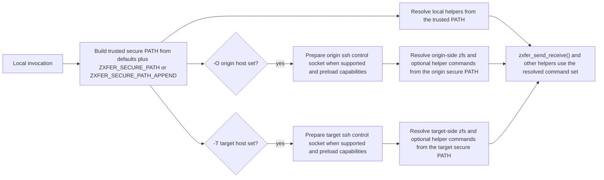
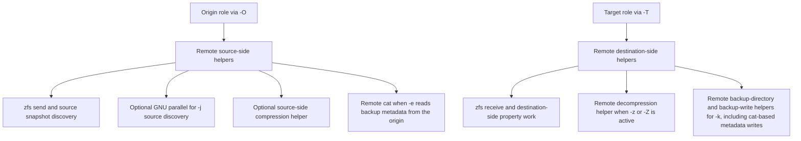

# Platform Support

## Supported Platforms

zxfer is intended to work with:

- FreeBSD with OpenZFS
- Linux with OpenZFS
- illumos / Solaris-family systems
- OpenZFS on macOS, with known property-reconciliation caveats

The project targets POSIX `/bin/sh`, so portability depends more on shell and
tool behavior than on GNU-specific scripting features.

## Integration Test Hosts

The VM-backed guest runner [../tests/run_vm_matrix.sh](../tests/run_vm_matrix.sh)
supports these host environments:

- Linux hosts with QEMU
- macOS hosts with QEMU
- Windows hosts via WSL2 running the same POSIX/QEMU workflow

Native Windows PowerShell or `cmd.exe` orchestration is intentionally not part
of the supported host surface.

Current guest targets for the VM matrix are:

- Ubuntu 24.04
- FreeBSD 15.0
- OmniOS r151056

The local runner prefers the guest architecture that best matches the host. On
Linux `amd64` hosts with KVM, and on Intel macOS hosts, the matrix uses the
pinned `amd64` guests. On Apple Silicon macOS hosts and other `arm64` hosts,
the `smoke` and `local` profiles now prefer official `arm64` Ubuntu and
FreeBSD images when QEMU's aarch64 UEFI firmware is available. OmniOS remains
an `amd64` guest, so that lane still falls back to TCG emulation on `arm64`
hosts. Those TCG runs are supported for development and debugging, but they
are not the strict isolation gate described in the testing docs.

## Tool Resolution

zxfer resolves required tools through a trusted secure-PATH model instead of
blindly inheriting the caller's `PATH`.



Important environment variables:

- `ZXFER_SECURE_PATH`: replace the default allowlist entirely
- `ZXFER_SECURE_PATH_APPEND`: append extra absolute directories
- `ZXFER_REDACT_FAILURE_REPORT_COMMANDS=1`: redact `invocation` and `last_command` in structured failure reports and any `ZXFER_ERROR_LOG` mirror
- `ZXFER_SSH_USER_KNOWN_HOSTS_FILE`: pin zxfer-managed ssh host-key checks to a specific absolute known-hosts file
- `ZXFER_SSH_USE_AMBIENT_CONFIG=1`: opt out of zxfer's default `BatchMode=yes` / `StrictHostKeyChecking=yes` transport policy

Default allowlist:

```text
/sbin:/bin:/usr/sbin:/usr/bin:/usr/local/sbin:/usr/local/bin
```

On macOS, the integration harness also prepends `/usr/local/zfs/bin` when that
OpenZFS-on-macOS path exists.

The computed allowlist also becomes the live runtime `PATH`, so an explicit
`ZXFER_SECURE_PATH` override must include every trusted helper directory that
later bare command lookups may need.

## Remote Hosts

Remote helper resolution is platform-aware for the hardened paths below and no
longer assumes the same local absolute binary path exists remotely. This
matters especially when:

- `zfs` lives in different directories between source and destination hosts
- wrapped host specs are used, for example `user@host pfexec`
- restore mode (`-e`) needs a remote `cat` on the origin, and remote backup
  writes for `-k` use `cat` on the target
- `-j` can use GNU `parallel` on the origin host for faster source snapshot
  discovery. Local-origin runs fall back to the serial discovery path when GNU
  `parallel` is unavailable or another `parallel` implementation is found.
  Remote-origin runs still fall back for an explicitly missing helper, but
  other remote helper probe or execution failures stop the run so zxfer does
  not silently mask a broken origin-side bootstrap path
- custom `-Z` compression commands or default `zstd` helpers must be resolved
  per host instead of assuming one shared absolute path
- the per-host remote-capability cache is keyed by the trusted dependency
  path, ssh transport policy, and the requested optional tool set, so repeated
  helper discovery inside one zxfer run can safely reuse matching handshake
  results without sharing stale helper-path data across different run shapes

Current releases also coordinate shared ssh control sockets, per-process ssh
leases, and remote capability-cache fills through one metadata-bearing
directory format under the validated temp root. Native `.lock` and
`leases/lease.*` paths therefore carry owner metadata instead of relying on
plain pid files, zxfer validates and reaps stale or corrupt owners before
reuse, and release failures are checked rather than silently ignored. Older
plain ssh lease files and pid-only lock directories are no longer supported;
clear stale reused cache roots before rerunning a current release.

The same validated secure `PATH` is also exported before remote capability
handshakes, helper-discovery probes, backup-directory prep, and remote
backup-metadata guard/staging scripts run, so their auxiliary
`stat`/`ls`/`id`/`awk` lookups do not fall back to the remote login shell's
ambient `PATH`.

zxfer-managed ssh transports also now force `BatchMode=yes` and
`StrictHostKeyChecking=yes` by default. They still rely on the local ssh
configuration's known-hosts sources unless `ZXFER_SSH_USER_KNOWN_HOSTS_FILE`
is set, and only `ZXFER_SSH_USE_AMBIENT_CONFIG=1` disables the zxfer-managed
ssh safety policy entirely.

In practice, the origin and target roles stay separate:



## Service Management

`-c` and migration-related service handling remain Solaris / illumos oriented.
These paths assume `svcadm` semantics and fail fast when the service manager is
not available.

## Testing Notes

Testing workflow guidance now lives in [testing.md](./testing.md), not in
[../KNOWN_ISSUES.md](../KNOWN_ISSUES.md).

Current platform-specific testing guidance:

- Prefer [../tests/run_vm_matrix.sh](../tests/run_vm_matrix.sh) for unattended
  integration coverage and for low-risk local validation on Linux, macOS, and
  WSL2 hosts. That runner keeps `integration` as its default guest test layer
  and can opt into guest shunit2 coverage with `--test-layer shunit2`.
- Keep [../tests/run_integration_zxfer.sh](../tests/run_integration_zxfer.sh)
  for manual, interactive runs on a disposable ZFS-capable host or VM when you
  explicitly want to exercise the harness outside the guest wrapper.
- Apple Silicon and other `arm64` hosts can run Ubuntu and FreeBSD guest lanes
  as `arm64`, but OmniOS remains an `amd64` guest and therefore a best-effort
  TCG lane rather than the project's strict isolation gate on those hosts.
- Hosted macOS CI remains a unit and shell-portability lane, not a required ZFS
  integration gate, because Darwin/OpenZFS property behavior is still less
  deterministic than the FreeBSD and Linux certification path.
