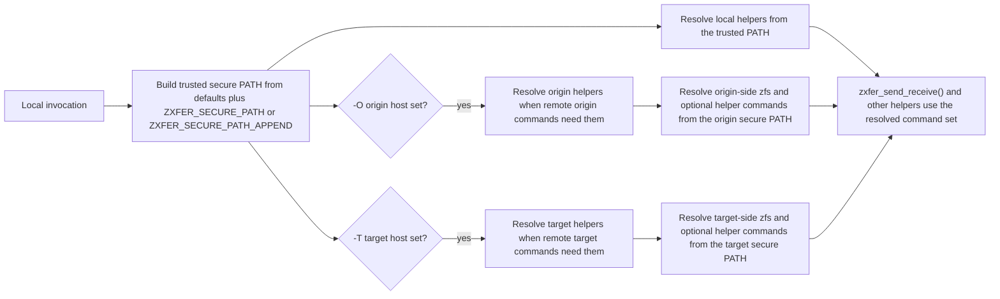
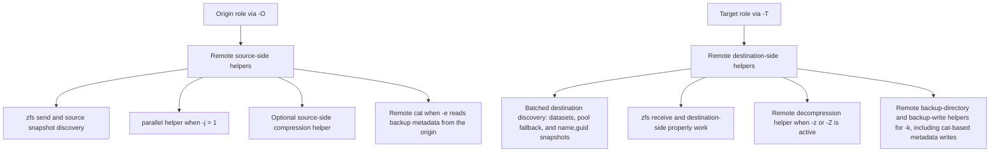

# Platform Support

## Supported Platforms

zxfer is intended to work with current OpenZFS 2.0+ environments:

- FreeBSD 14.4+ and 15.0+ maintained branches with OpenZFS
- Linux with OpenZFS
- currently supported OmniOS / illumos systems
- current OpenZFS on macOS workflows

For releases published after 2026-05-01, zxfer follows maintained FreeBSD
branches. The current FreeBSD baseline is 14.4+ on the stable/14 line and
15.0+ on the stable/15 line. FreeBSD 13.5 and the stable/13 branch reached
end of life on 2026-04-30, and FreeBSD 14.3 reaches upstream end of life on
2026-06-30. This codebase does not guarantee support for FreeBSD 14.3,
FreeBSD 13.x, or other end-of-life FreeBSD releases. Reports from EOL systems
can still be useful historical context, but fixes are prioritized only when
the issue also affects a maintained branch.

As of 2026-06-23, the supported OmniOS trains are `r151054` LTS, `r151056`
stable, and `r151058` stable. Older OmniOS trains are treated as historical
compatibility context unless a reported issue also affects a currently
supported train.

The project targets POSIX `/bin/sh`, so portability depends more on shell and
tool behavior than on GNU-specific scripting features.
Pre-OpenZFS 2.0 behavior, Solaris Express-era property profiles, and older
backup metadata layouts are intentionally outside the supported platform
surface.

## Integration Test Hosts

The VM-backed guest runner [../tests/run_vm_matrix.sh](../tests/run_vm_matrix.sh)
supports these host environments:

- Linux hosts with QEMU
- macOS hosts with QEMU
- Windows hosts via WSL2 running the same POSIX/QEMU workflow

Native Windows PowerShell or `cmd.exe` orchestration is intentionally not part
of the supported host surface.

Current guest targets for the VM matrix are:

- Ubuntu 26.04
- FreeBSD 15.1
- OmniOS r151058

The local runner prefers the guest architecture that best matches the host. On
Linux `amd64` hosts with KVM, and on Intel macOS hosts, the matrix uses the
pinned `amd64` guests. On Apple Silicon macOS hosts and other `arm64` hosts,
the `smoke` and `local` profiles now prefer official `arm64` Ubuntu and
FreeBSD images when QEMU's aarch64 UEFI firmware is available. OmniOS remains
an `amd64` guest, so that lane still falls back to TCG emulation on `arm64`
hosts. Those TCG runs are supported for development and debugging, but they
are not the strict isolation gate described in the testing docs.

## Tool Resolution

zxfer resolves required tools through a trusted secure-PATH model instead of
blindly inheriting the caller's `PATH`.


```mermaid
flowchart LR
    A["Local invocation"] --> B["Build trusted secure PATH from defaults plus ZXFER_SECURE_PATH or ZXFER_SECURE_PATH_APPEND"]
    B --> C{"-O origin host set?"}
    B --> D{"-T target host set?"}
    B --> E["Resolve local helpers from the trusted PATH"]
    C -->|yes| F["Resolve origin helpers when remote origin commands need them"]
    D -->|yes| G["Resolve target helpers when remote target commands need them"]
    F --> H["Resolve origin-side zfs and optional helper commands from the origin secure PATH"]
    G --> I["Resolve target-side zfs and optional helper commands from the target secure PATH"]
    E --> J["zxfer_send_receive() and other helpers use the resolved command set"]
    H --> J
    I --> J
```

Important environment variables:

- `ZXFER_SECURE_PATH`: replace the default allowlist entirely
- `ZXFER_SECURE_PATH_APPEND`: append extra absolute directories
- `ZXFER_BACKUP_DIR`: select the absolute property-backup metadata root
- `ZXFER_UNSAFE_FAILURE_REPORT_COMMANDS=1`: emit verbatim `invocation` and `last_command` in structured failure reports and any `ZXFER_ERROR_LOG` mirror; unsafe for shared logs
- `ZXFER_SSH_USER_KNOWN_HOSTS_FILE`: pin zxfer-managed ssh host-key checks to a specific absolute known-hosts file
- `ZXFER_SSH_USE_AMBIENT_CONFIG=1`: opt out of zxfer's default `BatchMode=yes` / `StrictHostKeyChecking=yes` transport policy

Default allowlist:

```text
/sbin:/bin:/usr/sbin:/usr/bin:/usr/local/sbin:/usr/local/bin
```

On macOS, the integration harness also prepends `/usr/local/zfs/bin` when that
OpenZFS-on-macOS path exists.

The computed allowlist also becomes the live runtime `PATH`, so an explicit
`ZXFER_SECURE_PATH` override must include every trusted helper directory that
later bare command lookups may need.
Both secure-PATH inputs are rejected in full if they contain a tab, carriage
return, or line feed; resolved local and remote helper paths must satisfy the
same byte-shape rule. `ZXFER_BACKUP_DIR` is likewise rejected before any path
derivation if it contains one of those three bytes. This validation happens
before readable remote programs are converted to their one-line transport
form, so login-shell compatibility cannot translate configured path bytes.

## Remote Hosts

Remote helper resolution is platform-aware for the hardened paths below and no
longer assumes the same local absolute binary path exists remotely. This
matters especially when:

- `zfs` lives in different directories between source and destination hosts
- wrapped host specs are used, for example `user@host pfexec`
- restore mode (`-e`) needs a remote `cat` on the origin, and remote backup
  writes for `-k` use `cat` on the target
- `-j` uses explicit per-dataset source discovery on the executing origin host
  in the changed-source/full discovery path whenever `jobs > 1`. The clean
  recursive no-op proof uses one recursive `name,guid` source stream and defers
  `parallel` until that heavier path is needed. Local-origin and remote-origin
  full discovery runs require a resolved `parallel` helper on that host. zxfer
  intentionally validates only helper existence through the secure-PATH model
  and assumes the operator or package supplied an implementation compatible
  with the GNU Parallel-style options used by the rendered pipeline. zxfer fails
  closed if the required helper is missing, while incompatible helpers fail
  through source discovery instead of silently falling back to the serial
  recursive listing. Source discovery uses tracked background PID cleanup and
  staged stderr, while send/receive workers run under the shared supervisor
  rather than bare wrapper-shell PID cleanup. The send/receive ready queue
  serializes active parent/child destination receives on the same target but can
  skip blocked descendants and start later independent datasets while job slots
  remain
- custom `-Z` compression commands or default `zstd` helpers must be resolved
  per host instead of assuming one shared absolute path
- remote helper capability discovery runs once per exact origin/target cache
  identity per invocation, keyed in memory by role, host spec, trusted
  dependency path, ssh transport policy, and the requested optional tool set;
  no capability-cache files are reused across concurrent or later zxfer
  invocations. Each accepted response is parsed once for that identity; later
  OS and helper lookups load the validated parsed fields instead of reparsing
  the raw handshake

Current releases keep ssh control sockets and remote capability state
strictly per-run. Each invocation creates its own short `ssh-<role>.sock`
path under the private 0700 temp root, reuses that socket only for its own
remote commands, and closes it before removing the temp root. There are no
shared ssh lease directories or remote capability-cache locks to inspect or
clear for current runs; only `ZXFER_ERROR_LOG` appends use the
metadata-bearing owned-directory lock format.

The same validated secure `PATH` is also exported before remote capability
handshakes, helper-discovery probes, backup-directory prep, and remote
backup-metadata guard/staging scripts run, so their auxiliary
`stat`/`ls`/`id`/`awk` lookups do not fall back to the remote login shell's
ambient `PATH`.

Capability probes and secure remote-backup directory/write protocols are
maintained as readable multiline POSIX `sh` programs and pinned by focused
golden tests. At the SSH boundary zxfer retains the established rendering for
short, single-line scripts. Long or multiline scripts are split into bounded,
quoted positional arguments on one physical login-shell command line; a fixed
POSIX `sh` bootstrap reassembles the original bytes before an explicit
`sh -c`. This keeps every word below the illumos csh lexical limit while
preserving the program, standard input, exit status, and protocol fields on
remote accounts whose login shell is csh or tcsh.

Remote target (`-T`) destination discovery also runs under that validated
target-side `PATH`. Current discovery batches the recursive destination dataset
inventory, the missing-root pool probe, and `name,guid` destination snapshot
listing into one target-side POSIX `sh -c` payload. The large snapshot section
is streamed back over ssh, compact statuses and stderr are staged separately,
and malformed or truncated section payloads fail closed. The local side
validates the complete ordered protocol in one private run-root workspace and
publishes its inventory, inventory-stderr, snapshot, and snapshot-stderr files
as one rollback-protected transaction. Local destination discovery deliberately
remains on the direct local `zfs` path.

zxfer-managed ssh transports also now force `BatchMode=yes` and
`StrictHostKeyChecking=yes` by default. They still rely on the local ssh
configuration's known-hosts sources unless `ZXFER_SSH_USER_KNOWN_HOSTS_FILE`
is set, and only `ZXFER_SSH_USE_AMBIENT_CONFIG=1` disables the zxfer-managed
ssh safety policy entirely.

In practice, the origin and target roles stay separate:


```mermaid
flowchart TD
    A["Origin role via -O"] --> B["Remote source-side helpers"]
    B --> C["zfs send and source snapshot discovery"]
    B --> D["parallel helper when -j > 1"]
    B --> E["Optional source-side compression helper"]
    B --> F["Remote cat when -e reads backup metadata from the origin"]

    G["Target role via -T"] --> H["Remote destination-side helpers"]
    H --> I["Batched destination discovery: datasets, pool fallback, and name,guid snapshots"]
    H --> J["zfs receive and destination-side property work"]
    H --> K["Remote decompression helper when -z or -Z is active"]
    H --> L["Remote backup-directory and backup-write helpers for -k, including cat-based metadata writes"]
```

## Service Management

`-c` and migration-related service handling remain Solaris / illumos oriented.
These paths assume `svcadm` semantics and fail fast when the service manager is
not available.

## Testing Notes

Testing workflow guidance now lives in [testing.md](./testing.md), not in
[../KNOWN_ISSUES.md](../KNOWN_ISSUES.md).

Current platform-specific testing guidance:

- Prefer [../tests/run_vm_matrix.sh](../tests/run_vm_matrix.sh) for unattended
  integration coverage and for low-risk local validation on Linux, macOS, and
  WSL2 hosts. That runner keeps `integration` as its default guest test layer
  and can opt into guest shunit2 coverage with `--test-layer shunit2` or
  guest-side performance checks with `--test-layer perf` or
  `--test-layer perf-compare`.
- Keep [../tests/run_integration_zxfer.sh](../tests/run_integration_zxfer.sh)
  for manual, interactive runs on a disposable ZFS-capable host or VM when you
  explicitly want to exercise the harness outside the guest wrapper.
- Apple Silicon and other `arm64` hosts can run Ubuntu and FreeBSD guest lanes
  as `arm64`, but OmniOS remains an `amd64` guest and therefore a best-effort
  TCG lane rather than the project's strict isolation gate on those hosts.
- Hosted macOS CI remains a unit and shell-portability lane, not a required ZFS
  integration gate, because the hosted runner does not install or exercise
  OpenZFS pools. Use the VM matrix or a disposable local OpenZFS-on-macOS host
  when macOS ZFS behavior needs end-to-end validation.
