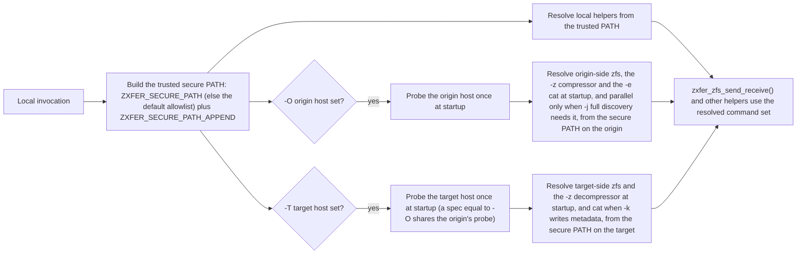
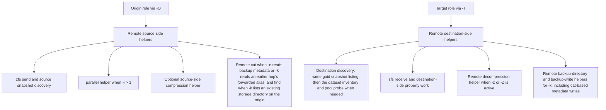

# Platform Support

## Supported Platforms

zxfer is intended to work with current OpenZFS 2.0+ environments:

- FreeBSD 14.4+ and 15.0+ maintained branches with OpenZFS
- Linux with OpenZFS
- currently supported OmniOS / illumos systems
- current OpenZFS on macOS workflows

For releases published after 2026-05-01, zxfer follows maintained FreeBSD
branches. The current FreeBSD baseline is 14.4+ on the stable/14 line and
15.0+ on the stable/15 line. FreeBSD 13.5 and the stable/13 branch reached
end of life on 2026-04-30, and FreeBSD 14.3 reached upstream end of life on
2026-06-30. This codebase does not guarantee support for FreeBSD 14.3,
FreeBSD 13.x, or other end-of-life FreeBSD releases. Reports from EOL systems
can still be useful historical context, but fixes are prioritized only when
the issue also affects a maintained branch.

As of 2026-06-23, the supported OmniOS trains are `r151054` LTS, `r151056`
stable, and `r151058` stable. Older OmniOS trains are treated as historical
compatibility context unless a reported issue also affects a currently
supported train.

The project targets POSIX `/bin/sh`, so portability depends more on shell and
tool behavior than on GNU-specific scripting features.
Failure-report and `-v` command quoting prints plain printable tokens without
spawning `awk` or `sed` only when the shell's `case` patterns support
`[[:print:]]`; zxfer checks this once at load, and shells without that support
(such as `posh`) keep the `awk`/`sed` escaping path for every token.
bash 3.2, macOS's `/bin/sh`, and ksh93 on macOS match a bracket range such
as `[0-9]` in a `case` pattern by locale collation, so under a UTF-8 locale
zxfer's digit checks accept some non-ASCII characters (see
[../KNOWN_ISSUES.md](../KNOWN_ISSUES.md)); dash, bash 5 and zsh compare code
points. The test tooling spells out its character lists instead.
Pre-OpenZFS 2.0 behavior, Solaris Express-era property profiles, and older
backup metadata layouts are intentionally outside the supported platform
surface.

`posh`, Debian's policy-checking shell, is not supported and has no CI lane.
Its `case` patterns have no POSIX character classes such as `[[:space:]]` and
`[[:cntrl:]]`, which zxfer's checks use. It has no `printf` or `kill` builtin,
and procps-ng 4.0.4's `/usr/bin/kill` (Ubuntu 26.04) inverts the exit status
of zxfer's `kill -SIG -PGID` group probe, so under `posh` zxfer would misread
whether a process group is alive. It also cannot parse a quote in a comment,
or a `case` pattern without a leading `(`, inside `$(...)`, which eight test
files contain.

## Integration Test Hosts

The VM-backed guest runner [../tests/run_vm_matrix.sh](../tests/run_vm_matrix.sh)
supports these host environments:

- Linux hosts with QEMU
- macOS hosts with QEMU
- Windows hosts via WSL2 running the same POSIX/QEMU workflow

Native Windows PowerShell or `cmd.exe` orchestration is intentionally not part
of the supported host surface.

Current guest targets for the VM matrix are:

- Ubuntu 26.04
- FreeBSD 15.1
- OmniOS r151058

The local runner prefers the guest architecture that best matches the host. On
Linux `amd64` hosts with KVM, and on Intel macOS hosts, the matrix uses the
pinned `amd64` guests. On Apple Silicon macOS hosts and other `arm64` hosts,
the `smoke` and `local` profiles now prefer official `arm64` Ubuntu and
FreeBSD images when QEMU's aarch64 UEFI firmware is available. OmniOS remains
an `amd64` guest, so that lane still falls back to TCG emulation on `arm64`
hosts. Those TCG runs are supported for development and debugging, but they
are not the strict isolation gate described in the testing docs.

## Tool Resolution

zxfer resolves required tools through a trusted secure-PATH model instead of
blindly inheriting the caller's `PATH`.


```mermaid
flowchart LR
    A["Local invocation"] --> B["Build the trusted secure PATH: ZXFER_SECURE_PATH (else the default allowlist) plus ZXFER_SECURE_PATH_APPEND"]
    B --> C{"-O origin host set?"}
    B --> D{"-T target host set?"}
    B --> E["Resolve local helpers from the trusted PATH"]
    C -->|yes| F["Probe the origin host once at startup"]
    D -->|yes| G["Probe the target host once at startup (a spec equal to -O shares the origin's probe)"]
    F --> H["Resolve origin-side zfs, the -z compressor and the -e cat at startup, and parallel only when -j full discovery needs it, from the secure PATH on the origin"]
    G --> I["Resolve target-side zfs and the -z decompressor at startup, and cat when -k writes metadata, from the secure PATH on the target"]
    E --> J["zxfer_zfs_send_receive() and other helpers use the resolved command set"]
    H --> J
    I --> J
```

Important environment variables:

- `ZXFER_SECURE_PATH`: replace the default allowlist entirely
- `ZXFER_SECURE_PATH_APPEND`: append extra absolute directories
- `ZXFER_BACKUP_DIR`: select the absolute property-backup metadata root
- `ZXFER_UNSAFE_FAILURE_REPORT_COMMANDS=1`: emit verbatim `invocation` and `last_command` in structured failure reports and any `ZXFER_ERROR_LOG` mirror; unsafe for shared logs
- `ZXFER_SSH_USER_KNOWN_HOSTS_FILE`: pin zxfer-managed ssh host-key checks to a specific absolute known-hosts file
- `ZXFER_SSH_BATCH_MODE`, `ZXFER_SSH_STRICT_HOST_KEY_CHECKING`: replace the `yes` value zxfer passes as `BatchMode` / `StrictHostKeyChecking`; any other value weakens that check
- `ZXFER_SSH_USE_AMBIENT_CONFIG=1`: opt out of zxfer's default `BatchMode=yes` / `StrictHostKeyChecking=yes` transport policy

Default allowlist:

```text
/sbin:/bin:/usr/sbin:/usr/bin:/usr/local/sbin:/usr/local/bin
```

On macOS, the integration and performance harnesses add `/usr/local/zfs/bin`
to `ZXFER_SECURE_PATH_APPEND` (after the default allowlist) when that
OpenZFS-on-macOS `zfs` exists.

The computed allowlist also becomes the live runtime `PATH`, so an explicit
`ZXFER_SECURE_PATH` override must include every trusted helper directory that
later bare command lookups may need. Local helpers are looked up by walking
that list in the shell, so only an executable regular file satisfies a
lookup; a shell function, alias, or builtin of the same name never does,
whatever `command -v` would report on the host shell.
Both secure-PATH inputs are rejected in full if they contain a tab, carriage
return, or line feed; resolved local and remote helper paths must satisfy the
same byte-shape rule. `ZXFER_BACKUP_DIR` is likewise rejected before any path
derivation if it contains one of those three bytes. This validation happens
before readable remote programs are converted to their one-line transport
form, so login-shell compatibility cannot translate configured path bytes.

## Path Checks

Local path checks (the run root and `TMPDIR`, backup metadata, and
`ZXFER_ERROR_LOG`) read owner, mode and inode from `ls -ldin`, not `stat`.
zxfer reads only the first four fields, which POSIX gives `ls -l` and which
GNU coreutils, uutils (Ubuntu 26.04), FreeBSD, macOS, illumos and BusyBox
print alike: the inode (BusyBox and illumos pad it with blanks), the mode
string, the link count and the numeric owner. The mode string may end in one
alternate-access character (`+` for an ACL, `@` for macOS extended
attributes, `.` for an SELinux context), and illumos writes `l` for
set-group-ID without group execute; a line without those four fields is
refused. The octal mode keeps the set-user-ID, set-group-ID and sticky bits
on every platform, so a backup metadata file or `ZXFER_ERROR_LOG` that is
0600 plus one of them is refused on FreeBSD and macOS as on Linux, and a run
root under a set-group-ID `TMPDIR` (mode 2700) is accepted. The
`ZXFER_ERROR_LOG` link-count check reads field 2 of `ls -ldn`, and the
remote backup programs read the owner from field 3 of `ls -ldn` on the
remote host.

## Remote Hosts

Remote helper resolution is platform-aware for the hardened paths below and no
longer assumes the same local absolute binary path exists remotely. This
matters especially when:

- `zfs` lives in different directories between source and destination hosts
- wrapped host specs are used, for example `user@host pfexec`
- restore mode (`-e`) needs a remote `cat` on the origin, remote backup
  writes for `-k` use `cat` on the target, and `-k` over `-O` lists the
  origin's backup storage directories once per run, with `find` when the
  source dataset already has a storage directory there, and reads each
  forwarded alias found there with the origin's `cat`
- `-j` uses explicit per-dataset source discovery on the executing origin host
  in the changed-source/full discovery path whenever `jobs > 1`. The clean
  recursive no-op proof uses one recursive `name,guid` source stream and never
  runs `parallel`. Without `-O`, `-j` still requires a resolved local
  `parallel` at startup, before any ssh master or discovery starts, even when
  the proof would find nothing to send; with `-O`, the origin's `parallel` is
  looked up only when full discovery needs it. zxfer
  intentionally validates only helper existence through the secure-PATH model
  and assumes the operator or package supplied an implementation compatible
  with the GNU Parallel-style options used by the rendered pipeline. zxfer fails
  closed if the required helper is missing, while incompatible helpers fail
  through source discovery instead of silently falling back to the serial
  recursive listing. Source discovery uses tracked background PID cleanup and
  staged stderr. Send/receive workers use verified process groups where
  available, with a descendant-tracking cleanup wrapper as the fallback. The send/receive ready queue
  serializes active parent/child destination receives on the same target but can
  skip blocked descendants and start later independent datasets while job slots
  remain
- custom `-Z` compression commands or default `zstd` helpers must be resolved
  per host instead of assuming one shared absolute path
- remote helper capability discovery runs once per host spec and requested
  optional tool set per invocation, so equal `-O` and `-T` specs share one
  probe (the secure PATH and ssh
  policy are fixed for the run), held only in memory; no capability-cache
  files are reused across concurrent or later zxfer invocations. Each accepted
  response is parsed once; later OS and helper lookups load the validated
  parsed fields instead of reparsing the raw handshake

Current releases keep ssh control sockets and remote capability state
strictly per-run. Each invocation creates its own short `ssh-<role>.sock`
path under the private 0700 temp root (or, when a long `TMPDIR` would push
that path past the `sun_path` limit, in a private `zxfer.ssh.XXXXXX`
directory under the default temp root) and opens the master before its
first remote command, reuses that socket only for its own remote commands
(a `-T` spec equal to the `-O` spec shares the origin master), and closes it
before removing the temp root and that directory. There are no
shared ssh lease directories, remote capability-cache locks, or
`ZXFER_ERROR_LOG` lock directories to inspect or clear for current runs.

The same validated secure `PATH` is also exported before remote capability
handshakes, helper-discovery probes, backup-directory prep, and remote
backup-metadata guard/staging scripts run, so their auxiliary lookups
(`uname`, `ls`, `id`, `awk`, `mkdir`, `chmod`, `mktemp`, `mv`, `rm` and
`find`) do not fall back to the remote login shell's ambient `PATH`.

Capability probes and secure remote-backup directory/write/read and
storage-listing protocols are maintained as readable multiline POSIX `sh`
programs and pinned by focused golden tests. At the SSH boundary zxfer retains the established rendering for
short, single-line scripts. Long or multiline scripts are split into bounded,
quoted positional arguments on one physical login-shell command line; a fixed
POSIX `sh` bootstrap reassembles the original bytes before an explicit
`sh -c`. This keeps every word below the illumos csh lexical limit while
preserving the program, standard input, exit status, and protocol fields on
remote accounts whose login shell is csh or tcsh.

Remote target (`-T`) destination discovery runs no target-side script. Like
every other destination `zfs` command, each discovery listing (the
`name,guid` snapshot listing, the recursive dataset inventory when later work
needs it, the exact existence probe after a failed listing, and the
missing-root pool probe) is one command running the capability probe's
resolved target `zfs` over the target's control master, so discovery needs
only `zfs` on the target: no `mktemp`, `grep`, `rm` or `cat`. Local and
`-T` destination discovery share one code path.

Recursive property prefetch (`-P` and related options) uses
`zfs get -r -t filesystem,volume`. OpenZFS on Linux, FreeBSD, and macOS, and
illumos support `-t`; on a platform that rejects it, the tree read fails and
zxfer falls back to per-dataset property reads. Every property read also lists
the names alone with `zfs get -H -o property` (or `-o name,property`), which
every supported zfs has; JSON output (`zfs get -j`) is deliberately not used
because illumos lacks it. A property read alone passes its name after `--`
(`zfs get -H[p]o property,value,source -- PROP DS`), since user property names
may start with `-`. OpenZFS 2.4.1 (Ubuntu) and 2.4.2 (FreeBSD) accept it, and
illumos `zfs get` also parses its options with getopt, which the OmniOS lane
has yet to confirm. `zfs set` and `zfs inherit` do not get `--` (see
`KNOWN_ISSUES.md`). A lone read of a user property removed since the name list
prints `PROP<TAB>-<TAB>-` and exits 0 on OpenZFS 2.4.1 (Ubuntu) and FreeBSD,
and zxfer leaves such a property out; `hostile_property_record_shaped_value_test`
checks that answer, which the OmniOS lane has yet to confirm.

zxfer-managed ssh transports pass `BatchMode=yes` and
`StrictHostKeyChecking=yes` by default. `ZXFER_SSH_BATCH_MODE` and
`ZXFER_SSH_STRICT_HOST_KEY_CHECKING` replace either value, the local ssh
configuration's known-hosts sources apply unless
`ZXFER_SSH_USER_KNOWN_HOSTS_FILE` is set, and `ZXFER_SSH_USE_AMBIENT_CONFIG=1`
drops all three zxfer-managed options.

In practice, the origin and target roles stay separate:


```mermaid
flowchart TD
    A["Origin role via -O"] --> B["Remote source-side helpers"]
    B --> C["zfs send and source snapshot discovery"]
    B --> D["parallel helper when -j > 1"]
    B --> E["Optional source-side compression helper"]
    B --> F["Remote cat when -e reads backup metadata or -k reads an earlier hop's forwarded alias, and find when -k lists an existing storage directory on the origin"]

    G["Target role via -T"] --> H["Remote destination-side helpers"]
    H --> I["Destination discovery: name,guid snapshot listing, then the dataset inventory and pool probe when needed"]
    H --> J["zfs receive and destination-side property work"]
    H --> K["Remote decompression helper when -z or -Z is active"]
    H --> L["Remote backup-directory and backup-write helpers for -k, including cat-based metadata writes"]
```

## Service Management

`-c` and migration-related service handling remain Solaris / illumos oriented.
These paths assume `svcadm` semantics and fail fast when the service manager is
not available.

## Testing Notes

Testing workflow guidance now lives in [testing.md](./testing.md), not in
[../KNOWN_ISSUES.md](../KNOWN_ISSUES.md).

Current platform-specific testing guidance:

- Prefer [../tests/run_vm_matrix.sh](../tests/run_vm_matrix.sh) for unattended
  integration coverage and for low-risk local validation on Linux, macOS, and
  WSL2 hosts. That runner keeps `integration` as its default guest test layer
  and can opt into guest shunit2 coverage with `--test-layer shunit2` or
  guest-side performance checks with `--test-layer perf` or
  `--test-layer perf-compare`.
- Keep [../tests/run_integration_zxfer.sh](../tests/run_integration_zxfer.sh)
  for manual, interactive runs on a disposable ZFS-capable host or VM when you
  explicitly want to exercise the harness outside the guest wrapper.
- Apple Silicon and other `arm64` hosts can run Ubuntu and FreeBSD guest lanes
  as `arm64`, but OmniOS remains an `amd64` guest and therefore a best-effort
  TCG lane rather than the project's strict isolation gate on those hosts.
- Hosted macOS CI remains a unit and shell-portability lane, not a required ZFS
  integration gate, because the hosted runner does not install or exercise
  OpenZFS pools. Use the VM matrix or a disposable local OpenZFS-on-macOS host
  when macOS ZFS behavior needs end-to-end validation.
