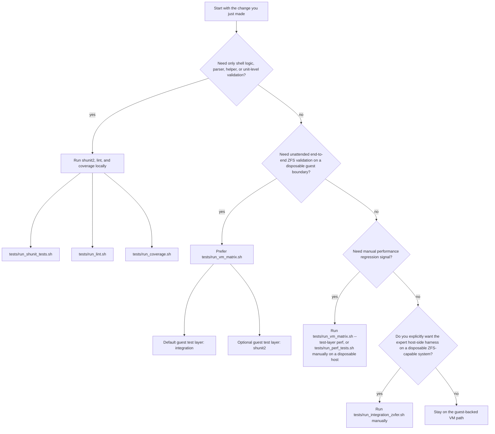
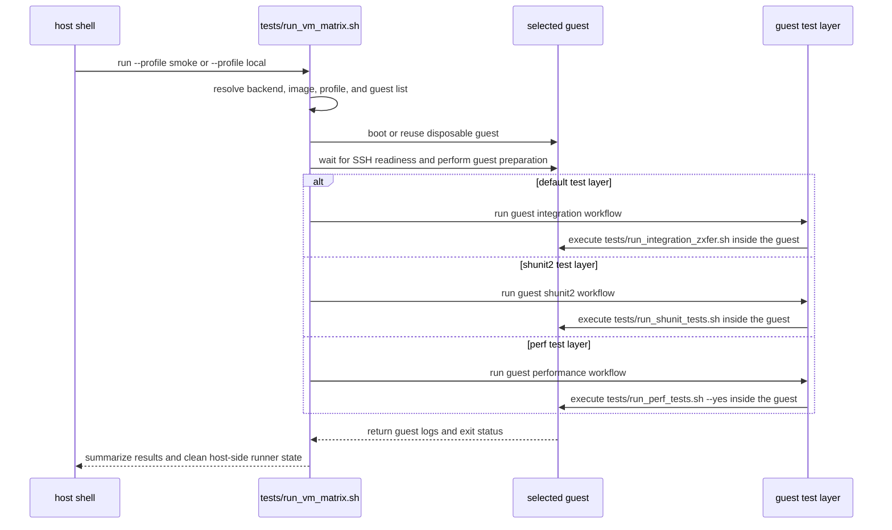

# Testing

## Test Layers

The project currently uses four practical layers of validation:

- shunit2 unit tests
- shell coverage reporting
- file-backed ZFS integration tests
- manual, non-gating performance tests

## Recommended Paths

Use the layers this way:

- Run shunit2, lint, and coverage locally for everyday shell changes.
- Prefer [../tests/run_vm_matrix.sh](../tests/run_vm_matrix.sh) for unattended
  integration coverage and for routine end-to-end validation on a disposable
  guest boundary.
- Use [../tests/run_perf_tests.sh](../tests/run_perf_tests.sh) for manual
  throughput and startup/cleanup regression checks, preferably through the VM
  matrix `perf` layer unless you are on a disposable ZFS-capable host.
- Use [../tests/run_integration_zxfer.sh](../tests/run_integration_zxfer.sh)
  directly only when you explicitly want an interactive host-side harness run
  on a disposable ZFS-capable system.

`KNOWN_ISSUES.md` tracks current open bugs and reliability/security findings.
Testing workflow guidance, host-safety notes, and CI entrypoint choices belong
here instead.

## Validation Route Map

Use this route map to decide which test entrypoint matches the change you are
making and the level of host risk you can tolerate.



The safe default is still:

- local shell validation for unit-scale changes
- [../tests/run_vm_matrix.sh](../tests/run_vm_matrix.sh) for unattended
  integration, guest-side shunit2, or guest-side performance runs
- [../tests/run_perf_tests.sh](../tests/run_perf_tests.sh) for explicit
  manual performance comparisons on disposable ZFS-capable hosts
- [../tests/run_integration_zxfer.sh](../tests/run_integration_zxfer.sh)
  only for explicit manual host-side harness work

## Unit Tests

Run all suites with the default bounded parallel worker count:

```sh
./tests/run_shunit_tests.sh
```

The shunit2 runner auto-detects a local CPU count, caps itself at 4 workers,
and clamps that default to the number of runnable suites. It buffers each
suite to a private log and replays grouped output in suite order so parallel
runs stay readable.

Force serial execution:

```sh
./tests/run_shunit_tests.sh --jobs 1
```

`--jobs 1` runs suites in the foreground and streams their output live instead
of buffering per-suite logs for ordered replay.

Explicit `--jobs` values above the runnable suite count are announced and
clamped to the number of runnable suites.

Run the local lint stack with the same pinned toolchain as CI:

```sh
./tests/run_lint.sh
```

For a ready-made contributor environment, open the repository in the included
VS Code / GitHub Codespaces devcontainer. It tracks the Ubuntu 24.04 CI host
family closely enough for local lint, shunit2, and coverage work, and it
preinstalls:

- `dash`
- `bash-posix`
- `busybox-ash`
- `posh`
- `kcov`
- Ubuntu `zfsutils-linux` userland (`zfs`, `zpool`)
- the pinned `actionlint`, `checkbashisms`, `shfmt`, `codespell`, and
  ShellCheck toolchain from `tests/run_lint.sh`

The devcontainer is still not a substitute for a real ZFS-capable host. Use
it for shell-portability work, linting, and local `kcov` runs such as:

```sh
ZXFER_COVERAGE_MODE=kcov ./tests/run_coverage.sh
```

Keep direct-host `tests/run_integration_zxfer.sh` runs on a disposable VM or
other safe system that can create and destroy file-backed zpools. For the
default unattended path, use `tests/run_vm_matrix.sh` instead.

Run one suite:

```sh
./tests/run_shunit_tests.sh tests/test_zxfer_replication.sh
```

Run the suites with an explicit parallel worker count:

```sh
./tests/run_shunit_tests.sh --jobs 4
```

Run the suites under a specific alternate shell:

```sh
ZXFER_TEST_SHELL=/bin/dash ./tests/run_shunit_tests.sh
```

For multi-word shell modes such as `bash --posix`, point `ZXFER_TEST_SHELL` at
an executable wrapper script that `exec`s the desired command.

The test layout broadly follows the source layout:

- `test_run_coverage.sh`
- `test_ci_vmactions_integration.sh`
- `test_run_shunit_tests.sh`
- `test_run_integration_zxfer.sh`
- `test_run_perf_tests.sh`
- `test_run_vm_matrix.sh`
- `test_zxfer_launcher.sh`
- `test_zxfer_locking.sh`
- `test_zxfer_reporting.sh`
- `test_zxfer_exec.sh`
- `test_zxfer_dependencies.sh`
- `test_zxfer_runtime.sh`
- `test_zxfer_background_jobs.sh`
- `test_zxfer_background_job_runner.sh`
- `test_zxfer_cleanup_child_wrapper.sh`
- `test_zxfer_cli.sh`
- `test_zxfer_snapshot_state.sh`
- `test_zxfer_backup_metadata.sh`
- `test_zxfer_property_cache_coverage.sh`
- `test_zxfer_remote_hosts.sh`
- `test_zxfer_remote_hosts_coverage.sh`
- `test_zxfer_snapshot_discovery.sh`
- `test_zxfer_snapshot_reconcile.sh`
- `test_zxfer_property_reconcile.sh`
- `test_zxfer_replication.sh`
- `test_zxfer_send_receive.sh`

Some support modules are still covered inside adjacent suites. For example,
`src/zxfer_property_cache.sh` is exercised mainly by
`test_zxfer_property_reconcile.sh`, with supplemental edge-path coverage in
`test_zxfer_property_cache_coverage.sh`.
`src/zxfer_backup_metadata.sh` now has a dedicated peer suite in
`test_zxfer_backup_metadata.sh`, with a smaller number of cross-module backup
restore and remote-helper expectations still covered in the property and
remote-host suites. Likewise,
`test_zxfer_remote_hosts_coverage.sh` keeps focused regression coverage for
remote-host and ssh-control-socket edge paths that would be awkward to express
through the broader peer suite alone.

The top-level launcher and `tests/test_helper.sh` both source
`src/zxfer_modules.sh`, so runtime module order is defined in one place rather
than being duplicated across test fixtures, including the owned-locking layer
that now sits ahead of reporting and remote-host helpers and the supervised
background-job layer that now sits between runtime and the higher-level
replication modules.

`test_zxfer_locking.sh` owns the shared lock/lease primitive itself:
metadata render/parse, owner-identity capture, stale-owner reaping, checked
release mismatches, and trap-time owned-lock cleanup helpers. The remote-host,
reporting, and runtime suites then cover the subsystem adapters that apply
that shared metadata-bearing format to ssh control-socket locks and leases,
remote capability-cache locks, and `ZXFER_ERROR_LOG` locking.

Focused tests that exercise `zxfer_init_globals()` should source through at
least the property-reconcile boundary, or anything later in
`src/zxfer_modules.sh`, because startup now resets property scratch state via
the property modules' public reset helpers rather than carrying a duplicated
copy of that reset inventory inside `zxfer_runtime.sh`.

`test_zxfer_background_jobs.sh` owns the supervisor-specific metadata and
abort-path coverage: launch/completion parsing, queue-record normalization,
completion-aware cleanup shortcuts when `completion.tsv` already exists,
refreshed post-signal revalidation when a runner disappears during teardown,
validated process-group cleanup, owned-child-set fallback, and PID-reuse
rejection when the tracked runner no longer matches the recorded helper
identity. The send/receive and snapshot-discovery suites then focus on how
their modules consume the shared supervisor contract.

`test_zxfer_background_job_runner.sh` owns the standalone runner entry point:
launch/completion file publication, completion queue notifications, fail-closed
queue/completion rewrite paths, optional `setsid` process-group isolation, and
the script's direct-exec behavior when it is invoked as a helper instead of
sourced for tests.

`test_zxfer_cleanup_child_wrapper.sh` owns the short-lived cleanup wrapper
entry point: direct-exec argument validation, exit-status passthrough for the
wrapped command, and descendant teardown when the wrapper is interrupted during
abort cleanup.

The suites also use `tests/test_helper.sh` for the shared shunit2 scaffolding:
default no-op lifecycle hooks, temporary-directory setup helpers, and common
stdout/stderr/status capture wrappers for failure-path assertions. Keep new
suite-local helpers focused on domain-specific fixtures rather than re-creating
that generic test plumbing.

## Coverage

Generate shell coverage:

```sh
./tests/run_coverage.sh
```

The coverage runner prefers `kcov` when available and otherwise falls back to a
bash xtrace-based approximation.

That fallback now discounts shell syntax that bash xtrace cannot attribute to a
real command line, such as `case` labels, here-doc bodies/delimiters attached
to control-flow terminators, grouping delimiters, and multiline string
continuations.

The bash-xtrace path is also the enforcement path. It appends a `TOTAL` row to
`coverage/bash-xtrace/summary.tsv`, checks the current summary against the
committed minimums in `tests/coverage_policy.tsv`, rejects total or per-file
coverage regressions relative to
`tests/coverage_baseline/bash-xtrace/summary.tsv`, and writes a unified diff
against `tests/coverage_baseline/bash-xtrace/missing.txt` to
`coverage/bash-xtrace/missing.diff`.

Because bash xtrace coverage is an approximation and can vary slightly by shell
or platform, the no-regression comparison also allows a small committed
hit-count tolerance before it treats a lower percentage as a real regression.

Run the policy gate locally:

```sh
ZXFER_COVERAGE_MODE=bash-xtrace ./tests/run_coverage.sh
```

Bypass the gate when you intentionally need a fresh report before updating the
committed baseline:

```sh
ZXFER_COVERAGE_MODE=bash-xtrace ZXFER_COVERAGE_ENFORCE_POLICY=0 ./tests/run_coverage.sh
```

Locally, you can force the higher-fidelity path when `kcov` is installed:

```sh
ZXFER_COVERAGE_MODE=kcov ./tests/run_coverage.sh
```

## VM Matrix

The VM matrix is a host wrapper around guest execution. The host runner
prepares the VM backend, boots or reuses guests, then asks the guest to run
the integration harness, the shunit2 layer, or the manual performance layer.



Use the VM-backed runner for unattended integration on supported host systems:

```sh
./tests/run_vm_matrix.sh --profile smoke
```

Run the default local profile:

```sh
./tests/run_vm_matrix.sh --profile local
```

Print the currently supported profiles or guest names without starting a run:

```sh
./tests/run_vm_matrix.sh --list-profiles
./tests/run_vm_matrix.sh --list-guests
```

Run the shunit2 suites inside the selected guests while keeping the default
VM path on integration:

```sh
./tests/run_vm_matrix.sh --profile local --test-layer shunit2
```

Run the smoke performance profile inside a disposable guest:

```sh
./tests/run_vm_matrix.sh --profile smoke --test-layer perf
```

Run the larger performance profile inside the same guest layer:

```sh
ZXFER_VM_PERF_PROFILE=standard ./tests/run_vm_matrix.sh --profile smoke --test-layer perf
```

Run the same profile with live guest stdout/stderr mirrored to the console:

```sh
./tests/run_vm_matrix.sh --profile local --stream-guest-output
```

Run the same profile in an AI-friendly failure-only mode:

```sh
./tests/run_vm_matrix.sh --profile local --failed-tests-only
```

Cherry-pick one or more named integration tests inside the guest:

```sh
./tests/run_vm_matrix.sh --profile local --guest ubuntu --only-test basic_replication_test,force_rollback_test
```

The runner also logs host-side setup phases so local runs do not look idle
while it refreshes checksum manifests, reuses or downloads guest images,
prepares base images, and waits for guest SSH readiness. Interactive serial
downloads show a curl progress bar automatically.
FreeBSD local guests now use an attached `cidata` config-drive because the
official BASIC-CLOUDINIT images expect `nuageinit` seed media rather than the
Ubuntu-style `nocloud-net` SMBIOS path. OmniOS local guests now keep waiting
until the first-boot SSH host key stops changing before the runner starts guest
preparation or the selected guest test layer.

This is the preferred integration entrypoint for contributors and CI because it
keeps the existing file-backed ZFS harness inside a disposable guest boundary.

Run up to two selected guests in parallel:

```sh
./tests/run_vm_matrix.sh --profile local --jobs 2
```

If you need to stop a local run, press `Ctrl+C`. The runner signals active
guest workers, waits for backend cleanup, removes temporary runner state, and
then exits non-zero.

Run the full matrix and keep failed guest state for inspection:

```sh
./tests/run_vm_matrix.sh --profile full --preserve-failed-guests
```

Supported host flows:

- Linux with QEMU
- macOS with QEMU
- Windows via WSL2 running the same POSIX/QEMU path

Native Windows PowerShell or `cmd.exe` orchestration is intentionally out of
scope. The host runner currently ships these backends:

- `qemu` for local disposable guest execution
- `ci-managed` for CI jobs that are already inside the target guest

Execution defaults:

- backend selection defaults to `auto`, which resolves to `qemu` for local
  runs and switches to `ci-managed` only when `ZXFER_VM_CI_MANAGED_GUEST`
  pins one guest in an already-in-guest CI environment
- guest execution is serial by default (`--jobs 1`)
- guest test-layer selection defaults to `integration`; `--test-layer shunit2` opts in to guest shunit2 runs, and `--test-layer perf` opts in to guest performance runs
- guest stdout/stderr is written to per-guest artifact files by default
- `--stream-guest-output` mirrors guest logs live to the console
- `--list-profiles` and `--list-guests` print the current supported choices
  and exit without touching a guest
- `--only-test name[,name...]` narrows the in-guest integration harness to one or more named tests and can be repeated; it is not used by the shunit2 or perf layers
- `--failed-tests-only` suppresses passing integration-test chatter inside the guest harness, automatically enables live guest output streaming, prints a compact `[N/TOTAL] PASS test_name` or `[N/TOTAL] SKIP test_name` line for each non-failing test, and replays the full labeled stdout/stderr for each failing test; it is not used by the shunit2 or perf layers
- `--jobs N` allows multiple selected guests to run in parallel

Profiles:

- `smoke`: Ubuntu 24.04 guest
- `local`: Ubuntu 24.04 plus FreeBSD 15.0 guests
- `full`: Ubuntu 24.04, FreeBSD 15.0, and OmniOS r151056 guests
- `ci`: the same guest set as `full`, intended for workflow-driven selection

The local QEMU backend prefers the guest architecture that best matches the
host while keeping the guest matrix stable. On Linux `amd64` hosts with
`/dev/kvm` access, and on Intel macOS hosts, the current guests run as
hardware-virtualized `amd64` VMs. On Apple Silicon macOS hosts and other
`arm64` hosts, the runner now prefers official `arm64` Ubuntu 24.04 and
FreeBSD 15.0 images for the `smoke` and `local` profiles. That lets those
lanes use a hardware-virtualized ARM guest boundary when the local QEMU
aarch64 UEFI firmware is available. OmniOS still ships only the pinned
`amd64` cloud image in this matrix, so OmniOS on `arm64` hosts remains a
best-effort TCG lane rather than the project's strict isolation gate.

Use `smoke` or `local` for routine development on Apple Silicon and other
`arm64` hosts. Treat the GitHub Actions `ubuntu-24.04` direct-host Linux lane
as the project's strict automated Linux integration gate, and treat local
TCG-backed OmniOS runs as development/debug coverage rather than the
highest-confidence certification path.

Recommended host tools for the local `qemu` backend:

- `qemu-system-x86_64`
- `qemu-system-aarch64` when the selected guest can run as `arm64`
- a readable aarch64 QEMU UEFI firmware file such as
  `edk2-aarch64-code.fd`, or an explicit `ZXFER_VM_QEMU_AARCH64_EFI` override
- `qemu-img`
- `curl`
- `python3`
- `ssh`, `ssh-keygen`, `ssh-keyscan`
- `tar`
- `xz` for the FreeBSD guest image

The VM runner downloads and verifies guest images, creates writable overlays,
copies the current checkout into the guest, and then runs the selected guest
test layer. By default that layer is the existing
`tests/run_integration_zxfer.sh --yes --keep-going` harness; add
`--test-layer shunit2` to run `tests/run_shunit_tests.sh` inside the guest
instead, or add `--test-layer perf` to run
`tests/run_perf_tests.sh --yes --profile "${ZXFER_VM_PERF_PROFILE:-smoke}"`
inside the guest. Perf artifacts land under the guest temp/artifact tree and
are copied back with the rest of the VM artifacts. Logs and preserved workdirs
still land under the configured artifact root. Even without live guest-output
streaming, the runner now logs each major phase so local runs do not appear
idle while a guest boots, installs prerequisites, or runs the selected guest
test layer.

Useful VM-runner environment variables:

- `ZXFER_VM_ARTIFACT_ROOT`: override the host artifact root
- `ZXFER_VM_CACHE_DIR`: override the guest-image cache directory
- `ZXFER_VM_JOBS`: default guest concurrency when `--jobs` is omitted
- `ZXFER_VM_TEST_LAYER`: default guest test layer
- `ZXFER_VM_STREAM_GUEST_OUTPUT=1`: default to live guest stdout/stderr
- `ZXFER_VM_ONLY_TESTS`: whitespace- or comma-delimited in-guest integration
  test names to pass through to `--only-test`
- `ZXFER_VM_FAILED_TESTS_ONLY=1`: default to the failure-only integration view
- `ZXFER_VM_PERF_PROFILE`: performance profile for `--test-layer perf`;
  supported values are `smoke` and `standard`
- `ZXFER_VM_QEMU_AARCH64_EFI`: override the detected aarch64 QEMU UEFI path
- `ZXFER_VM_CI_MANAGED_GUEST`: make `--backend auto` select the `ci-managed`
  backend for one named guest

## Performance Harness

`tests/run_perf_tests.sh` is a manual, non-gating performance runner. It
sources the integration harness in source-only mode and reuses the existing
file-backed sparse-pool, safety, mock-ssh, and passthrough-zstd helpers instead
of maintaining a second ZFS fixture layer.

Prefer the VM-backed path for unattended measurements:

```sh
./tests/run_vm_matrix.sh --profile smoke --test-layer perf
```

Run the direct harness only on a disposable ZFS-capable host. Without `--yes`,
it asks for one explicit confirmation before creating and destroying
file-backed pools:

```sh
./tests/run_perf_tests.sh
```

Use `--yes` only inside a disposable guest or trusted throwaway host so command
confirmation does not pollute timing samples:

```sh
./tests/run_perf_tests.sh --yes --profile smoke --output-dir /tmp/zxfer-perf
```

Compare a current run against a previous `summary.tsv` without turning
regressions into hard failures:

```sh
./tests/run_perf_tests.sh --yes --profile standard --case chain_local,fanout_local_j4_props --baseline /tmp/zxfer-perf/summary.tsv
```

Profiles:

- `smoke`: 0 warmups, 1 sample, about 6 chain snapshots, 8 sibling datasets,
  and 512 MB sparse pool files
- `standard`: 1 warmup, 3 samples, about 32 chain snapshots, 48 sibling
  datasets, and 2048 MB sparse pool files

Initial cases:

- `chain_local`
- `fanout_local_j1_props`
- `fanout_local_j4_props`
- `chain_remote_mock`
- `chain_remote_mock_compressed`

Artifacts:

- `samples.tsv`: one row per warmup or measured sample, including wall-clock
  time, estimated send bytes, throughput, startup latency, cleanup time,
  selected `-V` counters, mock-ssh invocation counts, zxfer status, and raw log
  paths
- `summary.tsv`: averages for measured samples only; warmups are retained in
  `samples.tsv` but excluded from the summary
- `summary.md`: human-readable summary table
- `compare.tsv`: optional baseline comparison, written when `--baseline` is
  provided
- `raw/`: per-sample stdout, stderr, and mock-ssh logs

Baseline comparisons currently warn when average wall time, startup latency, or
cleanup time rises by more than 10%, or throughput falls by more than 10%.
Those warnings do not fail the run; setup failures, zxfer failures, and
replication-correctness failures still fail immediately.

## Direct Host Harness

Run the integration suite interactively:

```sh
./tests/run_integration_zxfer.sh
```

By default, the harness prompts before data-modifying wrapped external
commands. This is the safest mode when testing on a real workstation.

This harness is still maintained and documented because it is the underlying
integration engine, but it is no longer the default recommendation for routine
unattended validation now that the VM-backed runner exists.

Run it unattended:

```sh
./tests/run_integration_zxfer.sh --yes
```

Keep running after failures:

```sh
./tests/run_integration_zxfer.sh --yes --keep-going
```

Keep running after failures but only replay failing test output:

```sh
./tests/run_integration_zxfer.sh --yes --keep-going --failed-tests-only
```

Run only specific named integration tests:

```sh
./tests/run_integration_zxfer.sh --yes --only-test basic_replication_test,force_rollback_test
```

Skip one or more tests:

```sh
./tests/run_integration_zxfer.sh --yes --skip-test property_creation_with_zvol_test
```

Or:

```sh
ZXFER_SKIP_TESTS="property_creation_with_zvol_test property_override_and_ignore_test" \
./tests/run_integration_zxfer.sh --yes --keep-going
```

Or select them through the environment:

```sh
ZXFER_ONLY_TESTS="basic_replication_test force_rollback_test" \
./tests/run_integration_zxfer.sh --yes --keep-going
```

Useful environment variables:

- `ZXFER_BIN`
- `SPARSE_SIZE_MB`
- `TMPDIR`:
  must resolve to an absolute directory owned by root or the effective UID and
  must not be writable by other users unless the sticky bit is set, or zxfer
  will fall back to a validated default temp root, preferring memory-backed
  locations such as `/dev/shm` or `/run/shm` when available before falling
  back to the system temporary directory for scratch files, FIFOs, and caches
- `ZXFER_SKIP_TESTS`

## Safety Model

The direct-host integration harness is much safer than older versions:

- file-backed pools only
- sparse vdev files under the harness work tree
- marker-gated pool cleanup
- cleanup scoped to pools created by the current run

On macOS and Linux, the harness no longer hard-requires root, but it still
needs OpenZFS permissions that allow file-backed `zpool create` /
`zpool destroy`. On FreeBSD, root may still be required depending on module and
device setup.

But it is still not fully sandboxed. It performs real kernel ZFS operations and
real mounts on the host.

Recommended usage:

- local throwaway test host
- disposable VM
- dedicated CI runner

If you want the lowest-risk local path, use `tests/run_vm_matrix.sh` and let it
run this same harness inside a disposable guest instead of invoking the harness
directly on the host.

When the VM matrix runs with hardware virtualization, it adds a disposable
guest kernel boundary around those same file-backed pool operations. When it
falls back to TCG, it still isolates the guest filesystem and kernel state
from the host, but that path is slower and is not treated as the strict CI
gate.

## GitHub Actions

The project currently ships four GitHub Actions workflows:

- `lint.yml`: `actionlint`, `checkbashisms`, ShellCheck, shfmt, and repository
  hygiene checks through the shared `tests/run_lint.sh` bootstrap with pinned
  tool versions and hashes
- `coverage.yml`: shell coverage with both the bash-xtrace fallback and a
  Docker-backed `kcov` pass, each uploaded as its own workflow artifact; the
  bash-xtrace lane is the coverage-policy gate and publishes the current
  `missing.txt` diff plus the policy report into the GitHub step summary
- `tests.yml`: shunit2 unit tests on Ubuntu and macOS, plus an Ubuntu
  portable-shell matrix for `dash`, `bash --posix`, and `busybox ash` on every
  push, plus a non-blocking `posh` lane on pushes to `main` only so the slower
  hosted-runner pass stays out of routine branch pushes; plus dedicated
  FreeBSD and OmniOS VM-backed unit jobs
- `integration.yml`: integration tests with the direct-host Ubuntu harness on
  `ubuntu-24.04`, plus FreeBSD and OmniOS guest-local `vmactions` lanes that
  install their native prerequisites and run `tests/run_integration_zxfer.sh`
  inside the guest, each preserving failure artifacts in a host-appropriate
  location before a host-side status check restores the guest harness result

The Linux integration lane now follows the same direct-host implementation as
the repository's `main` branch: it runs on GitHub-hosted `ubuntu-24.04`,
installs `zfsutils-linux`, loads the `zfs` module, and invokes
`./tests/run_integration_zxfer.sh --yes --keep-going` through `sudo` with a
preserved temporary workdir so failure artifacts can still be uploaded.

The FreeBSD and OmniOS integration lanes still use `vmactions` guests on
GitHub-hosted runners, but they follow the same direct guest-local harness
shape as the repository's `main` branch rather than entering the VM-matrix
entrypoint. The in-guest wrapper runs the lane-specific package preparation,
records the guest preparation or harness exit status, and returns success to
the VM action so its copyback phase can return preserved workdirs to the
Ubuntu host; a following host-side step then fails with the recorded status.
The FreeBSD lane uses the current pinned `vmactions/freebsd-vm` release and
forces `pkg bootstrap` plus `pkg update`, clears stale package repo/cache state,
and retries prerequisite installation before continuing with reduced coverage
if `parallel` or `zstd` remain unavailable. That avoids unnecessary host-OS
gating inside the guest while keeping preserved-workdir handling and artifact
uploads intact.

Those integration lanes also run the harness's non-destructive fail-closed
security regressions. In addition to the existing shell-metacharacter path and
host-spec cases, the harness now feeds garbage wrapped host specs, remote
capability payloads with control-whitespace helper paths, and malformed remote
capability responses into the CLI startup path. Garbage wrapped host specs are
expected to abort before replication begins and before any injected marker
payload can be evaluated locally or through the mock SSH transport. Capability
payloads that contain malformed records or invalid helper paths are treated as
invalid handshakes: zxfer must not use or cache those helper paths, and it may
only continue by degrading safely to the direct remote `uname` / `command -v`
probe path. When that direct path is still valid, replication is expected to
complete successfully; when it is not, startup must fail closed. The harness
carries that fail-closed and fallback coverage across both the origin (`-O`)
and target (`-T`) remote startup paths so receive-side helper resolution is
exercised as well.

The backup-metadata integration cases are also current-format only. Positive
`-k` / `-e` restore scenarios first create the exact keyed metadata file
through live zxfer runs, then mutate that file for security or corruption
checks. Legacy mountpoint-local `.zxfer_backup_info.*` files are covered only
as fail-closed negative tests.

The OmniOS unit and integration lanes still do not use the exact same shell
entry point. The OmniOS integration flow runs the harness under
`/usr/xpg4/bin/sh` so the live-path illumos coverage matches the project's
supported POSIX shell expectations, while the shunit2 job wraps `bash --posix`
through `ZXFER_TEST_SHELL`. That distinction remains intentional: OmniOS
`/usr/xpg4/bin/sh` follows ksh-style subshell function-binding semantics and
does not honor the helper overrides that the mock-heavy shunit2 suites use, so
the wrapper keeps the unit lane focused on zxfer behavior rather than shell-
specific test-stub dispatch.
The same `bash --posix` wrapper now applies when `tests/run_vm_matrix.sh`
selects `--test-layer shunit2` for an OmniOS guest.

The CI workflows use GitHub Actions concurrency cancellation keyed by workflow
name plus pushed ref, so stale branch runs are canceled when a new push
supersedes them.

The `kcov` job runs on `ubuntu-24.04` and uses the official `kcov/kcov` Docker
image pinned by digest instead of installing `kcov` from the runner package
manager. That keeps the higher-fidelity coverage lane available even though
current Ubuntu runner images do not consistently ship a native `kcov` package.
The bash-xtrace job is kept alongside it because the line-oriented
`summary.tsv`, `policy_failures.tsv`, and `missing.txt` diff outputs are stable
enough to enforce no-regression coverage policy in CI and on local developer
machines.

The macOS GitHub-hosted runner is currently used for `/bin/sh` and BSD-userland
unit coverage only. It is not a required hosted ZFS integration gate because
Darwin/OpenZFS property behavior remains less deterministic than
FreeBSD/Linux for some inherited child-dataset property assertions.
The macOS shunit2 job intentionally does not install ZFS; it is meant to catch
shell and userland portability regressions in the mock-heavy unit suites.
Local macOS hosts can still use `tests/run_vm_matrix.sh` through QEMU, but that
is a local-orchestration path rather than a hosted macOS integration gate.
On Apple Silicon, that local path now prefers official `arm64` Ubuntu and
FreeBSD guests for `smoke` and `local`, while OmniOS remains an `amd64`
best-effort lane.
The Ubuntu portable-shell matrix uses `ZXFER_TEST_SHELL` to rerun those same
shunit2 suites under alternate interpreters without changing the suite shebangs.
Hosted FreeBSD and OmniOS jobs now complement those Linux and macOS lanes, but
they do not replace local validation on the exact target OpenZFS and privilege
configuration used in production.
