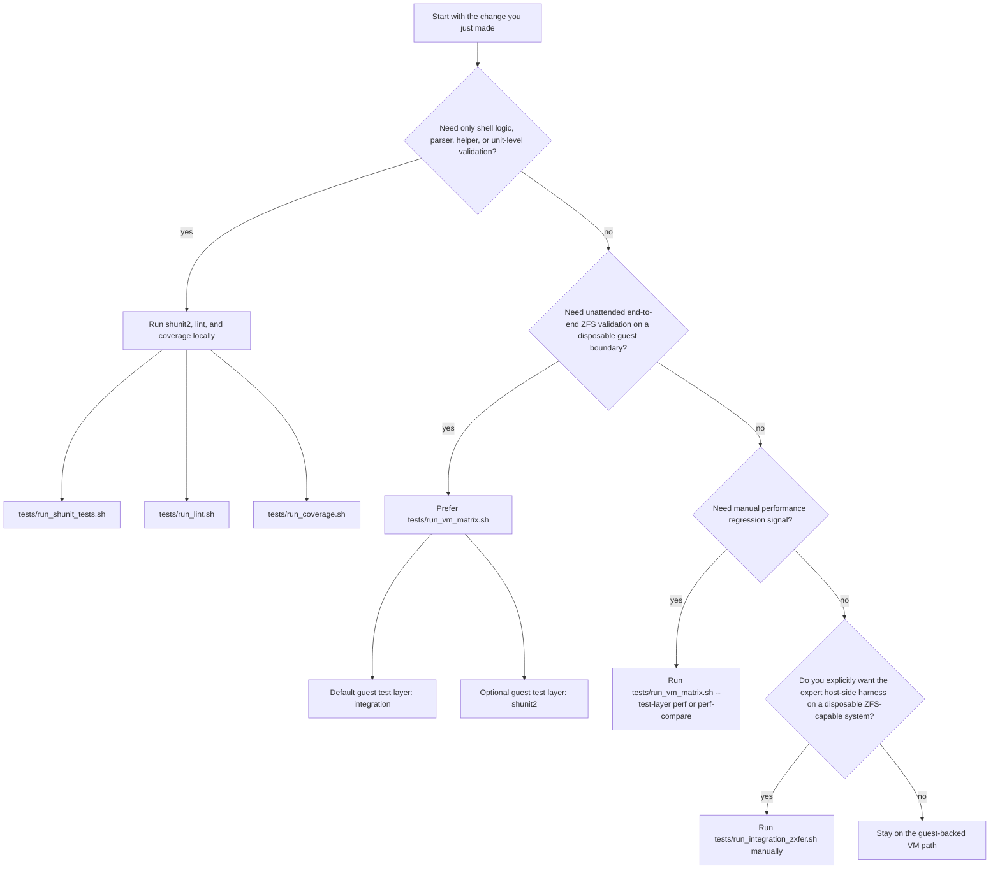
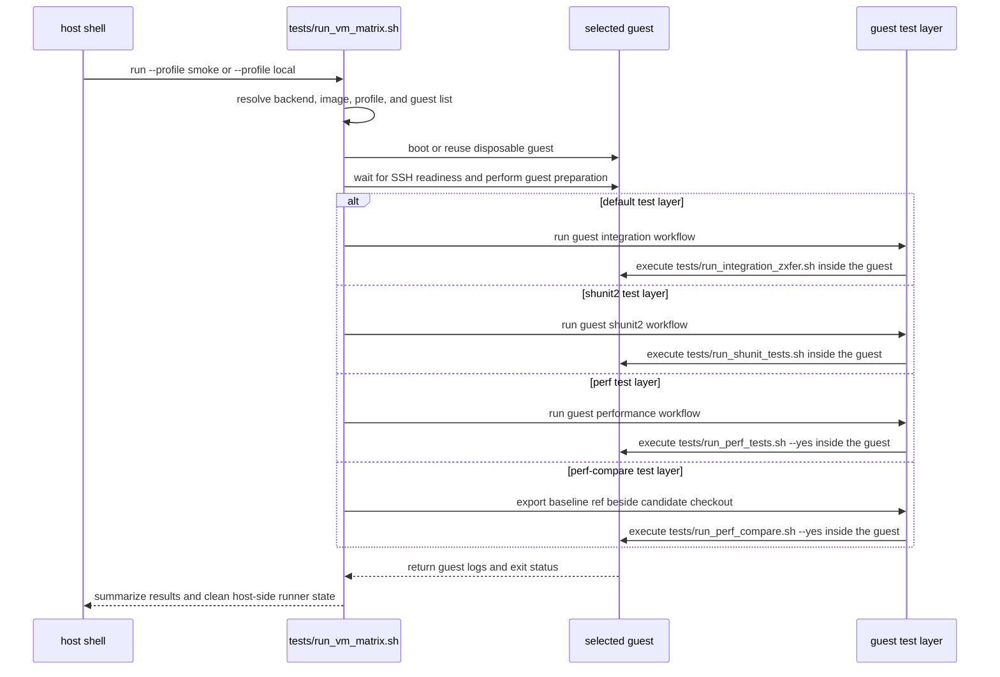

# Testing

## Test Layers

The project currently uses four practical layers of validation:

- shunit2 unit tests
- shell coverage reporting
- file-backed ZFS integration tests
- manual, non-gating performance tests

## Recommended Paths

Use the layers this way:

- Run shunit2, lint, and coverage locally for everyday shell changes.
- Prefer [../tests/run_vm_matrix.sh](../tests/run_vm_matrix.sh) for unattended
  integration coverage and for routine end-to-end validation on a disposable
  guest boundary.
- Use [../tests/run_perf_tests.sh](../tests/run_perf_tests.sh) for manual
  throughput and startup/cleanup regression checks, preferably through the VM
  matrix `perf` layer unless you are on a disposable ZFS-capable host.
- Use [../tests/run_perf_compare.sh](../tests/run_perf_compare.sh), preferably
  through the VM matrix `perf-compare` layer, when comparing two zxfer
  binaries such as the current checkout against `upstream-compat-final`.
- Use [../tests/run_perf_ab.sh](../tests/run_perf_ab.sh) for an advisory,
  host-safe wall-clock A/B of this checkout against a baseline ref such as
  `upstream-compat-final`. It needs no ZFS and no root: the baseline comes
  from `git archive`, a canned zfs answers every zfs command, and a mock ssh
  adds latency for `-O`/`-T` runs. A slowdown never fails it; exit 1 means a
  harness error.
- Use [../tests/run_integration_zxfer.sh](../tests/run_integration_zxfer.sh)
  directly only when you explicitly want an interactive host-side harness run
  on a disposable ZFS-capable system.

`KNOWN_ISSUES.md` tracks current open bugs and reliability/security findings.
Testing workflow guidance, host-safety notes, and CI entrypoint choices belong
here instead.

## Validation Route Map

Use this route map to decide which test entrypoint matches the change you are
making and the level of host risk you can tolerate.


```mermaid
flowchart TD
    A["Start with the change you just made"] --> B{"Need only shell logic, parser, helper, or unit-level validation?"}
    B -->|yes| C["Run shunit2, lint, and coverage locally"]
    C --> D["tests/run_shunit_tests.sh"]
    C --> E["tests/run_lint.sh"]
    C --> F["tests/run_coverage.sh"]
    B -->|no| G{"Need unattended end-to-end ZFS validation on a disposable guest boundary?"}
    G -->|yes| H["Prefer tests/run_vm_matrix.sh"]
    H --> I["Default guest test layer: integration"]
    H --> J["Optional guest test layer: shunit2"]
    G -->|no| N{"Need manual performance regression signal?"}
    N -->|yes| O["Run tests/run_vm_matrix.sh --test-layer perf or perf-compare"]
    N -->|no| K{"Do you explicitly want the expert host-side harness on a disposable ZFS-capable system?"}
    K -->|yes| L["Run tests/run_integration_zxfer.sh manually"]
    K -->|no| M["Stay on the guest-backed VM path"]
```

The safe default is still:

- local shell validation for unit-scale changes
- [../tests/run_vm_matrix.sh](../tests/run_vm_matrix.sh) for unattended
  integration, guest-side shunit2, or guest-side performance runs
- [../tests/run_perf_tests.sh](../tests/run_perf_tests.sh) for explicit
  manual performance comparisons on disposable ZFS-capable hosts
- [../tests/run_perf_compare.sh](../tests/run_perf_compare.sh) for
  informative two-binary comparisons when both binaries are already available
  on a disposable ZFS-capable host
- [../tests/run_integration_zxfer.sh](../tests/run_integration_zxfer.sh)
  only for explicit manual host-side harness work

## Validation Profiles

`tests/validate.sh` is the discoverable front door for common local paths.
Profile composition lives in `tests/validation_profiles.tsv` and dispatches
only a closed set of step names. `quick` selects unit suites by name first: a
change to `src/zxfer_NAME.sh` runs `tests/test_zxfer_NAME.sh` and every
`tests/test_contract_*.sh` suite. `tests/validation_map.tsv` then maps changed
path patterns to exception `unit_suites` (`@contract` selects every contract
suite), `integration_groups`, `perf_cases`, and `doc_surfaces`. Neither TSV
file is evaluated as shell code.

```sh
./tests/validate.sh --list
./tests/validate.sh doctor
./tests/validate.sh quick
./tests/validate.sh full
```

- `quick [PATH...]` explains each first-match path mapping, runs the offline
  anti-rebloat budget and deduplicated unit suites, and prints (without
  executing) relevant integration, performance, and documentation follow-ups.
  With no paths it inspects staged, unstaged, and untracked Git paths. It never
  downloads tools, starts a VM, invokes ZFS, or runs the integration harness.
- `full` runs the complete pinned lint stack, all unit suites, and report-only
  bash-xtrace coverage.
- `portable` runs the static POSIX portability lint targets.
- `docs` runs actionlint, codespell, the budget gate, and the deterministic
  `man/zxfer.8` to `man/zxfer.1m` rendering check.
- `vm [smoke|local]` forwards optional guest/test selectors but rejects every
  broader profile.

Every manifest-listed `tests/integration/` fragment has an exact first-match
row that selects the host-safe `tests/test_run_integration_zxfer.sh` loader
contract. A later `tests/integration/*.sh` fallback gives future fragments the
same safe minimum until they receive a concern-specific row. Changes to the
fragment manifest also select `tests/test_validate.sh`, so declared fragments
and quick-map ownership cannot drift independently. Wider integration groups
remain recommendations only; `quick` never runs the direct harness.

A `tests/suites/*` path that an entry suite names in a
`# zxfer-test-fragment:` marker maps as a change to that entry suite: `quick`
prints `fragment of: tests/test_*.sh` and uses the entry suite's map row.
Shared fixtures under `tests/helpers/` use their own rows.

`quick` and the full shunit step default to four concurrent suites. Set
`ZXFER_VALIDATE_JOBS` to a positive integer to reduce or increase that bound;
direct `tests/run_shunit_tests.sh` compatibility and its bounded,
auto-detected default are unchanged.
- `bootstrap` installs the pinned lint tools.
- `doctor` reports available POSIX shells, QEMU and ZFS commands, validation
  entrypoints, and cached lint binaries without downloading or invoking them.
- `docs` is host-safe but may populate the pinned lint-tool cache; its
  `network-cache` risk label makes that behavior explicit.

No profile runs `tests/run_integration_zxfer.sh` directly on the host.

## Developer Workflow Timing

`tests/run_dx_benchmark.sh` records report-only wall-time evidence for the
four contributor paths named by the DX targets:

- `named`: one named shunit test, with one summary-excluded warmup by default
- `quick`: a representative changed-path `validate.sh quick` run
- `shunit`: the complete shunit suite
- `validate`: the complete `validate.sh full` profile

Narrow the routine measurement to the sub-minute paths:

```sh
./tests/run_dx_benchmark.sh \
  --case named,quick --samples 5 \
  --output-dir /tmp/zxfer-dx-candidate
```

Omitting `--case` selects all four paths. The output directory is required,
must not already exist, and is created privately. `metadata.tsv` records the
selected runners and arguments, `results.tsv` retains every warmup and sample,
`summary.tsv` reports successful-sample median and nearest-rank P95 wall time,
and `logs/` preserves command and timer output.

Elapsed-time thresholds are intentionally not enforced. A selected command or
timing-parse failure is retained in the artifacts and makes evidence
collection return nonzero, while a slow successful sample remains report-only.
The runner uses fixed argv dispatch rather than shell command strings and
cleans up the active runner group on INT or TERM. Before arbitrary runner code
can start, a resident supervisor must prove that its PID is also the leader of
a private process group, publish readiness, and wait for the parent's explicit
`go` record. The launcher uses verified non-interactive shell job control when
available and otherwise a non-forking `setsid` utility. If neither path can be
verified, the measurement fails before the selected runner starts.

The supervisor remains the group leader after publishing the measured command
status. Normal retirement and signal cleanup first send `STOP` to the complete
group, then send one `KILL`, wait for the trusted supervisor, and clear active
state. A successful group-wide `STOP` freezes inherited-group descendants and
pins the group identity across teardown, so cleanup needs no post-readiness
process-table snapshot or PID/start-time race. Repeated INT or TERM is ignored
after cleanup commits. As with any process-group boundary, a deliberately
hostile child that explicitly creates a new session or process group is outside
the containment contract; contributor validation commands do not do so.

Executed measurements use the C locale so portable `time -p` decimals and TSV
summaries remain machine-readable. The runner does not invoke ZFS or the
network itself; selected commands retain their normal behavior. In particular,
the `validate` case may populate the pinned lint cache just as
`validate.sh full` does.

## Unit Tests

Run all suites with the default bounded parallel worker count:

```sh
./tests/run_shunit_tests.sh
```

The shunit2 runner auto-detects a local CPU count, caps itself at 4 workers,
and clamps that default to the number of runnable suites. It buffers each
suite to a private log and replays grouped output in suite order so parallel
runs stay readable.

On `INT` or `TERM`, the runner keeps wrapper shells alive to reap their suites.
It signals only a PID whose start token still matches or whose complete live
runner-to-wrapper-to-suite ownership chain can be revalidated. If start tokens
are unavailable, proven descendants are retired deepest-first before their
suite is signalled. A host that provides neither token queries nor parent/child
enumeration fails closed with a diagnostic and retains the wrapper; see
`KNOWN_ISSUES.md` for that degraded-platform limitation.

Force serial execution:

```sh
./tests/run_shunit_tests.sh --jobs 1
```

`--jobs 1` runs suites in the foreground and streams their output live instead
of buffering per-suite logs for ordered replay.

Explicit `--jobs` values above the runnable suite count are announced and
clamped to the number of runnable suites.

Run the local lint stack with the same pinned toolchain as CI:

```sh
./tests/run_lint.sh
```

The shell lint targets use one NUL-delimited Git source list containing the
tracked and non-ignored untracked `*.sh` files plus the `zxfer` launcher. New
modules therefore receive portability, formatting, and static checks before
they are staged, while ignored artifacts remain excluded.

The `budget` lint target checks only the sensitive-caller ratchets in
`tests/budget_policy.tsv` (production `eval`, `$(date`, `mktemp`, and
`zxfer_profile_now_ms` call sites).
Measured counts may be ratcheted down; raising one requires explicit review
justification. The former universal module, function, test-file,
integration-fragment, and `setUp` size ceilings were removed on 2026-09-01
because they forced mechanical module and function splitting instead of
preventing bloat. `tests/run_budget_check.sh` now accepts only `callers` rows:
any other record kind, a missing or non-numeric MAX, or a source tree it
cannot scan fails the gate.

For a ready-made contributor environment, open the repository in the included
VS Code / GitHub Codespaces devcontainer. It stays on the stable Ubuntu 24.04
base while carrying the same pinned lint, shunit2, and coverage tooling used
by CI, and it preinstalls:

- `dash`
- `bash-posix`
- `busybox-ash`
- `posh`
- `kcov`
- Ubuntu `zfsutils-linux` userland (`zfs`, `zpool`)
- the pinned `actionlint`, `checkbashisms`, `shfmt`, `codespell`, and
  ShellCheck toolchain from `tests/run_lint.sh`

The devcontainer is still not a substitute for a real ZFS-capable host. Use
it for shell-portability work, linting, and local `kcov` runs such as:

```sh
ZXFER_COVERAGE_MODE=kcov ./tests/run_coverage.sh
```

Keep direct-host `tests/run_integration_zxfer.sh` runs on a disposable VM or
other safe system that can create and destroy file-backed zpools. For the
default unattended path, use `tests/run_vm_matrix.sh` instead.

Run one suite:

```sh
./tests/run_shunit_tests.sh tests/test_zxfer_replication.sh
```

Discover suites and named tests without sourcing or executing them:

```sh
./tests/run_shunit_tests.sh --list
./tests/run_shunit_tests.sh --list-suites
./tests/run_shunit_tests.sh --list-tests tests/test_zxfer_replication.sh
```

Run one or more named tests from one or several suites:

```sh
./tests/run_shunit_tests.sh \
  --suite tests/test_zxfer_replication.sh \
  --test test_first_case \
  --test test_second_case \
  --suite tests/test_zxfer_exec.sh \
  --test test_exec_case
```

The runner validates test names and supplies shunit2's required `--`
separator before starting any suite. Each repeated `--suite` makes that suite
current for following `--test` options; duplicate suite selectors are merged,
and every suite runs once in first-selection order. The positional compatibility
form (`--test test_name tests/test_suite.sh`) remains available for one suite.

Run the suites with an explicit parallel worker count:

```sh
./tests/run_shunit_tests.sh --jobs 4
```

Run the suites under a specific alternate shell:

```sh
ZXFER_TEST_SHELL=/bin/dash ./tests/run_shunit_tests.sh
```

For multi-word shell modes such as `bash --posix`, point `ZXFER_TEST_SHELL` at
an executable wrapper script that `exec`s the desired command.

Parallel suites start as async lists, so on some shells (bash 3.2, the macOS
`/bin/sh`) they inherit INT and QUIT ignored, and a non-interactive shell
cannot trap a signal ignored on entry. Signal tests therefore deliver TERM for
real, call the INT handler directly, and check trap registration only for the
signals the test shell can trap.

### Unit-Test Layout

Contract suites come first. They drive the real `./zxfer` launcher against the
canned zfs of `tests/mock_toolchain_helper.sh` or a stand-in secure PATH, so
they pin what an operator sees and outlive internal refactoring:

| Suite | Pins |
| --- | --- |
| `test_contract_cli_golden.sh` | Help, usage-error and failure-report output, byte for byte (`tests/golden/cli_*.golden`). |
| `test_contract_planning.sh` | The zfs argv of whole runs: GUID-aware planning, fail-closed listings, `-d`/`-F` divergence, `-g`, `-j` order and cleanup, `-O`/`-T`, the property pass, and `-k`/`-e`. |
| `test_contract_properties.sh` | `-P` property argument boundaries and the recursive prefetch. |
| `test_contract_send_receive.sh` | `-D` progress streams under `-j 1` and `-j 3`, and `-n`. |
| `test_contract_verbose.sh` | `-v`/`-V` output for hostile property values. |

Every `src/zxfer_NAME.sh` has one home: the entry suite `test_zxfer_NAME.sh`
and the fragments it runs from `tests/suites/zxfer_NAME_TOPIC_tests.sh`.
`./tests/validate.sh quick` selects a module's tests by these names. Three
suites cover more than their name: `test_zxfer_launcher.sh` also covers the
`src/zxfer_modules.sh` loader, `test_zxfer_snapshot_discovery.sh` also covers
`src/zxfer_remote_snapshot_discovery.sh` (its remote-batch fragment), and
`test_zxfer_cleanup_child_wrapper.sh` covers the standalone wrapper script.
`test_zxfer_mock_toolchain.sh` and `test_zxfer_microbench_budgets.sh` test the
canned zfs and the spawn budgets; `test_run_*.sh`, `test_validate.sh`,
`test_ci_*.sh` and `test_generate_solaris_manpage.sh` test the tooling.

A fragment takes three lines in its entry, in the same order: a
`# zxfer-test-fragment: suites/NAME` marker (read by
`run_shunit_tests.sh --list-tests` and `validate.sh quick`), a `.` source line,
and its path in `suite() { zxfer_test_register_fragment_tests ...; }`, which
passes the entry file first and registers every `test*()` function in file
order. A new test needs no registration; a new fragment needs all three lines.
Each fragment header names what it covers and, when it is not the entry's
own, the fixture it runs under.

Fixtures that several entries share live in `tests/helpers/*_fixtures.sh`
(`exec`, `remote_host`, `runtime`, `send_job`, `property`, `replication` and
`snapshot_discovery`, plus `fake_tool` and `backup`). A fragment keeps the
fixture its cases were written for: the entry's `setUp` asks
`zxfer_test_running_test_is_in FILE` (from `tests/helpers/loader.sh`) and
applies that fixture to the fragment's cases only.

### Suite Notes

The remote-batch fragment's
`golden/remote_destination_discovery_batch_script.golden` fixture pins the
exact target-side secure-PATH setup, quoting, sentinels, section order, and
command topology; adjacent behavioral cases also execute that rendered script.
Focused remote-batch cases require one SSH invocation that leaves no temp file
behind, reject truncated or reordered protocols and non-numeric statuses, and
verify that any transport or parse failure, including a late ssh failure after
a complete stream, empties all four caller-visible outputs and publishes no
batch status, so a missing root still re-probes the pool live. Transport
failures retain their exact status and diagnostic. These cases use only fake
ZFS and SSH functions and are safe for the native and dash host-side loops.
`test_zxfer_backup_metadata.sh` holds every backup-metadata case, and
`test_contract_planning.sh` pins the operator-visible `-k`/`-e` contract.
Local and rendered-remote pair publication tests inject staging,
recovery-read, and either rename failures, and verify that failed rollback
preserves private recovery contents with operator guidance.

The top-level launcher and `tests/test_helper.sh` both source
`src/zxfer_modules.sh`, so runtime module order is defined in one place rather
than being duplicated across test fixtures. Path security and the runtime
artifact lifecycle (including path-adjacent staging) are separate modules;
owned locks live with their only consumer in `src/zxfer_error_log.sh`. Send-job
scheduling and completion state live together in `src/zxfer_send_jobs.sh`;
source discovery waits directly on its registered helper PID.

`test_zxfer_error_log.sh` owns the `ZXFER_ERROR_LOG` mirror and its
owned-lock protocol in `src/zxfer_error_log.sh` (pid+start-token metadata
render/parse, owner-identity capture, stale-owner reaping, checked release);
the `ps` start-token parser is covered by `test_zxfer_cleanup_child_wrapper.sh`.

`tests/test_helper.sh` loads every module in `src/zxfer_modules.sh` order, so
every suite sees the complete function set. The boundary argument of
`zxfer_source_modules_for_tests` and `zxfer_source_runtime_modules_through` is
ignored and kept only for older callers. Stub `src/` functions inside a
subshell; a stub defined in the current shell leaks into later cases. Entry
suites build `setUp` from `zxfer_test_reset_all_owner_state`
(`tests/helpers/lifecycle.sh`), which runs the production owner resets of
`zxfer_reset_session_state` without creating a run root or narrowing PATH, then
override only suite-specific values. `zxfer_test_stub_throw_error_to_stdout
[status]` is the shared `zxfer_throw_error` capture stub.

`test_zxfer_launcher.sh` runs `./zxfer` against a fixture whose module files
are empty files generated from the manifest plus a `zxfer_main` stub, so it
pins only launcher behavior (`$0` module lookup, the `-V` prescan, the early
secure PATH, invocation escaping), not module contents or order. Its loader
cases run against the real tree. Session startup order is pinned as a safety
property in `test_zxfer_session.sh`: an invalid secure PATH fails before the
run root exists, the run root is created before PATH is narrowed, and PATH ends
as the secure PATH; the same suite still pins the reset and trap order of
`zxfer_session_initialize`.

CLI goldens (`tests/golden/cli_*.golden`) compare byte for byte. After an
intentional change, run
`ZXFER_UPDATE_GOLDEN=1 ./tests/run_shunit_tests.sh tests/test_contract_cli_golden.sh`
to rewrite them from the actual transcripts, then review the fixture diff. The
remote-script goldens (capability probe, backup protocol, discovery batch) do
not have an update mode yet.

`test_zxfer_send_jobs.sh` covers the send-job scheduler: status-file
success and failure, completion out of launch order, reaping every finished
job in one scan, job limits, destination-ancestry conflicts, and abort
cleanup, including TERM before KILL and never signalling a recycled PID (a job
that recorded its status gets only a group signal, and a bare PID only while
it is in zxfer's own process group). `test_contract_send_receive.sh`
runs `-D` with and without `-j` against a strict receive mock that fails on an
empty stream, so a progress stage that drops the stream cannot pass.
`test_contract_properties.sh` puts an argv recorder in front of the
canned ZFS to pin property argument boundaries (a `\001` or newline in a
value stays one `zfs create -o` or `zfs set` argument, locally and over `-T`)
and the `-t filesystem,volume` recursive prefetch.
`test_contract_verbose.sh` runs `-v -V -P` locally and over `-T`, with
the launcher started by `/bin/sh` and by dash, on a property value holding
ESC, BEL, a literal `\033` and `\c`, CR and LF, and pins that stdout and
stderr hold no control byte but LF and TAB and that `zfs set` still gets the
raw value. The black-box cases in
`test_contract_planning.sh` exercise complete `-j` runs with canned ZFS:
each receive runs once, parent datasets precede their children, and failures
or TERM clean up the running jobs and run-private files; a TERM exits 143 with
one structured report whose stage is `signal`. The canned ZFS in
`tests/mock_toolchain_helper.sh` logs an `END receive <dataset>` line once a
receive has consumed its stream, which the `-j` ancestry pin uses to prove a
child receive starts only after its parent's receive ends. The black-box mock
parallel quotes each replacement the way GNU parallel does, and an argv
recorder pins a `-j` dataset name with spaces as one `zfs list` argument,
locally and over `-O`. Every contract suite but the CLI golden one shares
`tests/helpers/blackbox.sh`, which supplies the shunit2 lifecycle hooks (a
private `CASE_DIR` per case) and the `planning_*` fixture, run, and
log-assertion helpers. The exec, runtime,
snapshot-discovery and snapshot-producer suites cover short-lived helper
spawning and cleanup.
`test_zxfer_cleanup_child_wrapper.sh` covers the fallback wrapper's argument
validation, command status, and interrupted descendant cleanup, including
descendants whose start token changed or cannot be read and a real zombie.

`tests/run_microbench.sh` also runs `remote_noop` and `remote_incr`
(`-O localhost -T localhost`) through the socket-aware mock ssh written by
`zxfer_mockbin_write_socket_ssh` in `tests/mock_toolchain_helper.sh`. The mock
logs each call as `version`, `master`, `control`, `mux` or `direct`; a master
open, or a command without a live `-S` socket, counts as a new connection.
Every scenario reports `ssh_connections`, `ssh_invocations` and
`ssh_master_opens`, and `tests/perf_budgets.tsv` pins the connection and
master rows exactly, in both directions: one master per distinct host spec,
so 1 for the remote scenarios and 0 for local ones.
`test_zxfer_microbench_budgets.sh` self-tests that one extra direct ssh
command breaks the remote no-op budget, and so does a remote no-op that never
reaches ssh. Both bench runners keep their work directory directly under
`/tmp` and give zxfer its `tmp/` as `TMPDIR`, so the caller's `TMPDIR` cannot
change the counts. A sixth scenario, `props`, runs the incremental with `-P`
and 68 properties per dataset that already match on both sides
(`zxfer_mockbin_add_property_fixtures`); it fails if a property is set or
inherited, and its budgets include `zfs_get_calls` and the
`normalized_property_reads_*` counters, which jump if the recursive property
read falls back to per-dataset reads.

`tests/run_argv_fuzz.sh [--seed N] [--iterations N] [--case K] [--keep]` is a
seeded argv-boundary fuzz. Each case generates a small tree (a root and one to
four children, some siblings whose names are prefixes of one another, some
leaves volumes) whose dataset and snapshot names use alnum, space, `-`, `_`,
`.` and `:`, and user properties whose values mix bytes 0x01-0x7f with tabs,
newlines, CR, `\001`, quotes, backslashes, `$(`, backticks, `%`, commas and
`=`. Any property may start below the root, so some datasets lack it and some
hold no user property at all, and one case in three turns every line feed
into a TAB, so the recursive prefetch reads the tree instead of leaving it to
per-dataset reads. It then runs the real `./zxfer` against a model-backed fake
zfs (`tests/helpers/argv_fuzz.awk`) in seven modes: `-R`, `-P -R`, `-P -R`
with every recursive `zfs get` refused (mode `L`, so each dataset is read
alone), `-j 2 -P -R` with the GNU-parallel-faithful mock
parallel, `-O localhost` and `-T localhost` through a mock ssh that joins its
remote argv and runs it with `sh -c` as sshd does, and an operand holding a
control byte, which must fail closed with a structured report. The fake zfs
records every argv exactly, flags any operand that is not a whole generated
name, answers `list` and `get` from the model, and applies `create` (with
`-V` for volumes), `set`, `inherit` and `receive`. The checker requires exit
0, every generated property value as one byte-identical `name=value` argument
of `zfs set` or `zfs create -o`, and a converged destination: each dataset's
type and volume size, its snapshots, and every user property byte for byte
where the source holds it and unchanged where it does not. Mode `L` must also
make exactly the `zfs create`, `set` and `inherit` calls of mode `P`, which
compares the recursive prefetch with per-dataset reads of the same model. The
runner prints `seed=N`
first; a failure prints the case, the recorded argv and
`./tests/run_argv_fuzz.sh --seed N --case K --iterations 1 --keep`. The
generator uses its own Park-Miller stream instead of awk's `rand`, so a seed
reproduces with any awk. The `argv-fuzz` CI job runs
`./tests/run_argv_fuzz.sh --seed "$GITHUB_RUN_NUMBER" --iterations 200` on
every push, so each run takes a fresh seed and a failure prints its
reproduction command. Values whose raw `zfs get -H` rendering reads like
another record are generated on purpose (a fake user, native, real or
dataset-led name), and the checker also fails a case that sets any
property=value pair the source does not hold, derived from the case model.
`tests/test_run_argv_fuzz.sh` runs three fixed seeds and proves that injected
bugs (`ZXFER_ARGV_FUZZ_FAULT=split`, `truncate`, `inject` or `prefetch`) are
reported. A black-box pin can give the fake zfs a one-shot race file that
changes the model just before one call (`start_race`).

The suites also use `tests/test_helper.sh` for the shared shunit2 scaffolding:
default no-op lifecycle hooks, temporary-directory setup helpers, and common
stdout/stderr/status capture wrappers for failure-path assertions. Domain
fixtures are deliberately opt-in: suites that render property-backup metadata
source `tests/helpers/backup_fixtures.sh`, while suites needing the shared
environment-driven SSH stand-in source
`tests/helpers/fake_tool_fixtures.sh`. That file also provides the `echo` mode
of `zxfer_test_write_env_fake_ssh` (print the stand-in's argv) and
`create_fake_ssh_join_exec_bin PATH [CSH_SHELL]`, an SSH stand-in that joins
the remote argv and runs it under `/bin/sh -c` or the given csh. Keep new suite-local helpers focused on
domain-specific behavior rather than re-creating generic test plumbing or
adding every fixture to `tests/test_helper.sh`.

The vendored `tests/shunit2/shunit2` (2.1.8) carries two local portability
changes. `_shunit_escapeCharInStr` escapes with `awk` because BSD `sed`
rejects upstream's generated expression. `assertContains` and
`assertNotContains` match the expected text as one literal substring through
`_shunit_containsLiteral`. Upstream piped the container through `echo` into
`grep -F`, which matched any single line of a multi-line expectation,
reinterpreted backslashes on some shells, and failed on illumos, whose `grep`
rejects the empty pattern a trailing newline produces.
`test_vendored_shunit2_contains_matches_literal_text` in
`tests/test_run_shunit_tests.sh` pins that behavior; keep both changes when
updating shunit2.

### Fail-Closed Contract Sweep

`tests/test_contract_failures.sh` proves black-box that zxfer fails closed
whenever a zfs or ssh call fails. The canned zfs, the socket-aware mock ssh
and every counting wrapper in `tests/mock_toolchain_helper.sh` share one
fault injector: with `MOCK_FAIL_CALL=N` the Nth call of `MOCK_FAIL_TOOL`
(`zfs` by default, `ssh`, or a wrapped tool's name) prints
`MOCK_FAIL_STDERR` and exits `MOCK_FAIL_STATUS` instead of answering. The
defaults are an operational error, never "dataset does not exist" (for zfs
`cannot open '<last operand>': I/O error`, status 1; for ssh a closed
connection, status 255). Calls claim their numbers by noclobber file creation
in `MOCK_FAIL_DIR`, so concurrent calls never share one; `MOCK_FAIL_MATCH`
counts only calls whose argv matches a glob, `MOCK_FAIL_CALL=0` only counts,
and the failing call logs `FAIL <n> <tool> <argv>` to `MOCK_ZFS_LOG`.
`MOCK_ZFS_STRICT_RECEIVE=1` makes a receive refuse an empty stream, as
`zfs receive` does.

The suite runs nine small scenarios (local incremental, `-d`, `-d -F` with a
diverged child, `-d -g`, `-P`, `-k` then `-e`, `-j 2`, `-O localhost` and
`-T localhost`), numbers every zfs call of a clean run, and fails each one in
turn, by argv and occurrence so background discovery and `-j` interleaving
cannot move the target; the remote scenarios also fail each ssh call by
position. Every run must either exit 0 with the clean run's mutating calls
(a fallback absorbed the failure) or exit non-zero with one structured
runtime failure report and no mutating zfs call starting after the failure.
Two exceptions are exact: the receive sharing a failed send's pipeline, and
under `-j` the sibling child launched together with the failing one. Every
run must leave its `TMPDIR` empty, `-k` must publish nothing when it stops,
and `-e` must never change its backup files. Self-tests feed the classifier
synthetic logs and a launcher that ignores a failed destroy, so each kind of
fail-open is shown to be caught.

The default run (about 160 zxfer runs, about 80 s on macOS `/bin/sh`) fails
every call once. `ZXFER_FAILURE_SWEEP=full` repeats every failing run with a
second failure shape (zfs status 2 "dataset is busy", ssh status 255 with no
stderr), about 330 runs. `ZXFER_FAILURE_SWEEP_TRACE=FILE` appends one TSV
line per failing run (scenario, verdict, status, failed call); each scenario
also prints a `contract sweep:` summary line.

## Coverage

Generate shell coverage:

```sh
./tests/run_coverage.sh
```

The coverage runner prefers `kcov` when available and otherwise falls back to a
bash xtrace-based approximation.

That fallback now discounts shell syntax that bash xtrace cannot attribute to a
real command line, such as `case` labels, here-doc bodies/delimiters attached
to control-flow terminators, grouping delimiters, and multiline string
continuations.

The bash-xtrace path appends a `TOTAL` row to
`coverage/bash-xtrace/summary.tsv` and writes the uncovered lines to
`coverage/bash-xtrace/missing.txt`.

Coverage is report-only. There is no committed minimum, baseline, or
no-regression policy; the runner's exit status reflects only whether the
selected suites passed. Passing one or more suite paths traces just those
suites. The `--report-only` flag is still accepted for compatibility and has
no effect.

Run the bash-xtrace report locally:

```sh
ZXFER_COVERAGE_MODE=bash-xtrace ./tests/run_coverage.sh
```

Locally, you can force the higher-fidelity path when `kcov` is installed:

```sh
ZXFER_COVERAGE_MODE=kcov ./tests/run_coverage.sh
```

## VM Matrix

The VM matrix is a host wrapper around guest execution. The host runner
prepares the VM backend, boots or reuses guests, then asks the guest to run
the integration harness, the shunit2 layer, or the manual performance layer.


```mermaid
sequenceDiagram
    participant Host as host shell
    participant Matrix as tests/run_vm_matrix.sh
    participant Guest as selected guest
    participant Layer as guest test layer

    Host->>Matrix: run --profile smoke or --profile local
    Matrix->>Matrix: resolve backend, image, profile, and guest list
    Matrix->>Guest: boot or reuse disposable guest
    Matrix->>Guest: wait for SSH readiness and perform guest preparation
    alt default test layer
        Matrix->>Layer: run guest integration workflow
        Layer->>Guest: execute tests/run_integration_zxfer.sh inside the guest
    else shunit2 test layer
        Matrix->>Layer: run guest shunit2 workflow
        Layer->>Guest: execute tests/run_shunit_tests.sh inside the guest
    else perf test layer
        Matrix->>Layer: run guest performance workflow
        Layer->>Guest: execute tests/run_perf_tests.sh --yes inside the guest
    else perf-compare test layer
        Matrix->>Layer: export baseline ref beside candidate checkout
        Layer->>Guest: execute tests/run_perf_compare.sh --yes inside the guest
    end
    Guest-->>Matrix: return guest logs and exit status
    Matrix-->>Host: summarize results and clean host-side runner state
```

Use the VM-backed runner for unattended integration on supported host systems:

```sh
./tests/run_vm_matrix.sh --profile smoke
```

Run the default local profile:

```sh
./tests/run_vm_matrix.sh --profile local
```

Print the currently supported profiles or guest names without starting a run:

```sh
./tests/run_vm_matrix.sh --list-profiles
./tests/run_vm_matrix.sh --list-guests
```

The supported guest, profile, architecture, image, and guest-runtime metadata
is defined in `tests/vm/guest_manifest.tsv`. Keep that table in the intended
guest and profile display order when updating a guest release. The runner
validates the complete manifest before using it, and
`tests/test_run_vm_matrix.sh` pins the resolved contract so metadata changes
remain explicit.

Run the shunit2 suites inside the selected guests while keeping the default
VM path on integration:

```sh
./tests/run_vm_matrix.sh --profile local --test-layer shunit2
```

Run the smoke performance profile inside a disposable guest:

```sh
./tests/run_vm_matrix.sh --profile smoke --test-layer perf
```

Run the larger performance profile inside the same guest layer:

```sh
ZXFER_VM_PERF_PROFILE=standard ./tests/run_vm_matrix.sh --profile smoke --test-layer perf
```

Compare the current checkout against `upstream-compat-final` inside the guest:

```sh
ZXFER_VM_PERF_BASELINE_REF=upstream-compat-final ./tests/run_vm_matrix.sh --profile smoke --test-layer perf-compare
```

Older baseline binaries cannot execute every case. `upstream-compat-final`
requires a BSD-userland guest (its `mktemp -t` template is rejected by GNU
coreutils, so use the FreeBSD guest from the `local` profile) and fails the
property-transfer fanout cases on current OpenZFS because its legacy `-P`
path forwards read-only properties such as `pbkdf2iters` to `zfs create`.
Use `ZXFER_VM_PERF_CASES` to compare only the cases the baseline can run:

```sh
ZXFER_VM_PERF_BASELINE_REF=upstream-compat-final \
	ZXFER_VM_PERF_CASES="chain_local chain_local_noop chain_local_incr fanout_local_j1_incr chain_remote_mock chain_remote_mock_noop chain_remote_mock_pull_noop chain_remote_mock_compressed" \
	./tests/run_vm_matrix.sh --profile local --guest freebsd --test-layer perf-compare
```

Run the same profile with live guest stdout/stderr mirrored to the console:

```sh
./tests/run_vm_matrix.sh --profile local --stream-guest-output
```

Run the same profile in an AI-friendly failure-only mode:

```sh
./tests/run_vm_matrix.sh --profile local --failed-tests-only
```

Cherry-pick one or more named integration tests inside the guest:

```sh
./tests/run_vm_matrix.sh --profile local --guest ubuntu --only-test basic_replication_test,force_rollback_test
```

The runner also logs host-side setup phases so local runs do not look idle
while it refreshes checksum manifests, reuses or downloads guest images,
prepares base images, and waits for guest SSH readiness. Interactive serial
downloads show a curl progress bar automatically.
FreeBSD local guests now use an attached `cidata` config-drive because the
official BASIC-CLOUDINIT images expect `nuageinit` seed media rather than the
Ubuntu-style `nocloud-net` SMBIOS path. The runner pins the guest's ed25519
host key (one normalized `ssh-keyscan -t ed25519` line) and connects only with
`StrictHostKeyChecking=yes` against it. While waiting for readiness it rescans
only after a failed probe, ignores scans that print no key, logs and re-pins a
first-boot key change and restarts the consecutive-probe count, and backs off
5, 10, 20 s between failed attempts so sshd's `PerSourcePenalties` does not
refuse the QEMU user-network address. A local FreeBSD 15.1 guest reaches
readiness after about 65 s.

This is the preferred integration entrypoint for contributors and CI because it
keeps the existing file-backed ZFS harness inside a disposable guest boundary.

Run up to two selected guests in parallel:

```sh
./tests/run_vm_matrix.sh --profile local --jobs 2
```

If you need to stop a local run, press `Ctrl+C`. The runner signals active
guest workers, waits for backend cleanup, removes temporary runner state, and
then exits non-zero.

Run the full matrix and keep failed guest state for inspection:

```sh
./tests/run_vm_matrix.sh --profile full --preserve-failed-guests
```

Supported host flows:

- Linux with QEMU
- macOS with QEMU
- Windows via WSL2 running the same POSIX/QEMU path

Native Windows PowerShell or `cmd.exe` orchestration is intentionally out of
scope. The host runner currently ships these backends:

- `qemu` for local disposable guest execution
- `ci-managed` for CI jobs that are already inside the target guest

Execution defaults:

- backend selection defaults to `auto`, which resolves to `qemu` for local
  runs and switches to `ci-managed` only when `ZXFER_VM_CI_MANAGED_GUEST`
  pins one guest in an already-in-guest CI environment
- guest execution is serial by default (`--jobs 1`)
- guest test-layer selection defaults to `integration`; `--test-layer shunit2`
  opts in to guest shunit2 runs, `--test-layer perf` opts in to guest
  performance runs, and `--test-layer perf-compare` opts in to a two-binary
  performance comparison
- guest stdout/stderr is written to per-guest artifact files by default
- `--stream-guest-output` mirrors guest logs live to the console
- `--list-profiles` and `--list-guests` print the current supported choices
  and exit without touching a guest
- `--only-test name[,name...]` narrows the in-guest integration harness to one or more named tests and can be repeated; it is not used by the shunit2, perf, or perf-compare layers
- `--failed-tests-only` suppresses passing integration-test chatter inside the guest harness, automatically enables live guest output streaming, prints a compact `[N/TOTAL] PASS test_name` or `[N/TOTAL] SKIP test_name` line for each non-failing test, and replays the full labeled stdout/stderr for each failing test; it is not used by the shunit2, perf, or perf-compare layers
- `--jobs N` allows multiple selected guests to run in parallel

Profiles:

- `smoke`: Ubuntu 26.04 guest
- `local`: Ubuntu 26.04 plus FreeBSD 15.1 guests
- `full`: Ubuntu 26.04, FreeBSD 15.1, and OmniOS r151058 guests
- `ci`: the same guest set as `full`, intended for workflow-driven selection

The local QEMU backend prefers the guest architecture that best matches the
host while keeping the guest matrix stable. On Linux `amd64` hosts with
`/dev/kvm` access, and on Intel macOS hosts, the current guests run as
hardware-virtualized `amd64` VMs. On Apple Silicon macOS hosts and other
`arm64` hosts, the runner now prefers official `arm64` Ubuntu 26.04 and
FreeBSD 15.1 images for the `smoke` and `local` profiles. That lets those
lanes use a hardware-virtualized ARM guest boundary when the local QEMU
aarch64 UEFI firmware is available. OmniOS still ships only the pinned
`amd64` cloud image in this matrix, so OmniOS on `arm64` hosts remains a
best-effort TCG lane rather than the project's strict isolation gate.

Use `smoke` or `local` for routine development on Apple Silicon and other
`arm64` hosts. Treat the GitHub Actions `ubuntu-26.04` direct-host Linux lane
as the project's strict automated Linux integration gate. GitHub currently
offers that runner as a public preview, so runner-image regressions should be
triaged separately from zxfer integration failures. Treat local TCG-backed
OmniOS runs as development/debug coverage rather than the highest-confidence
certification path.

Recommended host tools for the local `qemu` backend:

- `qemu-system-x86_64`
- `qemu-system-aarch64` when the selected guest can run as `arm64`
- a readable aarch64 QEMU UEFI firmware file such as
  `edk2-aarch64-code.fd`, or an explicit `ZXFER_VM_QEMU_AARCH64_EFI` override
- `qemu-img`
- `curl`
- `python3`
- `ssh`, `ssh-keygen`, `ssh-keyscan`
- `tar`
- `xz` for the FreeBSD guest image

The VM runner downloads and verifies guest images, creates writable overlays,
copies the current checkout into the guest, and then runs the selected guest
test layer. By default that layer is the existing
`tests/run_integration_zxfer.sh --yes --keep-going` harness; add
`--test-layer shunit2` to run `tests/run_shunit_tests.sh` inside the guest
instead, or add `--test-layer perf` to run
`tests/run_perf_tests.sh --yes --profile "${ZXFER_VM_PERF_PROFILE:-smoke}"`
inside the guest. Add `--test-layer perf-compare` to export
`${ZXFER_VM_PERF_BASELINE_REF:-upstream-compat-final}` with host-side
`git archive`, copy it beside the current checkout in the guest, and run
`tests/run_perf_compare.sh` from the candidate checkout. Perf artifacts land
under the guest temp/artifact tree and are copied back with the rest of the VM
artifacts. Logs and preserved workdirs still land under the configured artifact
root. Even without live guest-output streaming, the runner now logs each major
phase so local runs do not appear idle while a guest boots, installs
prerequisites, or runs the selected guest test layer.

Ubuntu QEMU guests use a 16G per-run writable overlay so cloud-init can grow
the root filesystem before `apt` metadata and OpenZFS package setup run. The
cached upstream base image remains unchanged. FreeBSD and OmniOS overlays keep
the upstream image size unless a guest-specific need is identified.

FreeBSD and OmniOS QEMU guests require three consecutive SSH readiness probes
before the runner starts copying files, which avoids first-boot `sshd` restart
windows. After readiness each remote step waits for SSH on the pinned key and
stops the run if the guest presents a different key; a pinned file to which
ssh appended other key types (`UpdateHostKeys yes`) still matches.
QEMU guests now have up to 1800 seconds to reach initial SSH readiness before
the host runner declares a boot/provisioning timeout.
If the daemonized QEMU process exits while the runner is waiting for SSH, the
runner now fails immediately and points at the guest `serial.log`. A completely
empty `serial.log` usually means QEMU exited before firmware or the guest wrote
to the serial device; check the runner error and the per-run `qemu.pid` before
assuming the guest is still booting.

Useful VM-runner environment variables:

- `ZXFER_VM_ARTIFACT_ROOT`: override the host artifact root
- `ZXFER_VM_CACHE_DIR`: override the guest-image cache directory
- `ZXFER_VM_JOBS`: default guest concurrency when `--jobs` is omitted
- `ZXFER_VM_TEST_LAYER`: default guest test layer
- `ZXFER_VM_STREAM_GUEST_OUTPUT=1`: default to live guest stdout/stderr
- `ZXFER_VM_ONLY_TESTS`: whitespace- or comma-delimited in-guest integration
  test names to pass through to `--only-test`
- `ZXFER_VM_FAILED_TESTS_ONLY=1`: default to the failure-only integration view
- `ZXFER_VM_PERF_PROFILE`: performance profile for `--test-layer perf` and
  `--test-layer perf-compare`; supported values are `smoke` and `standard`
- `ZXFER_VM_PERF_BASELINE_REF`: host git ref archived by the QEMU backend for
  `--test-layer perf-compare`; defaults to `upstream-compat-final`
- `ZXFER_VM_PERF_CASES`: whitespace-delimited perf case names forwarded to the
  in-guest perf runner or comparator through `--case`; use this to restrict a
  comparison to cases the selected baseline binary can execute
- `ZXFER_VM_QEMU_AARCH64_EFI`: override the detected aarch64 QEMU UEFI path
- `ZXFER_VM_CI_MANAGED_GUEST`: make `--backend auto` select the `ci-managed`
  backend for one named guest

## Performance Harness

`tests/run_perf_tests.sh` is a manual, non-gating performance runner. It
reuses the focused file-backed sparse-pool, safety, mock-ssh, and
passthrough-zstd fixtures under `tests/helpers/` without sourcing the
integration composition runner or its test bodies.

Prefer the VM-backed path for unattended measurements:

```sh
./tests/run_vm_matrix.sh --profile smoke --test-layer perf
```

Run the direct harness only on a disposable ZFS-capable host. Without `--yes`,
it asks for one explicit confirmation before creating and destroying
file-backed pools:

```sh
./tests/run_perf_tests.sh
```

Use `--yes` only inside a disposable guest or trusted throwaway host so command
confirmation does not pollute timing samples:

```sh
./tests/run_perf_tests.sh --yes --profile smoke --output-dir /tmp/zxfer-perf
```

Compare a current run against a previous `summary.tsv` without turning
regressions into hard failures:

```sh
./tests/run_perf_tests.sh --yes --label candidate --profile standard --case chain_local,fanout_local_j4_props --baseline /tmp/zxfer-perf/summary.tsv
```

Compare two already-built zxfer executables on a disposable ZFS-capable host:

```sh
./tests/run_perf_compare.sh --yes \
  --baseline-bin /tmp/zxfer-baseline/zxfer \
  --candidate-bin ./zxfer \
  --baseline-label upstream-compat-final \
  --candidate-label candidate \
  --profile smoke \
  --output-dir /tmp/zxfer-perf-compare
```

Profiles:

- `smoke`: 0 warmups, 1 sample, about 6 chain snapshots, 8 sibling datasets,
  and 512 MB sparse pool files
- `standard`: 1 warmup, 3 samples, about 32 chain snapshots, 48 sibling
  datasets, and 2048 MB sparse pool files

Artifacts:

- `run-info.tsv`: run label, profile, selected cases, sample counts, platform,
  `ZXFER_BIN`, `zfs` / `zpool` version lines, timestamp, and fixture sizes
- `samples.tsv`: one raw row per warmup or measured sample, including all
  known `-V` profile counters; missing counters from older binaries are empty,
  not zero
- `summary.tsv` and `summary.md`: measured-sample averages only
- `compare.tsv`: advisory deltas for common numeric metrics when a baseline is
  supplied

No-op cases seed the destination first and measure the second run:
`chain_local_noop`, `fanout_local_j4_props_noop`, `chain_remote_mock_noop`,
and `chain_remote_mock_pull_noop`. The pull variant uses `-O localhost` only
(mock ssh origin, local destination). Since Phase 8 the fast recursive no-op
proof covers both the local and the pull no-op cases; only `-T` runs and
gated option combinations still take full discovery on a clean no-op.

Incremental cases seed the destination first, then create one newer snapshot
and measure the run that sends only that increment: `chain_local_incr`
(exactly one increment on the chain) and `fanout_local_j1_incr` (one increment
per sibling dataset with one job).

`tests/run_perf_compare.sh` writes `baseline/`, `candidate/`, top-level
`compare.tsv`, and top-level `compare.md`. It fails only when argument
validation or a sample run fails; performance regressions are annotations, not
CI gates.

Cases:

- `chain_local`
- `chain_local_noop`
- `chain_local_incr`
- `fanout_local_j1_props`
- `fanout_local_j1_incr`
- `fanout_local_j4_props`
- `fanout_local_j4_props_noop`
- `chain_remote_mock`
- `chain_remote_mock_noop`
- `chain_remote_mock_pull_noop`
- `chain_remote_mock_compressed`

Artifacts:

- `samples.tsv`: one row per warmup or measured sample, including wall-clock
  time, estimated send bytes, throughput, startup latency, cleanup time,
  selected `-V` counters, mock-ssh invocation counts, zxfer status, and raw log
  paths
- `summary.tsv`: averages for measured samples only; warmups are retained in
  `samples.tsv` but excluded from the summary
- `summary.md`: human-readable summary table
- `compare.tsv`: optional baseline comparison, written when `--baseline` is
  provided
- `raw/`: per-sample stdout, stderr, and mock-ssh logs

Baseline comparisons currently warn when average wall time, startup latency, or
cleanup time rises by more than 10%, or throughput falls by more than 10%.
Those warnings do not fail the run; setup failures, zxfer failures, and
replication-correctness failures still fail immediately.

### Advisory Wall-Clock A/B

`tests/run_perf_ab.sh` times this checkout against a baseline ref on the
canned zfs and a mock ssh, with no pools and no root:

```sh
./tests/run_perf_ab.sh --baseline-ref upstream-compat-final \
  --sizes 25,100 --reps 5 --summary /tmp/perf-ab.md
```

- The baseline tree comes from `git archive` of any commit-ish, a SHA
  included; `--candidate-root DIR` picks another candidate tree (default:
  this checkout).
- For each size (child datasets of the canned tree, `--snapshots N` deep,
  default 4) it times `noop`, `incr`, `remote_noop` and `remote_incr`: one
  warm-up per tree, then `--reps` alternating runs. The remote scenarios run
  `-O localhost -T localhost` through the socket-aware mock ssh, which sleeps
  `--latency-ms` (default 80) per new connection or master open and a
  sixteenth of it per multiplexed call. `--scenarios LIST` picks and orders
  them and adds the opt-in `props`: the incremental with `-P` and 68
  properties per dataset that already match, where any mutating zfs command
  besides the receives is a harness error. `props` is opt-in because `upstream-compat-final` reads
  properties in per-property shell loops (about 15 s for three children on
  macOS).
- `--shell PATH` runs both launchers with that interpreter (default
  `/bin/sh`), for example `--shell /bin/dash`.
- The clock is `date +%s%N` where it prints nanoseconds, then perl
  `Time::HiRes`, then `python3`, and otherwise whole seconds with a warning;
  the median cost of reading the clock is subtracted from every sample.
- Output: TSV (median, min, max and the candidate/baseline ratio) on stdout;
  `--summary FILE` appends a Markdown table; progress goes to stderr, whose
  first line names the work directory.
- The `perf-advisory` job in `.github/workflows/perf.yml` runs this against
  `origin/upstream-compat-final` at sizes 25,100 with 5 reps, then against
  the code the push replaces (the merge base with `origin/main` on a branch,
  `HEAD~1` on `main`) with `props` added, and never gates.
- Exit status: 0 for a completed run whatever the ratios; 1 for a harness
  error (an unknown ref, a failed run, a run that never reached the canned
  zfs, a wrong receive count, a remote run without ssh, or a `props` run that
  ran a mutating zfs command besides its receives); 2 for a usage error, including a repeated `--sizes` or
  `--scenarios` value; 130 on INT and 143 on TERM.
- The work directory sits directly under `/tmp` whatever `TMPDIR` is, so the
  candidate's control-socket paths stay below the socket path limit. A nested
  `TMPDIR` used to push the candidate into zxfer's socket-directory fallback,
  about 15-20 ms per remote run.
- On hosts whose `mktemp` rejects X-less templates (GNU, busybox), it appends
  `.XXXXXX` to `upstream-compat-final`'s `mktemp -t` templates in the
  extracted copy, because that baseline otherwise exits 3 on Linux.

## Direct Host Harness

Run the integration suite interactively:

```sh
./tests/run_integration_zxfer.sh
```

By default, the harness prompts before data-modifying wrapped external
commands. This is the safest mode when testing on a real workstation.

This harness is still maintained and documented because it is the underlying
integration engine, but it is no longer the default recommendation for routine
unattended validation now that the VM-backed runner exists.

The exact integration test/group order, including checks that run before pool
creation, is declared in `tests/integration_test_registry.tsv`. Test bodies
are grouped by concern under `tests/integration/`, and the fixed source order
is declared separately in `tests/integration_fragment_manifest.tsv`. Both TSV
files are validated as data rather than evaluated as shell. Before consulting
`zpool`, the harness rejects invalid manifest rows, missing fragments,
symlinked leaf or parent path components, duplicate paths, and registry or
definition drift. Integration fragments are definition-only: executable
top-level statements and nested function definitions are rejected before
sourcing, every registry name must have exactly one top-level definition, and
every top-level fragment function must appear in the registry.

The stable `tests/run_integration_zxfer.sh` entry point owns argument parsing,
confirmation, filtering, pool lifecycle, execution, and cleanup. Shared
reporting, host setup, file-backed pool guards, and mock-remote fixtures live
under `tests/helpers/`; the performance runner sources only those focused
fixtures and never sources the integration runner or its test bodies. Add a
new integration case to its matching concern fragment and to the execution
registry. Edit the fragment manifest only when the concern-level file set
itself changes.

`tests/integration/hostile_names_tests.sh` holds the hostile-input cases:
dataset names with spaces and ZFS-legal punctuation (locally, with `-j`, over
`-O` and `-T`, and with `-d`), and user property values with control
characters, quotes, zxfer's own list delimiters and shell syntax (with `-P`
locally and over `-O` and `-T`, with `-o`, and through `-k`/`-e`). A name or
value the platform's zfs rejects while building the fixture is skipped with a
log line; a zxfer failure fails the test.
`hostile_property_record_shaped_value_test` requires exit 0, byte-identical
values and no added, cut or changed property with `-R`, `-N`, `-O` and `-T`.
It first checks that zfs answers a lone `zfs get -Hpo property,value,source`
of a missing user property with `NAME<TAB>-<TAB>-` and exit 0, which zxfer
relies on to leave out a user property removed during a read. It then
replicates its whole tree with `-P -R`, locally and over `-T` (a one-line
value with TABs that the recursive prefetch reads, siblings `user` and
`user x` whose second value line is headed by the other's name, and a
volume), and compares every dataset's type, user property names, local user
property names below the root, and value bytes.
`hostile_property_dash_name_test` gives the source user properties named
`-x:y` and `-x:m` (the latter multi-line) and requires exit 0. It runs `-o`
with `-N` and `-R`, and `-P` with `-R` and `-T`, two passes each, and requires
byte-identical values under `-P`. It skips only when the platform's zfs cannot
create such a name: it tries `zfs set -- NAME=VALUE`, then a plain assignment
first. It never changes a destination value, because zxfer cannot yet
`zfs set` or `zfs inherit` such a name (`KNOWN_ISSUES.md`).

Run it unattended:

```sh
./tests/run_integration_zxfer.sh --yes
```

Keep running after failures:

```sh
./tests/run_integration_zxfer.sh --yes --keep-going
```

Keep running after failures but only replay failing test output:

```sh
./tests/run_integration_zxfer.sh --yes --keep-going --failed-tests-only
```

Run only specific named integration tests:

```sh
./tests/run_integration_zxfer.sh --yes --only-test basic_replication_test,force_rollback_test
```

Skip one or more tests:

```sh
./tests/run_integration_zxfer.sh --yes --skip-test property_creation_with_zvol_test
```

Or:

```sh
ZXFER_SKIP_TESTS="property_creation_with_zvol_test property_override_and_ignore_test" \
./tests/run_integration_zxfer.sh --yes --keep-going
```

Or select them through the environment:

```sh
ZXFER_ONLY_TESTS="basic_replication_test force_rollback_test" \
./tests/run_integration_zxfer.sh --yes --keep-going
```

Useful environment variables:

- `ZXFER_BIN`
- `SPARSE_SIZE_MB`
- `TMPDIR`:
  must resolve to an absolute directory owned by root or the effective UID and
  must not be writable by other users unless the sticky bit is set, or zxfer
  will fall back to a validated default temp root, preferring memory-backed
  locations such as `/dev/shm` or `/run/shm` when available before falling
  back to the system temporary directory for scratch files, FIFOs, and caches
- `ZXFER_SKIP_TESTS`

## Safety Model

The direct-host integration harness is much safer than older versions:

- file-backed pools only
- sparse vdev files under the harness work tree
- marker-gated pool cleanup
- cleanup scoped to pools created by the current run

On macOS and Linux, the harness no longer hard-requires root, but it still
needs OpenZFS permissions that allow file-backed `zpool create` /
`zpool destroy`. On FreeBSD, root may still be required depending on module and
device setup.

But it is still not fully sandboxed. It performs real kernel ZFS operations and
real mounts on the host.

Recommended usage:

- local throwaway test host
- disposable VM
- dedicated CI runner

If you want the lowest-risk local path, use `tests/run_vm_matrix.sh` and let it
run this same harness inside a disposable guest instead of invoking the harness
directly on the host.

When the VM matrix runs with hardware virtualization, it adds a disposable
guest kernel boundary around those same file-backed pool operations. When it
falls back to TCG, it still isolates the guest filesystem and kernel state
from the host, but that path is slower and is not treated as the strict CI
gate.

## GitHub Actions

The project currently ships five GitHub Actions workflows:

- `lint.yml`: `actionlint`, `checkbashisms`, ShellCheck, shfmt, and repository
  hygiene checks through the shared `tests/run_lint.sh` bootstrap with pinned
  tool versions and hashes
- `coverage.yml`: shell coverage with both the bash-xtrace fallback and a
  non-blocking Docker-backed `kcov` pass, each uploaded as its own workflow
  artifact; the bash-xtrace lane is report-only and publishes the current
  `summary.tsv` into the GitHub step summary
- `tests.yml`: shunit2 unit tests on Ubuntu 26.04, macOS 26 (`macos-26`),
  and macOS 27 (the `xcode-27` preview image, because GitHub publishes no
  `macos-27` label yet), plus an Ubuntu
  portable-shell matrix for `dash`, `bash --posix`, and `busybox ash` on every
  push, plus a non-blocking `posh` lane on pushes to `main` only so the slower
  hosted-runner pass stays out of routine branch pushes; plus dedicated
  FreeBSD 15.1 and OmniOS r151058 VM-backed unit jobs, plus a gating
  `argv-fuzz` job on `ubuntu-26.04` that runs
  `./tests/run_argv_fuzz.sh --seed "$GITHUB_RUN_NUMBER" --iterations 200` on
  every push (it installs nothing: the fake zfs, mock ssh and mock parallel
  ship with it; the job prints the awk version first, so a failure shows
  which awk ran)
- `perf.yml`: the advisory `perf-advisory` job (continue-on-error, with a
  full-history checkout so `origin/upstream-compat-final`, `origin/main` and
  `HEAD~1` exist) runs
  `./tests/run_perf_ab.sh --baseline-ref origin/upstream-compat-final --sizes 25,100 --reps 5 --summary "$GITHUB_STEP_SUMMARY"`,
  then the same A/B with `props` against the merge base with `origin/main`
  (on `main`, against `HEAD~1`), each step continue-on-error, and appends the
  `tests/run_microbench.sh` TOTAL and `ssh_*` rows to the job summary; a
  slowdown or harness error never fails the workflow, and the spawn budgets
  are enforced by the unit suites
- `integration.yml`: integration tests with the direct-host Ubuntu harness on
  `ubuntu-26.04`, plus FreeBSD and OmniOS guest-local `vmactions` lanes that
  install their native prerequisites and run `tests/run_integration_zxfer.sh`
  inside the guest, each preserving failure artifacts in a host-appropriate
  location before a host-side status check restores the guest harness result

The Linux integration lane now follows the same direct-host implementation as
the repository's `main` branch: it runs on GitHub-hosted `ubuntu-26.04`,
installs `zfsutils-linux`, loads the `zfs` module, and invokes
`./tests/run_integration_zxfer.sh --yes --keep-going` through `sudo` with a
preserved temporary workdir so failure artifacts can still be uploaded.

The FreeBSD and OmniOS integration lanes still use `vmactions` guests on
GitHub-hosted runners, but they follow the same direct guest-local harness
shape as the repository's `main` branch rather than entering the VM-matrix
entrypoint. The in-guest wrapper runs the lane-specific package preparation,
records the guest preparation or harness exit status, and returns success to
the VM action so its copyback phase can return preserved workdirs to the
Ubuntu host; a following host-side step then fails with the recorded status.
The FreeBSD lane uses the current pinned `vmactions/freebsd-vm` release and
forces `pkg bootstrap` plus `pkg update`, clears stale package repo/cache state,
and retries prerequisite installation before continuing with reduced coverage
if `parallel` or `zstd` remain unavailable. That avoids unnecessary host-OS
gating inside the guest while keeping preserved-workdir handling and artifact
uploads intact.

Those integration lanes also run the harness's non-destructive fail-closed
security regressions. In addition to the existing shell-metacharacter path and
host-spec cases, the harness now feeds garbage wrapped host specs, remote
capability payloads with control-whitespace helper paths, and malformed remote
capability responses into the CLI startup path. Garbage wrapped host specs are
expected to abort before replication begins and before any injected marker
payload can be evaluated locally or through the mock SSH transport. Capability
payloads that contain malformed records or invalid helper paths are treated as
invalid handshakes: zxfer must not use or cache those helper paths, and it may
only continue by degrading safely to the direct remote `uname` / `command -v`
probe path. When that direct path is still valid, replication is expected to
complete successfully; when it is not, startup must fail closed. The harness
carries that fail-closed and fallback coverage across both the origin (`-O`)
and target (`-T`) remote startup paths so receive-side helper resolution is
exercised as well.

The backup-metadata integration cases are also current-format only. Positive
`-k` / `-e` restore scenarios first create the current chunked lossless-keyed
v2 metadata path through live zxfer runs, then mutate that file for security or
corruption checks. The unit suites cover read-only restore fallback for the
retired checksum-keyed v2 filename, and `tests/test_contract_planning.sh`
pins it end to end with literal `k<cksum>.<len>` names. The black-box suite also
pins the v1 retired-alias refusal, per-dataset forwarded aliases (local and
`-O`), two-hop chained `-k` through an alias without its own root row, the
`-n -v -k -P` output, the partial-failure write boundary, and `-s`
and `-m` with a failing `date` (`-m` never unmounts); the unit suite pins that
each forwarded alias is read once per run, locally and over `-O`. Legacy
mountpoint-local
`.zxfer_backup_info.*`, v1, and older layouts are covered only as fail-closed
negative tests.

The OmniOS unit and integration lanes still do not use the exact same shell
entry point. The OmniOS integration flow runs the harness under
`/usr/xpg4/bin/sh` so the live-path illumos coverage matches the project's
supported POSIX shell expectations, while the shunit2 job wraps `bash --posix`
through `ZXFER_TEST_SHELL`. That distinction remains intentional: OmniOS
`/usr/xpg4/bin/sh` follows ksh-style subshell function-binding semantics and
does not honor the helper overrides that the mock-heavy shunit2 suites use, so
the wrapper keeps the unit lane focused on zxfer behavior rather than shell-
specific test-stub dispatch.
The same `bash --posix` wrapper now applies when `tests/run_vm_matrix.sh`
selects `--test-layer shunit2` for an OmniOS guest.

The FreeBSD and OmniOS unit guests (the `vmactions` jobs and the local qemu
backend) run the suites as root, so owner and permission tests must not assume
a non-root uid; fake the other identity instead, as the remote backup read
test does.

The CI workflows use GitHub Actions concurrency cancellation keyed by workflow
name plus pushed ref, so stale branch runs are canceled when a new push
supersedes them.

The `kcov` job runs on `ubuntu-26.04` and uses the official `kcov/kcov` Docker
image pinned by digest instead of installing `kcov` from the runner package
manager. That keeps the higher-fidelity coverage lane available even though
current Ubuntu runner images do not consistently ship a native `kcov` package.
The Docker-backed `kcov` step is artifact-only and non-blocking because that
instrumented container can diverge from the normal unit-test hosts in process,
file-descriptor, and base-tool behavior. In CI it is deliberately scoped to
the production-focused `tests/test_contract_*.sh` and `tests/test_zxfer_*.sh`
suites, avoiding recursive
instrumentation of the shunit, lint, validation, and benchmark runners. The
bash-xtrace job is kept alongside it because the line-oriented
`summary.tsv` and `missing.txt` outputs are stable enough to compare across
CI and local developer machines.

The macOS GitHub-hosted runner is currently used for `/bin/sh` and BSD-userland
unit coverage only. The macOS shunit2 job intentionally does not install ZFS;
it is meant to catch shell and userland portability regressions in the
mock-heavy unit suites, not to act as a hosted OpenZFS integration gate. Local
macOS hosts can still use `tests/run_vm_matrix.sh` through QEMU, or a
disposable OpenZFS-on-macOS host can run the integration harness manually when
native macOS ZFS behavior needs end-to-end validation.
On Apple Silicon, that local path now prefers official `arm64` Ubuntu and
FreeBSD guests for `smoke` and `local`, while OmniOS remains an `amd64`
best-effort lane.
The Ubuntu portable-shell matrix uses `ZXFER_TEST_SHELL` to rerun those same
shunit2 suites under alternate interpreters without changing the suite shebangs.
Hosted FreeBSD and OmniOS jobs now complement those Linux and macOS lanes, but
they do not replace local validation on the exact target OpenZFS and privilege
configuration used in production.
