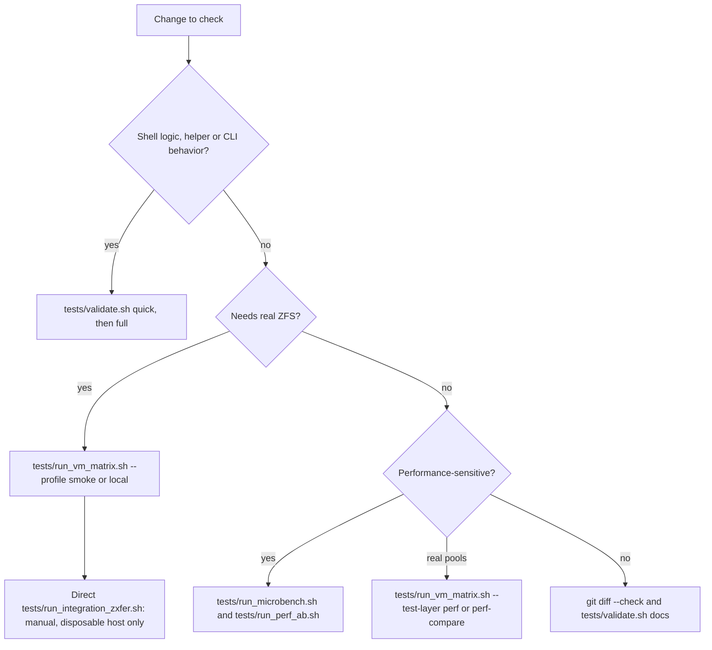
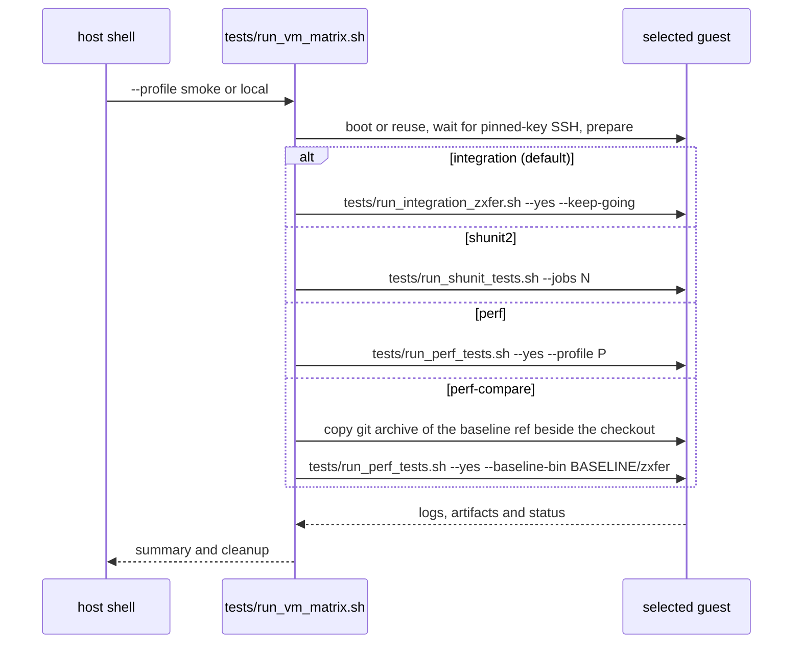

# Testing

This is the reference for zxfer's test tooling. [CONTRIBUTING.md](../CONTRIBUTING.md)
is the how-to: which commands to run for a change and in what order.
`KNOWN_ISSUES.md` tracks open bugs; host-safety notes and CI entry points
belong here.

## Test Layers

- Contract suites (`tests/test_contract_*.sh`) run the real `./zxfer`
  launcher against the canned zfs of `tests/mock_toolchain_helper.sh` and pin
  what an operator sees: argv, output, exit codes and failure reports.
- Module suites (`tests/test_zxfer_*.sh`) unit-test `src/` functions.
- Tool self-tests (`tests/test_run_*.sh`, `tests/test_validate.sh`,
  `tests/test_ci_*.sh`, `tests/test_generate_solaris_manpage.sh`) test the
  runners, `validate.sh`, the CI workflow contracts and the man-page
  generator.
- The seeded argv fuzz (`tests/run_argv_fuzz.sh`) runs host-safe against its
  own model-backed fake zfs.
- Coverage is a report-only bash-xtrace or kcov run of the unit suites.
- Integration runs real file-backed pools, inside a disposable VM
  (`tests/run_vm_matrix.sh`) or, manually, on a disposable ZFS host.
- Performance has three tools: `tests/run_microbench.sh` counts helper
  spawns on the canned zfs (its budgets gate every unit run), and the
  advisory timers `tests/run_perf_ab.sh` (canned zfs) and
  `tests/run_perf_tests.sh` (real pools).

```mermaid
flowchart TD
    A["Change to check"] --> B{"Shell logic, helper or CLI behavior?"}
    B -->|yes| C["tests/validate.sh quick, then full"]
    B -->|no| D{"Needs real ZFS?"}
    D -->|yes| E["tests/run_vm_matrix.sh --profile smoke or local"]
    D -->|no| F{"Performance-sensitive?"}
    F -->|yes| G["tests/run_microbench.sh and tests/run_perf_ab.sh"]
    F -->|real pools| H["tests/run_vm_matrix.sh --test-layer perf or perf-compare"]
    F -->|no| I["git diff --check and tests/validate.sh docs"]
    E --> J["Direct tests/run_integration_zxfer.sh: manual, disposable host only"]
```

## Validation Profiles

`tests/validate.sh` is the front door. Profiles live in
`tests/validation_profiles.tsv` and dispatch a closed set of step names;
neither it nor `tests/validation_map.tsv` is evaluated as shell.

- `quick [PATH...]` (default: the staged, unstaged and untracked Git paths)
  runs the offline budget check and the selected unit suites, and prints but
  never runs integration, performance and documentation follow-ups. A change
  to `src/zxfer_NAME.sh` selects `tests/test_zxfer_NAME.sh` and every
  contract suite by name; a `tests/suites/*` fragment selects the entry suite
  whose `# zxfer-test-fragment:` marker names it. Every path must also match
  a row of `tests/validation_map.tsv` (first match wins; an unmatched path
  stops `quick`), which adds exception suites (`@contract` means every
  contract suite, `@self` the changed suite), integration groups, perf cases
  and doc surfaces.
- `full` runs the pinned lint stack, every unit suite and report-only
  bash-xtrace coverage.
- `portable` runs the static POSIX portability lint targets.
- `docs` runs actionlint, codespell, the budget gate and the man-page
  rendering check; it may populate the pinned lint-tool cache.
- `vm [smoke|local]` forwards to `tests/run_vm_matrix.sh` and rejects broader
  profiles.
- `bootstrap` installs the pinned lint tools; `doctor` reports shells, QEMU,
  ZFS commands and cached tools without downloading or running them.

`quick` and `full` run four suites at a time; `ZXFER_VALIDATE_JOBS` changes
that. No profile runs `tests/run_integration_zxfer.sh` on the host.

## Unit Runner

`tests/run_shunit_tests.sh [options] [--] [suite ...]` runs every
`tests/test_*.sh` suite, or the named ones.

- `--jobs N` bounds concurrent suites (default: the CPU count, at most 4,
  never more than the runnable suites; a larger explicit value is announced
  and clamped). With more than one job each suite's output is buffered and
  replayed in suite order, and the known-slow suites (`RUNNER_SLOW_SUITES`
  in the runner, longest first) start before the rest, so a long suite never
  starts last and stretches the run; `--jobs 1` runs and streams in suite
  order.
- `--suite-timeout SECONDS` (or `ZXFER_TEST_SUITE_TIMEOUT`; default 900,
  0 disables) stops a suite that runs longer: the runner prints the suite
  and its processes, sends TERM, then KILL, replays the partial output and
  reports `timed out after Ns`. A timeout makes the run exit 124.
- `--skip-tool-suites` leaves out the tool self-tests. The portable-shell,
  FreeBSD, OmniOS and xcode-27 CI lanes use it; the tool suites run on
  ubuntu-26.04 and macos-26.
- `--list-suites` (alias `--list`) and `--list-tests SUITE` print without
  running anything; `--list-tests` also reads the fragments an entry names.
- `--suite SUITE --test NAME ...` runs named tests. Names are validated
  before any suite starts, a repeated `--suite` merges into its first
  position, and `--test NAME SUITE` still works for one positional suite.
- `ZXFER_TEST_SHELL=PATH` runs each suite through that interpreter. For a
  mode such as `bash --posix`, point it at a wrapper script that `exec`s the
  command.

Exit status: 0 when every suite passes, otherwise the last failed suite's
status in suite order (124 for a timeout, 1 for a missing suite); 129, 130
or 143 after HUP, INT or TERM.

Each suite runs under a worker subshell that reports `done ID STATUS` on a
FIFO the runner reads, so a finished suite is noticed at once. A ticker
writes `tick` to the same FIFO once a second; the watchdog and signal
teardown count ticks. A signal trap only records the signal, and the main
loop stops the suites after the next event: TERM, a three-tick grace, KILL,
then KILL for any worker that still has not reported. Stopping is best
effort: the runner signals the suite and every descendant of its worker
found in one `ps -A -o pid= -o ppid= -o args=` snapshot. A process that left
the tree or started its own session is missed, and a PID reused between the
snapshot and the signal could be hit; that window is open only on a timeout
or a signal. Suites start as async lists, so on some shells (bash 3.2, the
macOS `/bin/sh`) they inherit INT and QUIT ignored; the runner therefore
stops them with TERM.

## Unit-Test Layout

Contract suites come first:

| Suite | Pins |
| --- | --- |
| `test_contract_cli_golden.sh` | Help, usage-error and failure-report output byte for byte (`tests/golden/cli_*.golden`; rewrite with `ZXFER_UPDATE_GOLDEN=1` and review the diff). |
| `test_contract_failures.sh` | Fail-closed behavior when any zfs or ssh call fails (see Fail-Closed Sweep). |
| `test_contract_planning.sh` | The zfs argv of whole runs: GUID-aware planning, fail-closed listings and the failure stage they report, `-d` deletes, the `-F` rollback and divergence, `-g`, `-Y` passes, `-j` order and cleanup, `-O`/`-T`, the property pass and `-k`/`-e`. |
| `test_contract_properties.sh` | `-P` property argument boundaries, the recursive prefetch and its read races, and the `-o` rules: a repeated item is a usage error before any zfs call (the CLI goldens also pin a malformed one), and a property the source lacks stops the run before the destination is touched. |
| `test_contract_send_receive.sh` | `-D` progress streams under `-j 1` and `-j 3`, and `-n`. |
| `test_contract_verbose.sh` | `-v`/`-V` output for hostile property values, and `-V` counters that start at zero whatever the environment holds. |

Every `src/zxfer_NAME.sh` has one home: `tests/test_zxfer_NAME.sh` and the
fragments it runs from `tests/suites/zxfer_NAME_TOPIC_tests.sh`.
`test_zxfer_launcher.sh` also covers the `src/zxfer_modules.sh` loader, and
`test_zxfer_cleanup_child_wrapper.sh` covers the standalone wrapper.
`test_zxfer_mock_toolchain.sh` tests the canned zfs and
`test_zxfer_microbench_budgets.sh` the spawn budgets.

A fragment takes three lines in its entry, in order: a
`# zxfer-test-fragment: suites/NAME` marker (read by `--list-tests` and
`validate.sh quick`), a `.` source line, and its path in
`suite() { zxfer_test_register_fragment_tests ...; }`, which registers every
`test*()` function in file order. A fragment keeps the fixture its cases were
written for: the entry's `setUp` asks `zxfer_test_running_test_is_in FILE`
(`tests/helpers/loader.sh`) and applies it to that fragment's cases only.

`tests/test_helper.sh` loads every module in `src/zxfer_modules.sh` order, so
every suite sees the whole function set, and provides the lifecycle and
capture helpers. A suite that needs clean module state calls
`zxfer_test_reset_all_owner_state` (`tests/helpers/lifecycle.sh`) from
`setUp`, directly or through its domain fixture; it runs the production
owner resets without creating a run root or narrowing PATH.
Stub `src/` functions inside a subshell. Domain fixtures are opt-in files in
`tests/helpers/*_fixtures.sh` (`exec`, `remote_host`, `runtime`, `send_job`,
`property`, `replication`, `snapshot_discovery`, `fake_tool`, `backup`);
contract suites share `tests/helpers/blackbox.sh`. The legacy string-capture
helpers `zxfer_test_capture_subshell` and `zxfer_test_capture_subshell_split`
evaluate their script; the lint shellcheck target rejects any other `eval` in
the shared helpers.

The vendored `tests/shunit2/shunit2` (2.1.8) carries two local changes:
`_shunit_escapeCharInStr` escapes with `awk` (BSD `sed` rejects upstream's
expression), and `assertContains`/`assertNotContains` match the expected text
as one literal substring (`_shunit_containsLiteral`), which
`test_vendored_shunit2_contains_matches_literal_text` pins. Keep both when
updating shunit2.

The FreeBSD and OmniOS unit guests run the suites as root, so owner and
permission tests must fake the other identity rather than assume a non-root
uid. FreeBSD `sh` (unless the name is already exported) and ksh93, the
illumos `/bin/sh`, do not export a `VAR=value` prefix on a shell-function
call, so a case that must hand `TMPDIR` or a mock variable to the launcher
through a helper function exports it in a subshell instead; the
[coding style](./coding-style.md) lists this and the other portability
traps.

## Fail-Closed Sweep

The canned zfs, the socket-aware mock ssh and every counting wrapper in
`tests/mock_toolchain_helper.sh` share one fault injector: with
`MOCK_FAIL_CALL=N` the Nth call of `MOCK_FAIL_TOOL` (`zfs` by default)
prints `MOCK_FAIL_STDERR` and exits `MOCK_FAIL_STATUS` (defaults: zfs
`cannot open '<operand>': I/O error` and 1, ssh a closed connection and 255).
`MOCK_FAIL_MATCH` counts only calls whose argv matches a glob,
`MOCK_FAIL_CALL=0` only counts, calls claim numbers by noclobber files in
`MOCK_FAIL_DIR`, and the failing call logs `FAIL <n> <tool> <argv>` to
`MOCK_ZFS_LOG`. `MOCK_ZFS_STRICT_RECEIVE=1` makes a receive refuse an empty
stream.

`tests/test_contract_failures.sh` runs nine scenarios (local incremental,
`-d`, `-d -F` with a diverged child, `-d -g`, `-P`, `-k` then `-e`, `-j 2`,
`-O localhost`, `-T localhost`), numbers every zfs call of a clean run and
fails each in turn (and each ssh call of the remote scenarios). Every run must
either exit 0 with the clean run's mutating calls, or exit non-zero with one
structured failure report and no mutating zfs call starting after the
failure; the receive sharing a failed send's pipeline, and under `-j` the
sibling started with the failing one, are the exact exceptions. Every run
must leave `TMPDIR` empty, `-k` must publish nothing when it stops, and `-e`
must not change its backup files. The default run is about 160 zxfer runs;
`ZXFER_FAILURE_SWEEP=full` adds a second failure shape (about 330), and
`ZXFER_FAILURE_SWEEP_TRACE=FILE` appends one TSV line per failing run.

## Argv Fuzz

`tests/run_argv_fuzz.sh [--seed N] [--iterations N] [--case K] [--keep]`
generates small trees (a root and one to four children, prefix-sharing
sibling names, some volumes) with names of alnum, space, `-`, `_`, `.` and
`:`, and user property values that mix bytes 0x01-0x7f with tabs, newlines,
CR, `\001`, quotes, backslashes, `$(`, backticks, `%`, commas and `=`,
including values shaped like another `zfs get -H` record. It runs the real
launcher against a model-backed fake zfs (`tests/helpers/argv_fuzz.awk`) in
seven modes (`-R`, `-P -R`, `-P -R` with recursive gets refused, `-j 2 -P -R`,
`-O localhost`, `-T localhost`, and a control-byte operand that must fail
closed), and requires every value to arrive as one byte-identical argument
and the destination to converge. The generator has its own Park-Miller
stream, so a seed reproduces with any awk; a failure prints
`./tests/run_argv_fuzz.sh --seed N --case K --iterations 1 --keep`.
`tests/test_run_argv_fuzz.sh` runs one fixed seed and proves that injected
bugs (`ZXFER_ARGV_FUZZ_FAULT=split`, `truncate`, `inject`, `prefetch`) are
reported; the `argv-fuzz` CI job runs 200 iterations with the run number as
the seed on every push.

## Micro-Bench and Budgets

`tests/run_microbench.sh` counts helper spawns (22 tools), `-V` profile
counters and ssh use on the canned zfs for `noop`, `dryrun_incr`, `incr`,
`remote_noop`, `remote_incr` (`-O localhost -T localhost` through the
socket-aware mock ssh, which logs each call as `version`, `master`,
`control`, `mux` or `direct`) and `props` (`-P` with 68 matching
properties per dataset; any mutating zfs command besides the receives fails
it). The work directory sits
under `/tmp` whatever `TMPDIR` is. `tests/test_zxfer_microbench_budgets.sh`
runs the 8 x 2 fixture and enforces the 37 rows of `tests/perf_budgets.tsv`:
the helper TOTAL, `ssh_connections` and `ssh_master_opens` (exact, both
directions) and the zfs call counters of each scenario. Budgets only go
down; the file header gives the rule.

## Coverage

`tests/run_coverage.sh [--] [suite ...]` prefers kcov and falls back to a
bash-xtrace report (`ZXFER_COVERAGE_MODE=auto|kcov|bash-xtrace`). The
bash-xtrace mode runs the suites through `tests/run_shunit_tests.sh` with a
`ZXFER_TEST_SHELL` wrapper that traces each suite into its own file, then
writes `coverage/bash-xtrace/summary.tsv` (with a `TOTAL` row) and
`missing.txt`. It discounts syntax xtrace cannot attribute (case labels,
heredoc bodies, grouping delimiters, multi-line strings) and skips the
`./zxfer` entry point unless `ZXFER_COVERAGE_INCLUDE_ENTRYPOINT=1`. Coverage
is report-only: the exit status reflects only the suites; `--report-only` is
accepted and ignored.

## Lint

`tests/run_lint.sh [target ...]` runs the pinned actionlint, checkbashisms,
shfmt, codespell and ShellCheck toolchain that CI uses, plus `budget` (the
sensitive-caller ratchets in `tests/budget_policy.tsv`, checked by
`tests/run_budget_check.sh`; `--list` prints measured values) and `manpages`
(`man/zxfer.1m` must be the generated rendering of `man/zxfer.8`). Shell
targets lint every tracked or non-ignored untracked `*.sh` file and
`zxfer`. The devcontainer (Ubuntu 24.04) carries the same toolchain plus
dash, bash, busybox ash, kcov and `zfsutils-linux` userland; it is not a ZFS
host.

## VM Matrix

`tests/run_vm_matrix.sh` boots or reuses disposable guests and runs one test
layer inside them.

```mermaid
sequenceDiagram
    participant Host as host shell
    participant Matrix as tests/run_vm_matrix.sh
    participant Guest as selected guest
    Host->>Matrix: --profile smoke or local
    Matrix->>Guest: boot or reuse, wait for pinned-key SSH, prepare
    alt integration (default)
        Matrix->>Guest: tests/run_integration_zxfer.sh --yes --keep-going
    else shunit2
        Matrix->>Guest: tests/run_shunit_tests.sh --jobs N
    else perf
        Matrix->>Guest: tests/run_perf_tests.sh --yes --profile P
    else perf-compare
        Matrix->>Guest: copy git archive of the baseline ref beside the checkout
        Matrix->>Guest: tests/run_perf_tests.sh --yes --baseline-bin BASELINE/zxfer
    end
    Guest-->>Matrix: logs, artifacts and status
    Matrix-->>Host: summary and cleanup
```

- Profiles: `smoke` (Ubuntu 26.04), `local` (plus FreeBSD 15.1), `full` and
  `ci` (plus OmniOS r151058). Automated runs use `smoke` or `local` only.
  `--list-profiles` and `--list-guests` print the choices;
  `tests/vm/guest_manifest.tsv` holds the guest metadata, validated before
  use and pinned by `tests/test_run_vm_matrix.sh`.
- Options: `--guest NAME`, `--jobs N` (guests in parallel), `--test-layer`,
  `--only-test NAME[,NAME]` and `--failed-tests-only` (integration layer
  only), `--stream-guest-output`, `--preserve-failed-guests`.
- Environment: `ZXFER_VM_ARTIFACT_ROOT`, `ZXFER_VM_CACHE_DIR`,
  `ZXFER_VM_JOBS`, `ZXFER_VM_TEST_LAYER`, `ZXFER_VM_STREAM_GUEST_OUTPUT`,
  `ZXFER_VM_ONLY_TESTS`, `ZXFER_VM_FAILED_TESTS_ONLY`,
  `ZXFER_VM_PERF_PROFILE` (`smoke` or `standard`),
  `ZXFER_VM_PERF_BASELINE_REF` (default `upstream-compat-final`),
  `ZXFER_VM_PERF_CASES`, `ZXFER_VM_QEMU_AARCH64_EFI`, and
  `ZXFER_VM_CI_MANAGED_GUEST` (selects the `ci-managed` backend for one
  in-guest CI job; `perf-compare` needs `qemu`).
- Hosts: Linux and macOS with QEMU, and Windows through WSL2. On `amd64`
  hosts with KVM, and Intel Macs, guests run hardware-virtualized `amd64`;
  on Apple Silicon and other `arm64` hosts Ubuntu and FreeBSD use `arm64`
  images and OmniOS stays a best-effort TCG lane. Host tools:
  `qemu-system-x86_64`, `qemu-system-aarch64` with aarch64 UEFI firmware,
  `qemu-img`, `curl`, `python3`, `ssh`, `ssh-keygen`, `ssh-keyscan`, `tar`,
  `xz`.
- Boot: Ubuntu gets a 16G overlay; FreeBSD uses a `cidata` config drive; the
  runner pins the guest's ed25519 key and connects only with
  `StrictHostKeyChecking=yes`, requires three consecutive SSH probes on
  FreeBSD and OmniOS, backs off 5, 10, 20 s after failed probes, allows 1800 s
  to first readiness, and fails at once (pointing at `serial.log`) if QEMU
  exits. The OmniOS shunit2 layer runs the suites through a `bash --posix`
  wrapper, as the CI job does. Ctrl+C stops guest workers and cleans up.

## Performance Harness

`tests/run_perf_tests.sh` measures real file-backed pools. Run it only in a
disposable guest (`--test-layer perf` or `perf-compare`) or on a throwaway
ZFS host; without `--yes` it asks once before creating pools.

- Options: `--profile smoke|standard` (1 sample, 6 chain snapshots, 8
  siblings, 512 MB pools; or 1 warmup, 3 samples, 32, 48 and 2048 MB),
  `--case LIST`, `--samples N`, `--warmups N`, `--label L`,
  `--output-dir DIR`, `--baseline summary.tsv`, and `--baseline-bin PATH`
  with `--baseline-label L`, which first runs the same cases with that
  executable into `OUTPUT_DIR/baseline/` and then compares `ZXFER_BIN`
  (default `./zxfer`) against it.
- Cases: `chain_local`, `chain_local_noop`, `chain_local_incr`,
  `fanout_local_j1_props`, `fanout_local_j1_incr`, `fanout_local_j4_props`,
  `fanout_local_j4_props_noop`, `chain_remote_mock`,
  `chain_remote_mock_noop`, `chain_remote_mock_pull_noop` (`-O` only) and
  `chain_remote_mock_compressed`. No-op cases seed the destination and time
  the second run; incremental cases time sending one new snapshot.
- Artifacts: `run-info.tsv`, `samples.tsv` (every warmup and sample, with the
  `-V` counters; counters an older binary lacks stay empty), `summary.tsv`
  and `summary.md` (measured samples only), `raw/`, and with a baseline
  `compare.tsv` and `compare.md`. A regression (wall, startup or cleanup time
  up, or throughput down, by more than 10%) is a warning; only setup, zxfer
  or correctness failures fail the run.
- `upstream-compat-final` needs a BSD-userland guest (GNU `mktemp` rejects
  its template) and fails the property fanout cases on current OpenZFS; limit
  a comparison with `ZXFER_VM_PERF_CASES`.

`tests/run_perf_ab.sh --baseline-ref REF` is the host-safe wall-clock A/B:
the baseline comes from `git archive` of any commit-ish, a canned zfs answers
every zfs command, and a mock ssh sleeps `--latency-ms` (default 80) per new
connection. For each `--sizes` value (children, `--snapshots N` deep,
default 4) it times `noop`, `incr`, `remote_noop` and `remote_incr`, or the
`--scenarios` list with the opt-in `props`, with one warm-up per tree and
`--reps` alternating runs under `--shell PATH` (default `/bin/sh`). It prints
median, min, max and the ratio as TSV, appends Markdown with `--summary`,
and exits 0 whatever the ratios, 1 for a harness error, 2 for a usage error.
Its work directory sits directly under `/tmp` so control-socket paths stay
short.

## Integration Harness

`tests/run_integration_zxfer.sh` is the engine the VM matrix runs inside a
guest. Run it directly only on a disposable ZFS host: by default it asks
before every data-modifying wrapped command; `--yes` skips that,
`--keep-going` continues after failures, `--failed-tests-only` replays only
failing output, `--only-test` and `--skip-test` (or `ZXFER_ONLY_TESTS`,
`ZXFER_SKIP_TESTS`) filter tests, and `ZXFER_BIN`, `SPARSE_SIZE_MB` and
`TMPDIR` configure it.

Test bodies live in `tests/integration/NAME_tests.sh` fragments, loaded in C
sort order; `tests/integration_test_registry.tsv` holds the execution order,
the test/group kind and the pre-pool flag. Before consulting `zpool`, the
harness rejects a fragment with another name shape, a symbolic-link fragment
or directory, an empty directory, and any fragment that is not
definition-only: outside a function only comments and `name() {` headers may
appear, a function ends at a lone `}` in column 0 (the shfmt layout lint
enforces), and a `name()` pattern inside a body fails as a nested
definition. Every registry name needs exactly one top-level definition and
every fragment function a registry row. `tests/integration/hostile_names_tests.sh`
holds the hostile dataset-name and property-value cases.

The harness uses file-backed pools only, sparse vdevs under its work tree,
marker-gated cleanup of pools the current run created, and no raw devices.
It still performs real kernel ZFS operations and mounts, so it is not a
sandbox: use a disposable VM for zero host risk. On macOS and Linux it needs
OpenZFS permission for file-backed `zpool create` and `destroy`; FreeBSD may
need root.

## GitHub Actions

| Workflow | Jobs |
| --- | --- |
| `tests.yml` | shunit2 on ubuntu-26.04 (`--jobs 4`), macos-26 and xcode-27 (macOS 27 preview, `--jobs 1`); dash, `bash --posix` and busybox ash (`--jobs 4`); FreeBSD 15.1 and OmniOS r151058 `vmactions` guests (`--jobs 2`, OmniOS through `bash --posix`); and the gating `argv-fuzz` job. Only ubuntu-26.04 and macos-26 run the tool self-tests. |
| `lint.yml` | Every `tests/run_lint.sh` target as a matrix; `tests/test_ci_workflow_contracts.sh` keeps the matrix equal to `run_lint.sh --list`. |
| `coverage.yml` | Report-only bash-xtrace coverage (summary in the job summary, report as an artifact) and a non-blocking kcov pass over the contract and module suites in the digest-pinned `kcov/kcov` image with `procps` and `openssh-client` added (zxfer requires `ps`; the remote backup cases resolve `ssh`). |
| `perf.yml` | The advisory `perf-advisory` job: `run_perf_ab.sh` against `origin/upstream-compat-final`, then against the code the push replaces (the merge base with `origin/main`, or `HEAD~1` on `main`) with `props`, plus the micro-bench TOTAL and ssh rows; never gates. |
| `integration.yml` | The direct-host harness on ubuntu-26.04 (`sudo`, preserved workdir), and FreeBSD and OmniOS `vmactions` guests that run the harness in-guest (OmniOS under `/usr/xpg4/bin/sh`), copy failure artifacts back and restore the guest status in a host-side step. |

Every workflow cancels superseded runs for the same ref. The macOS lanes do
not install ZFS: they are `/bin/sh` and BSD-userland portability gates. The
OmniOS unit job uses `bash --posix` because `/usr/xpg4/bin/sh` follows
ksh-style subshell function binding and ignores the suites' subshell stubs;
the integration job keeps `/usr/xpg4/bin/sh` for live illumos coverage.

There is no posh lane: posh is not a supported shell (see
[platforms](./platforms.md)).
