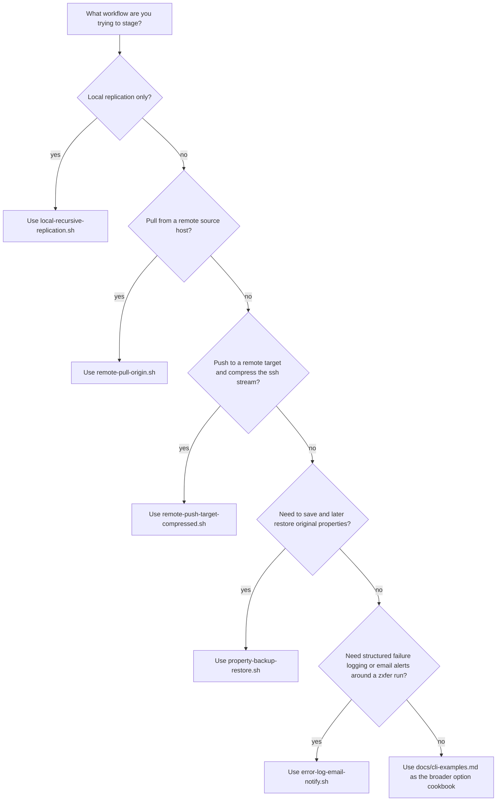

# zxfer Examples

This directory holds small command templates for the most common zxfer
workflows. Review and edit dataset names, hostnames, and option flags before
running anything against a real system.

For an option-by-option CLI cookbook that covers the full current flag set, see
[../docs/cli-examples.md](../docs/cli-examples.md).

## Included Templates

- [local-recursive-replication.sh](./local-recursive-replication.sh): local recursive send/receive
- [remote-pull-origin.sh](./remote-pull-origin.sh): pull from a remote origin with `-O`
- [remote-push-target-compressed.sh](./remote-push-target-compressed.sh): push to a remote target with `-T -z`
- [property-backup-restore.sh](./property-backup-restore.sh): capture and later restore property metadata with `-k` and `-e`
- [error-log-email-notify.sh](./error-log-email-notify.sh): mirror structured failure reports into `ZXFER_ERROR_LOG` and email the current failure report captured from stderr with `mailx`, BSD `mail`, or `sendmail`

## Choose A Starting Template

Use the matching example as a starting point, then replace every dataset name,
hostname, and path before touching a real system:

These are intentionally conservative examples. They show the command shape and
the main options involved without trying to automate environment-specific host
or pool setup.

Each script resolves the project root relative to its own location, so it can
be run from any current working directory while still targeting the local
checkout's `zxfer` entry point.

For [`error-log-email-notify.sh`](./error-log-email-notify.sh):

- Linux and illumos deployments commonly use `mailx`; FreeBSD and macOS often provide BSD `mail` in the base system. Leave `MAILER=auto` unless you need to force `mailx`, `mail`, or `sendmail`.
- Set `TARGET_HOST`, `ORIGIN_HOST`, and `RAW_SEND=1` when the wrapped zxfer command needs `-T`, `-O`, or `-w` in addition to the default `-v -R`.
- Set `SRC_DATASETS="tank/source tank/archive"` to run the wrapper sequentially for multiple source roots; `SRC_DATASET` remains the single-source default for backward compatibility.
- The alert body includes the current run's structured failure report plus any stderr warnings emitted outside that report, such as `ZXFER_ERROR_LOG` append failures.
- Set `ZXFER_REDACT_FAILURE_REPORT_COMMANDS=1` if hook strings, wrapper-style host specs, or other zxfer command arguments can contain secrets; the mailed and logged `invocation` / `last_command` fields will be emitted as `[redacted]`.
- Set `MAIL_FROM` when your MTA requires a sender address. The default `MAIL_FROM_FLAG` is `-r` for `mailx`/`mail`, and the default `SENDMAIL_FROM_FLAG` is `-f` for `sendmail`; override either flag if your local mailer expects something different.
- When forcing `MAILER=sendmail`, keep `ALERT_TO` and `MAIL_FROM` as single-line header values; embedded newlines are rejected.
- Validate the wrapper logic without touching ZFS or a real mail server by running `sh ./examples/error-log-email-notify.sh --self-test`.
